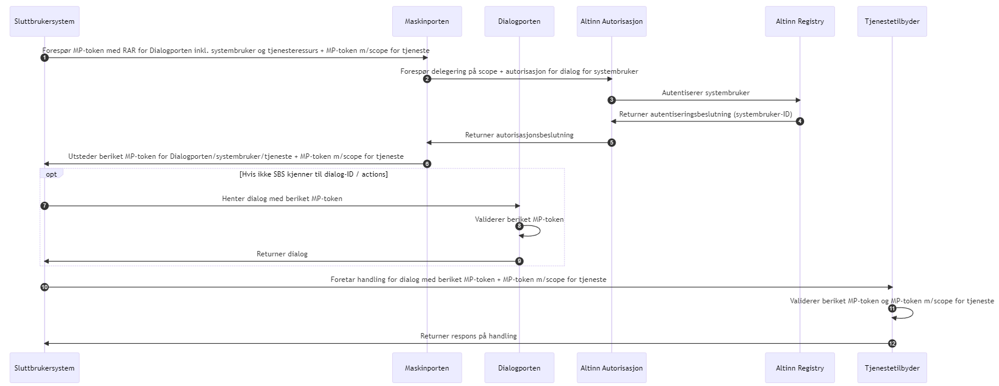

 <!-- info -->
This is work in progress.


## General
Altinn solutions for Authentication and Authorization are described under:

* [Altinn Authentication](/authentication/)  
* [Altinn Authorization](/authorization/).

## Authentication

In order to authenticate to the API, you need to use a Maskinporten token as a bearer token. You should use delegated tokens as described [here](https://samarbeid.digdir.no/maskinporten/konsument-delegert-til-leverandor/120).

TBD: More excplicit reference to the updated Maskinporten and Altinn Authorization 
solution architecture documentation. 

## Maskinporten-token med systembruker-ID

Ref. [Draft Dialogporten documentation on Authorization](https://digdir.github.io/dialogporten/#autorisasjon)

Maskinporten foretar autentisering av systembruker/passord og utsteder
et beriket token med identifikator for systembrukeren. Både
tjenestetilbyder og Dialogporten må foreta oppslag mot Altinn
Autorisasjon for å autorisere den oppgitte systembrukeren på
tjenestenivå.

## Maskinporten-token med innbakt autorisasjon

Ref. [Draft Dialogporten documentation on Authorization](https://digdir.github.io/dialogporten/#autorisasjon)

I dette mønsteret oppgir SBS systembruker + passord, samt
tjenesteressurs i forespørselen til Maskinporten, som da foretar både
grov- og finkornet autorisasjon. Dette krever innføring av RAR (Rich
Authorization Requests) for Maskinporten, og en tettere kobling mellom
Maskinporten og Altinn Autorisasjon. Samme token-type kan benyttes mot
både Tjenestetilbyder og Dialogporten, men aud-claim må settes i token
og valideres for å unngå å åpne for replay-attacks.

