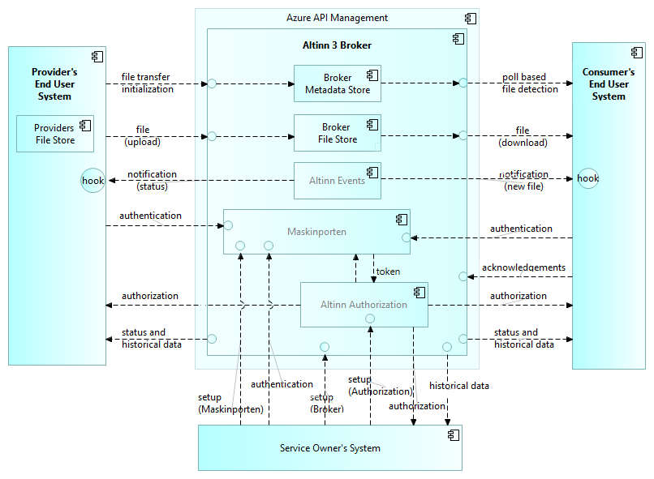
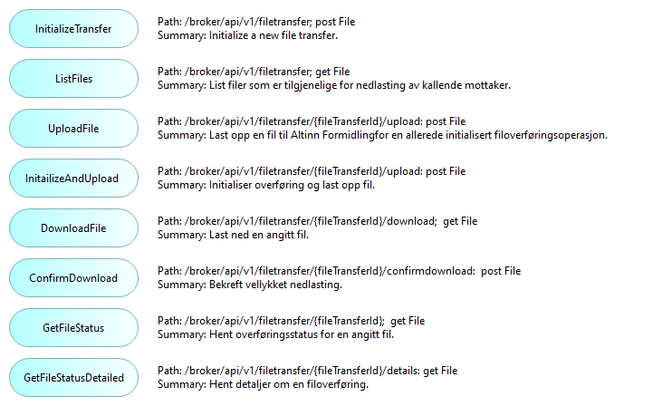

## Overview of Altinn 3 Broker external interfaces
The following figure indicates the main system interfaces of Altinn 3 Broker:

<!--
*TIP: The details of the interfaces are not shown by the image as
such, however the image hyperlinks to a clickable web version with further details.*
-->

__Interfaces for design time configuration of services and options:__

<!-- Erik, lenke til API/Swagger-spec. også for API for configuration of Altinn Broker -->

* API for configuration of Altinn Broker
* API for configuration of Maskinporten (authentication and course-grained authorization)
* API for configuration of Altinn Authorization (fine-grained authorization)
* API for setup of event subscriptions via Altinn Events
* GUI for configuration of Altinn Broker
* GUI for configuration of  Maskinporten
* GUI for configuration of Altinn Authorization Erik [13:39] Fatland, Ragnar Inge
https://docs.altinn.studio/authorization/modules/resourceregistry/studio/
Ressurs Admin Altinn Studio – Altinn
Ressursregisteret tilbyr API for alle typer håndtering av ressurser. I tilegg kan man  som del av Altinn studio kan administrere ressursene.

    _Note_: Altinn 3 Broker does not currently provide a GUI for file transfer operations, 
but relies om End User System GUIs.

__Interfaces for runtime operation:__

* [API for individual file transfers, including upload, download and status monitoring](#altinn-3-broker-api-for-individual-file-transfers)

__Interfaces for historical data and statistics:__

* API for historical data and statistics

<!--

### Authorizarions interfaces

## Altinn 3 Broker File Transfer Interfaces

### Event Subscriptions
See https://docs.altinn.studio/events/subscribe-to-events/developer-guides/setup-subscription/

TBD.

### User Interfaces

Altinn 3 Broker does not currently provide a GUI for file transfer operations, but relies om End User System GUIs.

-->

## Altinn 3 Broker API for individual file transfers

### Altinn 3 Broker Application services

An overview of the application services of Altinn 3 Broker is given in the following figure:

Each of these application services correspond to a _path_ in the [Altinn 3 Broker OpenAPI specification][Altinn 3 Broker OpenAPI specifications].

### Altinn Broker File Transfer REST API 

See [Altinn 3 Broker OpenAPI specification][Altinn 3 Broker OpenAPI specifications].

### Event notifications (machine-to-machine)

Notifications about new messages and other events are delivered to webhook subscribers. 
The specific events are specified as part of the [Altinn 3 Broker OpenAPI specification][Altinn 3 Broker OpenAPI specifications]. 

Summary:

* filetransferinitialized: Information about a new file transfer
* filedeleted: The file has been deleted from Broker
* fileneverconfirmeddownloaded: File was never confirmed downloaded by a recipient
* uploadprocessing: File has been uploaded and is being processed
* published: File has finished processing and is ready for download
* uploadfailed: An upload failed either during upload or processing
* downloadconfirmed: A recipient confirmed their download
* allconfirmeddownloaded: All recipients have confirmed the download
* 
Also see:

* [Description of the Events capabilities in Altinn 3](https://docs.altinn.studio/events/)
* [How-to guide on setting up a subscription for events](https://docs.altinn.studio/events/subscribe-to-events/developer-guides/setup-subscription/)

<!--
Webhooks are a way for an app or a service to provide real-time information to other apps or services. They are used to trigger automatic reactions or notifications when specific events occur. Essentially, a webhook sends an HTTP POST request to a specified URL in response to an event — for example, when a new record is added to a database, or a user completes a purchase.

How Webhooks Work:
1. Event Occurrence: A webhook is configured to listen for certain events in a source application (e.g., a new post on a blog, a new payment received, a new user registration).
2. Notification: When the specified event occurs, the source application generates an HTTP POST request. This request contains information or data related to the event, formatted in a way that the receiving application expects (usually as JSON or XML).
3. Listener: The target application (or a server-side script) listens for incoming POST requests on a specified URL (the webhook URL).
4. Action: Once the target application receives the data, it can use it to perform an action, update its own database, send a notification, or trigger other workflows.

Advantages of Webhooks:
* Real-Time: Webhooks provide a mechanism for real-time data transfer and event handling, as opposed to traditional polling mechanisms where an application repeatedly checks for updates at regular intervals.
* Efficient: They are more efficient than polling because they only send data when there is an actual event, reducing unnecessary network traffic and server load.
* Customizable: Webhooks can be configured to listen for specific events, making them highly customizable and flexible for various use cases.

Considerations:
* Security: Since webhooks involve sending data from one service to another, they need to be secured to prevent unauthorized access or data interception. This often involves validating the incoming requests and using HTTPS for encryption.
* Error Handling: The receiving application needs to be capable of handling errors or exceptions that may occur during data processing. This includes dealing with malformed data, service downtime, or network issues.
* Infrastructure: The server that receives the webhook must be set up to handle potentially high volumes of incoming HTTP requests and process them efficiently.
-->

### End user notifications (email, SMS)
Notifications to end users about new messages, files, and other events are sent via the Altinn Notification Service.

Also see:

* [Description of notification capabilities in Altinn 3](https://docs.altinn.studio/notifications/)

## Scenario descriptions

### End-to-end typical sequence

The follow sequence diagram shows the typical "happy path" message sequence:  

<!--
Note: Explanations for each arrow should match the online, clickable Archi version.
Issue: How to link to the specific OpenAPI specification of this particular API call?
-->

For a summary of each message in the sequence diagram; see [Altinn 3 application services (paths)](#altinn-3-broker-application-services).

Note that, in the sequence diagram, only some of the message parameters are indicated.
Refer to the [Altinn 3 Broker OpenAPI specification][Altinn 3 Broker OpenAPI specifications] 
for the complete documentation of parameters.

<!--
Here's a high level description of the message flow:

Note: Details regarding authentication and
authorization not shown here.

<!-- 4. CheckIfAvailableFiles: --

1. InitalizeTransfer (id, type, options): Initialize a new file transfer, indicating a message id, the type of message (Altinn resourceid) and any non-default selection of options.
2. UploadFile (fileId, protocol): Upload a file to the Broker filestore for an already initialized file transfer operation.
3. NewFileUploaded: ...
5. ListFiles (new):
6. FileList (fileIds):
7. DownloadRequest (fileId):
8. DownloadConfirmation:
9.  TransferCompleted (fileId): 
10. GetFileStatus (fileId):
11. FileStatusOverview (fileId):
12. GetFileStatusDetailed: 
13. FileStatusDetails (fileId):
-->

<!--
### Exception scenarios
The following ... TBD ..

1. Failing upload
2. Failing download
3. Resuming a failed upload
4. Resuming a failed download

### Other scenarios

    Reporting sequence – service owner fetching statistics
    Reporting sequence –provider fetching statistics
    Reporting sequence –consumer fetching statistics
    File storage purging

-->

<!-- References within this document: -->
[Altinn 3 Broker OpenAPI specifications]: https://github.com/Altinn/altinn-broker/blob/main/altinn-broker-v1.json

<!-- Erik, lenk til Swagger-spec. : -->