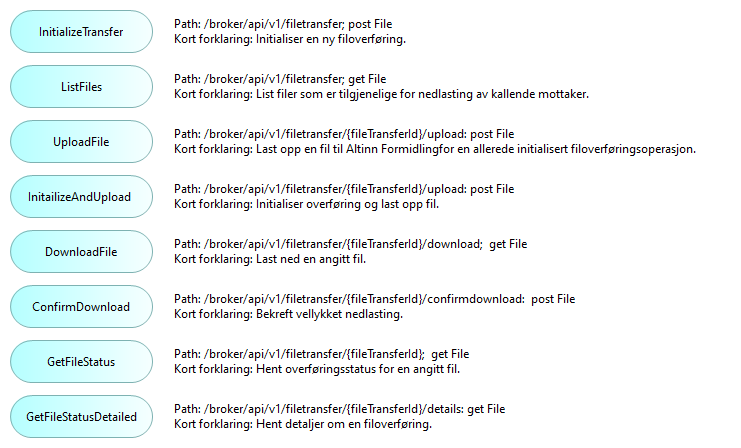

## Oversikt over Altinn 3 Formidling eksterne grensesnitt
Følgende figur indikerer de viktigste systemgrensesnittene for Altinn 3 Formidling som selvstendig løsning (uten Dialogporten):

<!--
*TIP: The details of the interfaces are not shown by the image as
such, however the image hyperlinks to a clickable web version with further details.*
-->

__Grensesnitt for konfigurering av tjenester og alternativer i designfasen:__

<!-- Erik, lenke til API/Swagger-spec. også for API for configuration of Altinn Broker -->

* API for konfigurering av Altinn Broker
* API for konfigurering av Maskinporten (autentisering og grovkornet autorisasjon)
* API for konfigurering av Altinn Autorisasjon (finkornet autorisasjon)
* API for oppsett av hendelsesabonnementer via Altinn Hendelser
* GUI for konfigurering av Altinn Broker
* GUI for konfigurering av Maskinporten
* GUI for konfigurering av Altinn Autorisasjon

<!--
  Erik [13:39] Fatland, Ragnar Inge
https://docs.altinn.studio/authorization/modules/resourceregistry/studio/
Ressurs Admin Altinn Studio – Altinn
Ressursregisteret tilbyr API for alle typer håndtering av ressurser. I tilegg kan man  som del av Altinn studio kan administrere ressursene.
-->

_Merk: Altinn 3 Broker tilbyr inntli videre ikke et eget GUI for filoverføringsoperasjoner, 
men overlater dette til sluttbrukersystemene._

__Grensesnitt for kjøretidsoperasjoner:__

* API for individuelle filoverføringer, inkludert opplasting, nedlasting og statusovervåking

__Grensesnitt for historiske data og statistikk:__

* API for historiske data og statistikk

<!--

### Authorizarions interfaces

## Altinn 3 Broker File Transfer Interfaces

### Event Subscriptions
See https://docs.altinn.studio/events/subscribe-to-events/developer-guides/setup-subscription/

TBD.

### User Interfaces

Altinn 3 Broker does not currently provide a GUI for file transfer operations, but relies om End User System GUIs.

-->

## API-operasjoner {#altinn-3-broker-application-services}
En oversikt over operasjoner i Altinn 3 Formidling API gis av følgende figur:

 <!-- info -->
Merk: Navnene på API-operasjonene er ikke oversatt til norsk, for å unngå misforståelser opp mot tekniske OpenAPI-spesifikasjoner.


Hver av disse applikasjonstjenestene tilsvarer en _path_ i [Altinn 3 Formidling OpenAPI spesifikasjon][Altinn 3 Broker OpenAPI specifications].

## Notifikasjoner om hendelser - maskin-til-maskin

Varsler om nye meldinger og andre hendelser leveres til abonnenter av webhooks. 
De spesifikke hendelsene er spesifisert som en del av 
[Altinn 3 Formidling OpenAPI spesifikasjon][Altinn 3 Broker OpenAPI specifications]. 

Oppsummering:

 <!-- info -->
Merk: Navnene på hendelsene er ikke oversatt til norsk, for å unngå misforståelser opp mot tekniske spesifikasjoner.


* filetransferinitialized: Informasjom om en ny filoverføring
* filedeleted: Filen har blitt slettet fra Altinn Formidling
* fileneverconfirmeddownloaded: Filen har ikke blitt bekreftet nedlastet av noen mottaker
* uploadprocessing: Filen har blitt opplastet til Altinn Formidling, og blir kontrollert
* published: Filen er ferdig opplstet og kontrollert, og er klar for nedlasting
* uploadfailed: Filopplasting eller kontroll feilet
* downloadconfirmed: En eller flere mottakere har bekreftet vellykket nedlasting
* allconfirmeddownloaded: Alle aktuelle mottakere har bekreftet vellykket nedlasting
* 
Se også:

* [Funksjonalitet for notifikasjon om hendelser i Altinn 3](https://docs.altinn.studio/events/)
* [Veiledning for oppsett av abonnement på notifikasjon om hendelser i Altinn 3](https://docs.altinn.studio/events/subscribe-to-events/developer-guides/setup-subscription/)

<!--
Webhooks are a way for an app or a service to provide real-time information to other apps or services. They are used to trigger automatic reactions or notifications when specific events occur. Essentially, a webhook sends an HTTP POST request to a specified URL in response to an event — for example, when a new record is added to a database, or a user completes a purchase.

How Webhooks Work:
1. Event Occurrence: A webhook is configured to listen for certain events in a source application (e.g., a new post on a blog, a new payment received, a new user registration).
2. Notification: When the specified event occurs, the source application generates an HTTP POST request. This request contains information or data related to the event, formatted in a way that the receiving application expects (usually as JSON or XML).
3. Listener: The target application (or a server-side script) listens for incoming POST requests on a specified URL (the webhook URL).
4. Action: Once the target application receives the data, it can use it to perform an action, update its own database, send a notification, or trigger other workflows.

Advantages of Webhooks:
* Real-Time: Webhooks provide a mechanism for real-time data transfer and event handling, as opposed to traditional polling mechanisms where an application repeatedly checks for updates at regular intervals.
* Efficient: They are more efficient than polling because they only send data when there is an actual event, reducing unnecessary network traffic and server load.
* Customizable: Webhooks can be configured to listen for specific events, making them highly customizable and flexible for various use cases.

Considerations:
* Security: Since webhooks involve sending data from one service to another, they need to be secured to prevent unauthorized access or data interception. This often involves validating the incoming requests and using HTTPS for encryption.
* Error Handling: The receiving application needs to be capable of handling errors or exceptions that may occur during data processing. This includes dealing with malformed data, service downtime, or network issues.
* Infrastructure: The server that receives the webhook must be set up to handle potentially high volumes of incoming HTTP requests and process them efficiently.
-->

## Varsling til sluttbrukere via e-post og SMS

Varsler til sluttbrukere om nye meldinger, filer og andre hendelser sendes via Altinns varslingstjeneste.

Se også:

* [Altinn 3 varsling](https://docs.altinn.studio/notifications/)

## Scenariobeskrivelser

### Ende-til-ende typisk sekvens

Følgende sekvensdiagram viser typisk "happy path" meldingssekvens:  

 <!-- info -->
Merk: Meldingsnavnene er ikke oversatt til norsk, for å unngå misforståelser opp mot tekniske spesifikasjoner.


")

<!--
Note: Explanations for each arrow should match the online, clickable Archi version.
Issue: How to link to the specific OpenAPI specification of this particular API call?
-->

Meldingene i dette sekvensdiagrammet er realisert som API-kall til applikasjonstjenester.
Se [Altinn 3 applikasjonstjenester](#altinn-3-broker-application-services) for 
dokumentasjon av de aktuelle applikasjonstjenestene (API-kallene).

Legg merke til at dette sekvensdiagrammet bare viser utvalgte meldingsparametre.
Se [Altinn 3 Formidling OpenAPI spesifikasjonen][Altinn 3 Broker OpenAPI specifications] 
for den komplette dokumentasjonen av parametre.

<!--
Here's a high level description of the message flow:

Note: Details regarding authentication and
authorization not shown here.

<!-- 4. CheckIfAvailableFiles: --

1. InitalizeTransfer (id, type, options): Initialize a new file transfer, indicating a message id, the type of message (Altinn resourceid) and any non-default selection of options.
2. UploadFile (fileId, protocol): Upload a file to the Broker filestore for an already initialized file transfer operation.
3. NewFileUploaded: ...
4. ListFiles (new):
5. FileList (fileIds):
6. DownloadRequest (fileId):
7. DownloadConfirmation:
8.  TransferCompleted (fileId): 
9.  GetFileStatus (fileId):
10. FileStatusOverview (fileId):
11. GetFileStatusDetailed: 
12. FileStatusDetails (fileId):
-->

<!--
### Exception scenarios
The following ... TBD ..

1. Failing upload
2. Failing download
3. Resuming a failed upload
4. Resuming a failed download

### Other scenarios

    Reporting sequence – service owner fetching statistics
    Reporting sequence –provider fetching statistics
    Reporting sequence –consumer fetching statistics
    File storage purging

-->

<!-- References within this document: -->
[Altinn 3 Broker OpenAPI specifications]: https://github.com/Altinn/altinn-broker/blob/main/altinn-broker-v1.json

<!-- Erik, lenk til Swagger-spec. : -->