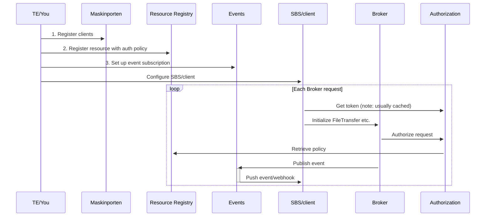



{}
This section of the documentation is a work in progress.
There are sections with missing or only partial documentation.
{}

## Developers User Guide

Since Altinn Broker is open source, you can access our code in [our public github repo](https://github.com/Altinn/altinn-broker) and build a local docker instance to test against.

We also welcome contributions to the solution.

See the [readme file at github](https://github.com/Altinn/altinn-broker/blob/main/README.md) for an introduction to Altinn 3 Broker, and how to build and run it in your dev environment.

The Repo also contains a [PostMan collection](https://github.com/Altinn/altinn-broker/blob/main/altinn3-broker-postman-collection.json) with examples.

### Overall API operation

To understand how the Broker API operates, including its dependencies and configuration steps, refer to the information below:

TODO: Replace with sequence diagram

You need to have performed the steps in [Get started](../get-started/) to setup the Access requirements.

### Authentication

Authenticate using your Maskinporten Client then acquire an Altinn Token from [Altinn Authentication](https://docs.altinn.studio/authentication/architecture/accesstoken/).
Use the Altinn Token as a Bearer token for all Broker API requests along with the APIM subscription key as a header with the key `Ocp-Apim-Subscription-Key`.

### Overall process

Overall process flow reflect the implemented reality of the [file transfer process](../../basic-concepts/#file-transfer-process-states)

All operations are asyncronous, unless otherwise noted.
As such, you should implement Event subscriptions to make your process optimized isteand of relying on polling for status.

### Set up Event Subscriptions

In order to use events/webhooks for a broker resource, you need to setup a subscription for the given resource. This subscription is used to configure the endpoint where the events published by broker end up. [You can read more about how to setup an Events subscription in Altinn Events here](https://docs.altinn.studio/events/subscribe-to-events/developer-guides/setup-subscription/).

## Important operations for a Sender

Here are the detailed operations and events you will be using as a Sender

### Initialize FileTransfer

This operation initializes a filetransfer, including validating basic metadata and autorizing if the recipient(s) specified are valid.

Once completed, the event `no.altinn.broker.filetransferinitialized` is published to the sender, indicating the File Transfer has been successfully initialized.

**Example:**

'Broker\Intitialize' in our [PostMan collection](https://github.com/Altinn/altinn-broker/blob/main/altinn3-broker-postman-collection.json)

### UploadStreamed

Upload the file data as a stream using the FileTransferId received in InitializeFileTransfer.

**Example:**

'Broker\fileTransferId\upload' in our [PostMan collection](https://github.com/Altinn/altinn-broker/blob/main/altinn3-broker-postman-collection.json)

Immediatly upon completion, event `no.altinn.broker.uploadprocessing` is published to the sender, and an async job will run to check the file data for malware.

Once upload processing has successfully completed, the event `no.altinn.broker.published` is published to both sender and recipients.

If malware was detected, the event `no.altinn.broker.uploadfailed` is instead published.

### Get FileTransfer

Get a simple overview of the file transfer with current status.

### Get FileTransferDetails

Get a detailed view of the file transfer, including detailed File Transfer and Recipient Statuses. Useful for troubleshooting, but should be used sparingly.

## Recipient's User Guide

After performing the steps in the 'Common Getting Started' guide, you are ready to start implementing.
Here are the detailed operations you will be using as a Recipient

### GetFileTransfers

This operation should be used sparingly, as you should instead focus on the webhook/Event `no.altinn.broker.published` to notify you of FileTransfers available for you.

### DownloadFile

Download the file content as a binary stream.

### ConfirmDownloaded

Must be used to confirm that the File data has been downloaded and confirmed successful.
This will update the status of the File Transfer, and potentially delete the file data according to the settings on the Broker Resource.

Publishes the event: `no.altinn.broker.downloadconfirmed`.
