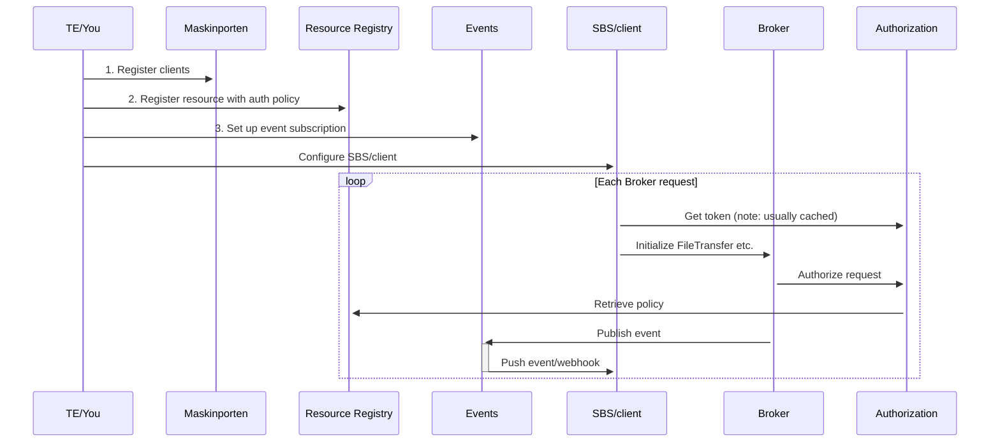



{}
This section of the documentation is a work in progress.
There are sections with missing or only partial documentation.
{}

Since Altinn Broker is open source, you can access our code in [our public github repo](https://github.com/Altinn/altinn-broker) and build a local docker instance to test against.

We also welcome contributions to the solution.

See the [readme file at github](https://github.com/Altinn/altinn-broker/blob/main/README.md) for an introduction to Altinn 3 Broker, and how to build and run it in your dev environment.

The Repo also contains a [PostMan collection](https://github.com/Altinn/altinn-broker/blob/main/altinn3-broker-postman-collection.json) with examples.

Swagger for the File Transfer API is hosted [here](/api/broker/spec/).

## Overall API operation

To understand how the Broker API operates, including its dependencies and configuration steps, refer to the information below:

TODO: Replace with sequence diagram

You need to have performed the steps in [Get started](../get-started/) to setup the Access requirements.

## Overall process

Overall process flow reflect the implemented reality of the [file transfer process](../../basic-concepts/#file-transfer-process-states)

All operations are asynchronous, unless otherwise noted.
As such, you should implement Event subscriptions to make your process optimized instead of relying on polling for status.

## Authentication

For all operations you will need to Authenticate using your Maskinporten Client then acquire an Altinn Token from [Altinn Authentication](https://docs.altinn.studio/authentication/architecture/accesstoken/).
Use the Altinn Token as a Bearer token for all Broker API requests along with the APIM subscription key as a header with the key `Ocp-Apim-Subscription-Key`.

## Set up Event Subscriptions

In order to use events/webhooks for a Broker resource, you need to setup a subscription for the given resource. This subscription is used to configure the endpoint where the events published by broker end up. [You can read more about how to setup an Events subscription in Altinn Events here](/content/events/subscribe-to-events/developer-guides/setup-subscription/).
