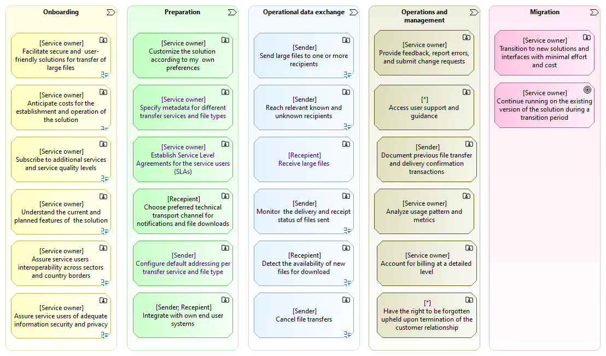

{}
Notice: Addional feature descriptions under construction.
{}

## Main Features

The following diagram lists the main features as high level user stories (epics).

Examples of how to read the diagram:

* As a Service Owner, I need (the ability) to facilitate secure and user friendly solutions for transfer of large files.
* As a Sender, I need (the ability) to send large files to one or more recipients.
