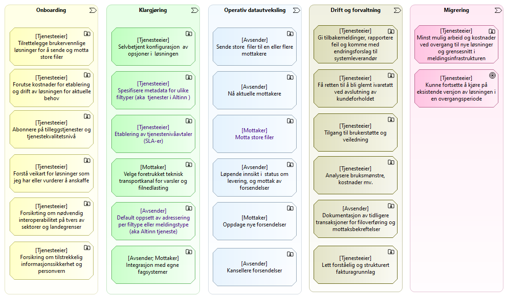

{}
Merk: Ytterligere oversikt over produktfunksjonalitet er i  arbeid.
{}

## Produktfunksjonalitet

Følgende diagram viser hovedfunksjonene som brukerhistorier på høyt nivå (epos).

Eksempler på hvordan lese diagrammet:

* Som tjenesteeier trenger jeg (evnen til) å legge til rette for sikre og 
  brukervennlige løsninger for overføring av store filer.
* Som avsender trenger jeg (evnen til) å sende store filer til en eller flere mottakere.