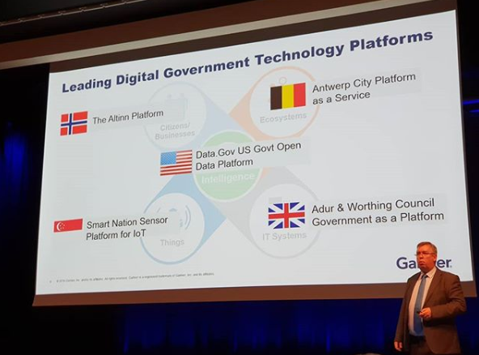

Altinn eies av [Digitaliseringsdirektoratet](https://www.digdir.no/digdir/om-digitaliseringsdirektoratet/1547) og utvikles som åpen kildekode.

Den nåværende løsningen og plattformen (Altinn II - lansert i 2010) regnes av Gartner som en
av verdens fem ledende plattformer for digitale myndigheter.

Plattformen brukes av over 90 % av den norske befolknigen og nær 100 % av alle virksomheter.  
Mer enn 65 etater, fylkeskommuner og kommuner bruker Altinn som platform for sine tjenester, og 
næringslivet rapporterer at [bruken av Altinn sparer bedrifter for over 15 milliarder per år](https://www.digdir.no/digitale-felleslosninger/altinn-gir-rekordinnsparing-naeringslivet/1912).

Det finnes nær 1000 aktive tjenester på plattformen som dekker ulike bruksscenarier.  
Eksempler på slike tjenester er skattemeldingen, rapportering av ulykker i luftfarten, meldinger fra forsvaret,
oppslag mot data i Brønnøysundregistrene og mye, mye mer.

## Konsept

Ved å bruke Altinn 3 kan etater og andre myndighetsutøvere bygge tjenester som fullverdige applikasjoner og produksjonssette
dem som containere til deres isolerte infrastruktur i skyen. Altinn Platform gir appene kjernefunksjonalitet
som lagring, autorisasjon, autentisering, tilgang på registerdatam med mer.

Infrastrukturen er svært skalerbar for å støtte de ulike behovene tjenesteeierne har, og forvaltes av DevOps-teamet hos Altinn.

Applikasjons-templaten som følger med Altinn Studio er gjort klar for de vanligste typene digitale tjenester,
noe som gjør det mulig å lage og publisere de enkleste tjenestene i løpet av timer.

Når applikasjonen er produksjonssatt til Altinn Apps er den tilgjengelig for så godt som alle privatpersoner og virksomheter i Norge.

## Hvorfor Altinn 3?

Det er mange grunner til å bruke Altinn 3 til å bygge og kjøre dine digitale tjenester.

- Applikasjonsmal som har innebygd funksjonalitet for de vanligste bruksområdene for digitale tjenester
- Lett å utvikle og kjøre applikasjoner
- Gjenbruk av data, brukergrensesnitt, APIer og funksjonalitet
- En kjent plattform for sluttbrukerne
- Svært skalerbar og sikker infrastruktur
- [Åpen kildekode](open-source)
- Tilgang til så godt som alle privatpersoner og virksomheter i Norge

## Når ble Altinn 3 lansert?

Første versjon av Altinn 3 kom i juni 2020, og de første applikasjonene på løsningen ble satt i produksjon 19. juni 2020.

## Hvordan lære mer om Altinn 3

Begynn gjerne med å lese om de ulike delløsningene i Altinn 3.  

- Altinn Studio lar deg bygge dine digitale tjenester
- Altinn Apps lar deg kjøre dine digitale tjenester
- Altinn Platform gir deg standardfunksjonalitet til bruk i dine digitale tjenester


