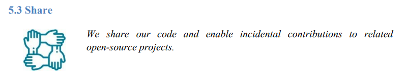

There are many who have noticed that Altinn has chosen a new and very open direction in recent years.

We've received questions about why, and thought it would be interesting that we share our thoughts on open source,
as as central national common component in Norway.

## Sharing and reuse

There are [many](https://opensource.com/life/15/12/why-open-source)
[good](https://tom.preston-werner.com/2011/11/22/open-source-everything.html)
[reasons](https://opensource.google/docs/why/) to share your code as open source.

NAV, one of the trailblazers of open source in Norway, is also repeating several of the
[same arguments](https://github.com/navikt/offentlig#retningslinjer-for-%C3%A5pen-kildekode-i-nav)
(Norwegian Only), and especially the importance of transparency and trust related to solutions financed by the public.

We applaud, when NAV writes this:

> *Solutions funded by the public should be publicly available.  
> The motivation is then not mainly reuse, although it is obviously a nice side effect.  
> The motivation is primarily openness and transparency in the digital solutions.*

But to be clear, reuse is something we in Altinn consider a *central* motivation. And we're not alone thinking like this:

- the **UK government** action plan
[Open Source, Open Standards and Re­Use](https://assets.publishing.service.gov.uk/government/uploads/system/uploads/attachment_data/file/61962/open_source.pdf)
(PDF) describes reuse as both a policy and a principle.
- **EU** has has had a clear
[open source strategy](https://ec.europa.eu/info/sites/default/files/en_ec_open_source_strategy_2020-2023.pdf) (PDF)
for a long time.

We facilitate reuse and sharing at all levels of the Altinn architecture, from [our principles](/principles)
to the entire platform and infrastructure, down to design and UI-widgets, code and configuration.

This is also one of several reasons why Altinn is now a [Digital Public Good (DPG)](https://digitalpublicgoods.net/),
where the goal is to be able to reuse everything we develop not only at national level, but also globally to
accelerate the attainment of [the sustainable development goals](https://www.undp.org/sustainable-development-goals).

We also encourage [the developers building apps](https://www.altinn.no/en/about-altinn/the-altinn-co-operation/)
using Altinn Studio to also [share their apps](../../../app/launched-apps/).
In fact, you have to do an active decision *not* to share, since sharing and reuse is central to the concept of Altinn 3.

## Cooperation

The best way to get a good collaboration across organizations and projects is openness and transparency,
that everyone can contribute, provide input, be heard, follow what's happening.

This has been a central point in the open source "revolution",
that has become the new norm for large parts of software development in the world.
There are now [40 million developers and over 28 million open repositories](https://en.wikipedia.org/wiki/GitHub) on GitHub.

Since all the tools and dependencies we use are open source on Github, we in Altinn can also follow what's happening,
and collaborate and contribute back to the software we're using.

Examples of such open source software is [.NET](https://dotnet.microsoft.com/platform/open-source),
[Kubernetes](https://github.com/kubernetes/kubernetes), [React](https://github.com/facebook/react),
[Linkerd](https://linkerd.io/) and [Gitea](https://github.com/go-gitea/gitea).
And our [issue #5992](https://github.com/Altinn/altinn-studio/issues/5992) is a good example on how we can track
and easily link to issues across software. 

And since Altinn is open source at Github, it is as easy for everyone else to do the same thing to us.
Both [creating new issues](https://github.com/Altinn/altinn-studio/issues/new/choose),
contribute in discussions or contribute code, something the label
[external-contribution-❤️](https://github.com/search?q=org%3AAltinn+label%3Aexternal-contribution-%E2%9D%A4%EF%B8%8F&type=pullrequests)
illustrates well.

## Vendor bindings

Altinn as a national common component has previously experienced major challenges by building on closed proprietary software.
Software from Adobe in Altinn 1 and from Microsoft in Altinn 2.

End-of-life for proprietary software is actually the main reason for why we had to create Altinn 3.

When building a solution on top of proprietary software, then you've lost control over your own future,
for example if the vendor chooses to phase out the product.  
If your solution is built on top of open source products then you, or anybody else, can
make a [fork](https://docs.github.com/en/get-started/quickstart/fork-a-repo) in such a situation.

Altinn 3 is therefore [based on software and libraries](../../../technology/tools/) which is open source.

We think this naturally is also very important for those who consider whether to adopt Altinn or not.

*Which bindings do we introduce to Altinn as a technical solution and to
[Digdir](https://www.digdir.no/digdir/about-norwegian-digitalisation-agency/887) as a "supplier"?* 
Even though [Altinn is a cooperation](https://www.altinn.no/en/about-altinn/the-altinn-co-operation/),
this will be an important question.

Altinn 3 is therefore completely open source with [a permissive license](https://github.com/Altinn/altinn-studio/blob/master/LICENSE.md),
and everything runs as regular [containers](https://www.docker.com/resources/what-container).

## The best tools

To develop good software, it is important to have access to good tools.

One thing that many may not think about is that when you share what you develop as open source,
many of the very best tools out there are available - for free.

*"Share, and thou will be shared with..."*

Here are some of the wonderful [SaaS](https://en.wikipedia.org/wiki/Software_as_a_service)-tools that we use:

- [GitHub](https://github.com/features) - Handling of source code, backlogs, boards, automation, CI/CD, etc.
- [ZenHub](https://www.zenhub.com/) - Epics, estimates, agile reports.
- [Cypress](https://www.cypress.io/) - Dashboards and automated UI-testing.
- [SonarCloud](https://sonarcloud.io/) - Static analysis of source code.
- [LGTM](https://semmle.com/lgtm) - Security analysis of source code.

And this is just a small selection...

Also, all tools and framework that we build Altinn 3 on top of, is open software that is also
[very popular](/technology/architecture/principles/#build-with-modern-and-popular-frameworks).

## The best people

It is a common theme that [people](https://github.com/orgs/Altinn/people) like to work with new technology and the best tools.
The best developers also prefer to work with open source, feeling that one contributes to something bigger, that one leaves a mark on the world.

In the time that has passed since we [launched Altinn 3](https://www.digdir.no/digitale-felleslosninger/altinns-nye-skyplattform-i-produksjon/1590)
(Norwegian only) in the summer of 2020, we've hired some very skilled people, and a repeating pattern in interviews and discussions is that the best
candidates are clearly expressing that they think open source is important, and that this is something they want to participate in.

We want to build a big community, where everyone can contribute, and then it is important that we have skilled and
[happy developers](https://www.techrepublic.com/article/what-makes-developers-happy-contributing-to-open-source/)
who can help make that happen.
