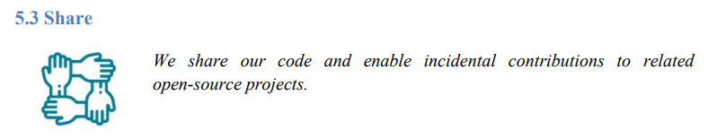

Det er flere som har fått med seg at Altinn har tatt en fundamentalt ny og åpen retning de siste årene.

Vi har fått litt spørsmål om hvorfor vi har gjort dette, og tenker det kan være interessant
at vi deler våre tanker om åpen kildekode, som en sentral nasjonal felleskomponent.

## Deling og gjenbruk

Det finnes [mange](https://opensource.com/life/15/12/why-open-source)
[gode](https://tom.preston-werner.com/2011/11/22/open-source-everything.html)
[grunner](https://opensource.google/docs/why/) til å dele kode som åpen kildekode.

[NAV](https://github.com/navikt/offentlig#retningslinjer-for-%C3%A5pen-kildekode-i-nav),
en av de virkelig store inne åpen kildekode i Norge, er også inne på flere av de samme punktene,
men særlig dette med viktigheten av gjennomsiktighet og tillit i forbindelse med løsninger finansiert av det offentlige.

Vi applauderer når NAV skriver dette:

> *Offentlig finansierte løsninger bør være offentlig tilgjengelig.  
> Motivasjonen er da ikke hovedsakelig gjenbruk, selv om det selvsagt er en heldig bieffekt.
> Motivasjonen er først og fremst åpenhet og gjennomsiktighet i de digitale løsningene.*

Gjenbruk er derimot noe vi i Altinn anser som en helt sentral motivasjon. Og vi er ikke alene om å tenke slik:

- **gov.uk** sin
[Open Source, Open Standards and Re­Use](https://assets.publishing.service.gov.uk/government/uploads/system/uploads/attachment_data/file/61962/open_source.pdf)
(PDF) beskriver gjenbruk som både en policy og et prinsipp.
- **EU** har lenge hatt en tydelig
[open source strategi](https://ec.europa.eu/info/sites/default/files/en_ec_open_source_strategy_2020-2023.pdf) (PDF)
som sier at kildekode skal deles, og ikke bare det, men at man også bør bidra tilbake.

Vi legger til rette for gjenbruk og deling på alle nivåer i arkitekturen til Altinn 3, fra [våre prinsipper](/principles)
til hele plattformen og infrastrukturen, ned til design og GUI-komponenter, kode og konfigurasjon.

Dette er også en av flere grunner til at Altinn nå er et [digitalt fellesgode (DPG)](https://digitalpublicgoods.net/),
der målsettingen er å kunne gjenbruke det vi utvikler ikke bare på nasjonalt nivå, men også globalt for å understøtte
[FNs bærekraftsmål](https://www.fn.no/om-fn/fns-baerekraftsmaal).

Vi oppfordrer også alle [de som lager tjenester](https://www.altinn.no/om-altinn/om-altinn-samarbeidet/)
med Altinn Studio til å [dele sine apper](../../../altinn-studio/news/launched-apps/), og alt er tilrettelagt for at det skjer automatisk.
Faktisk så må tjenesteeierne gjøre et aktivt valg for å ikke dele,
siden deling og gjenbruk på tvers i det offentlige er helt sentralt i Altinn 3.

## Samarbeid

Den beste måten å få til et godt samarbeid på tvers av organisasjoner og prosjekter er åpenhet og gjennomsiktighet,
at alle kan bidra, gi input, bli hørt, følge med på det som skjer.

Det er dette som har vært helt sentralt i "revolusjonen" med åpen kildekode,
som har blitt den nye normalen for store deler av programvareutvikling i verden.
Det er nå [40 millioner utviklere og over 28 millioner åpne repos](https://en.wikipedia.org/wiki/GitHub) på GitHub.

Siden alle våre verktøy og avhengigeheter ligger åpent på GitHub så kan også vi i Altinn følge med,
samarbeide og bidra tilbake til programvare som vi benytter.

Eksempler på dette er [.NET](https://dotnet.microsoft.com/platform/open-source),
[Kubernetes](https://github.com/kubernetes/kubernetes), [React](https://github.com/facebook/react),
[Linkerd](https://linkerd.io/) og [Gitea](https://github.com/go-gitea/gitea).  
Og vår [issue #5992](https://github.com/Altinn/altinn-studio/issues/5992) er et godt eksempel på hvordan vi kan spore
og enkelt lenke til saker på tvers av programvare.

Og siden Altinn er åpen kildekode på GitHub, så er det like enkelt for alle andre å gjøre det samme mot oss.
Både det å [opprette nye issues](https://github.com/Altinn/altinn-studio/issues/new/choose),
bidra i diskusjoner eller bidra med kode, noe labelen
[external-contribution-❤️](https://github.com/search?q=org%3AAltinn+label%3Aexternal-contribution-%E2%9D%A4%EF%B8%8F&type=pullrequests)
illustrerer godt.

## Leverandørbindinger

Altinn som felleskomponent har tidligere fått store utfordringer ved å basere seg på lukket proprietær programvare.
Programvare fra Adobe i Altinn 1 og fra Microsoft i Altinn 2.

End-of-life for proprietær programvare er faktisk
[hovedårsaken](https://www.digi.no/artikler/altinn-skal-aldri-mer-ga-ut-pa-dato-men-forst-ma-inntil-tusen-tjenester-skrives-om/508174)
til behovet for å lage Altinn 3.

Når du bygger en løsning på toppen av proprietær programvare så har du i praksis mistet kontroll over egen fremtid,
f.eks. om leverandøren velger å fase ut produktet.
Om man baserer seg på åpen kildekode så kan man i en slik situasjon
lage en [fork](https://docs.github.com/en/get-started/quickstart/fork-a-repo), om ikke noen andre gjør det.

Altinn 3 er derfor [basert på programvare og biblioteker](/technology/tools/) som er åpen kildekode.

Vi tenker at dette naturlig nok også er veldig viktig for de som vurderer om man skal ta i bruk Altinn.

*Hvilke bindinger innfører vi til Altinn som teknisk løsning og Digdir som "leverandør"?*
Selv om Altinn er [et samarbeid](https://www.altinn.no/om-altinn/om-altinn-samarbeidet/), så vil dette være viktige spørsmål.

Altinn 3 er derfor helt åpen kildekode med [liberal lisensiering](https://github.com/Altinn/altinn-studio/blob/main/LICENSE.md),
og alt som utvikles kjører som vanlige [containere](https://www.docker.com/resources/what-container).

## De beste verktøyene

For å utvikle god programvare så er det viktig å ha tilgang til gode verktøy.

En ting som mange kanskje ikke tenker på er at når du deler det du utvikler som åpen kildekode,
så blir mange av de aller beste verktøyene der ute tilgjengelig - helt gratis.

*"Del, og du blir delt med..."*

Her er noen av de fantastiske [SaaS](https://en.wikipedia.org/wiki/Software_as_a_service)-verktøyene som vi benytter:

- [GitHub](https://github.com/features) - Håndtering av kildekode, backlogs, boards, automatisering, CI/CD, etc.
- [ZenHub](https://www.zenhub.com/) - Epos, estimering, avhengigheter, rapporter.
- [Cypress](https://www.cypress.io/) - Dashboards og automatisert testing av GUI.
- [SonarCloud](https://sonarcloud.io/) - Statisk analyse av kildekode.
- [LGTM](https://semmle.com/lgtm) - Sikkerhetsanalyse av kildekode.

Og dette er bare et lite utvalg...  
Alle verktøy og rammeverk som vi bygger Altinn på toppen av, er åpen programvare som er
[veldig godt likt](/technology/architecture/principles/#build-with-modern-and-popular-frameworks).

## De beste folkene

Det er et gjennomgående tema at [folk](https://github.com/orgs/Altinn/people) liker å jobbe med ny teknologi og de beste verktøyene.
De beste utviklerne foretrekker også å jobbe med åpen kildekode, føle at man bidrar til noe større, at man setter spor.

I tiden som har gått siden vi [lanserte Altinn 3](https://www.digdir.no/digitale-felleslosninger/altinns-nye-skyplattform-i-produksjon/1590)
så har vi ansatt en del veldig dyktige folk, og et gjennomganstema i intervjuer og diskusjoner er at de beste
kandidatene er tydelige på at de synes det er viktig med åpen kildekode, og at dette er noe de ønsker å være med på.

Vi ønsker å bygge et stort community, der alle kan bidra, og da er det ekstremt viktig at vi har teams med dyktige og
[fornøyde utviklere](https://www.techrepublic.com/article/what-makes-developers-happy-contributing-to-open-source/) som kan hjelpe til med å få det til å skje.
