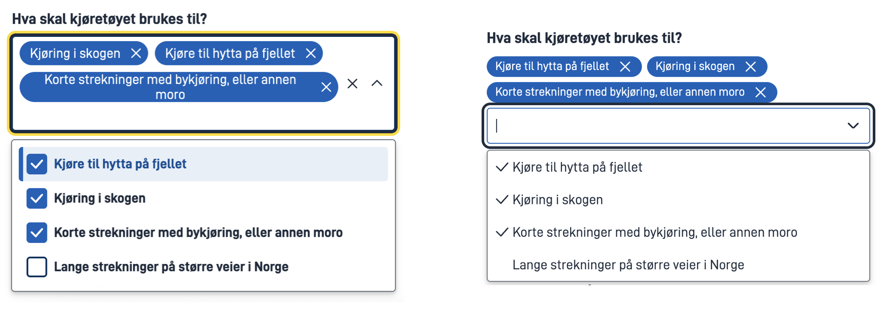
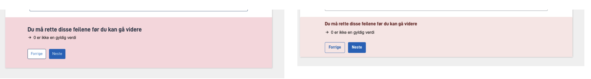
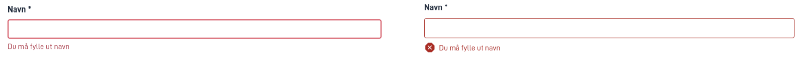

# Visual changes after the designsystem update to v1.0.0

The designsystem update to v1.0.0 introduced several visual changes to the Altinn Studio app frontend. These changes are
part of an ongoing effort to improve the user experience and align with modern design standards.

## Most noticable changes

### Multiple select component

### Validation summary

### Validation errors

## Other changes