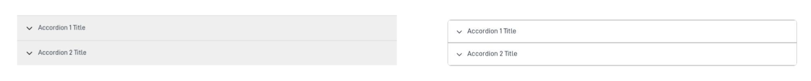
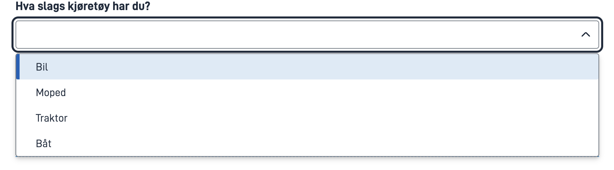

# Visuelle endringer etter oppdatering av designsystemet til v1.0.0

Endringen kommer i versjon v4.21.0 av app frontend.

Oppdateringen av designsystemet til v1.0.0 introduserte flere visuelle endringer i frontend for Altinn Studio-appen.
Disse endringene er en del av et pågående arbeid med å forbedre brukeropplevelsen og tilpasse seg moderne designstandarder.

## Mest merkbare endringer

### Multiple select

### Valideringsoppsummering

### Valideringsfeil

## Andre endringer

### Accoridon

### Dropdown

### Knapper

### Radioknapper

