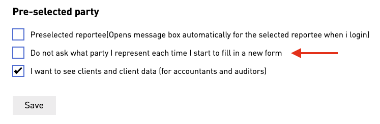
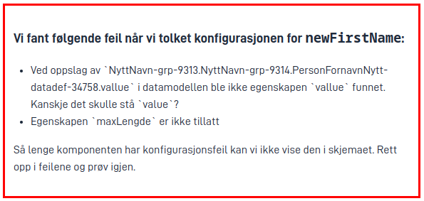

App frontend v4 brings with it some new features and breaking changes. This document aims to give an overview of the
changes and how they may affect your app. As always, with a new major version, we recommend that you test your app
thoroughly before deploying to production.

{}
Make sure to read through this page before you continue with the [migration routine](migrating-from-v3), and
make the necessary changes throughout your app.
{}

{}
App frontend v4 is still in its early stages with release candidates. While we recommend you to try it out, test
your app(s) with it, and build your future apps with v4, but we do not recommend you to deploy it to production at
this stage. We will update this page with more as it arrives, and there may arrive more breaking changes in future
release candidates before the final stable release.
{}

## Requires backend version 8.0.0

App frontend v4 requires at least version 8.0.0 of the `Altinn.App.Core` and `Altinn.App.Api` nuget packages.
See the [overview of changes in backend v8](/community/changelog/app-nuget/v8) for more information on how to upgrade.

## Using layout sets is now required

Layout sets is a way to support multiple forms in a single application.
This entails a slightly different folder structure in the `ui` folder of your app, as well as a new `layout-sets.json` file.
This used to be optional, but as of v4 it is required, even for apps with only a single data step.
See the [documentation on layout sets](/app/development/ux/pages/layout-sets) for more information.

## Defining a custom receipt is now done with a layout set

{}
This change was introduced in `v4.0.0-rc3`. It was not present in `v4.0.0-rc1` or `v4.0.0-rc2`. In these previous versions,
a custom receipt was not supported.
{}
A custom receipt view can now be created in the same way as all other form pages.

To create a custom receipt view, you create a new layout set. This layout set works exactly like
all other page types. Within the layout set, you can create a layouts folder and here define all the pages you want to
include in the receipt view (Yes, the receipt view supports multiple pages!). Inside the layout set, you must also create
a `Settings.json`, where you can define the order of the pages in the receipt view.

For the app to understand that this layout set should be used as a receipt view, you must refer to the name of the layout set
in `layout-sets.json`. Add a new layout set with `id` that refers to the name of your layout set, and add
the key value `"CustomReceipt"` in the `tasks` array of the layout set. In addition, you can specify which data model
should be available in the receipt view by adding the key `dataType` with the name of the data model you want to support.

Here is a complete example where we have a layout set named custom-receipt that will be used as a receipt view:




```
|- App/
  |- ui/
    |- layout-sets.json
    |- custom-receipt/
      |- layouts/
        |- page1.json
        |- page2.json
      |- Settings.json
```








App/ui/layout-sets.json


```json {hl_lines=[4,6]}
{
  "$schema": "https://altinncdn.no/toolkits/altinn-app-frontend/4/schemas/json/layout/layout-sets.schema.v1.json",
  "sets": [
    {
      "id": "custom-receipt",
      "dataType": "fields",
      "tasks": ["CustomReceipt"]
    }
  ]
}
```








App/ui/custom-receipt/Settings.json


```json
{
  "$schema": "https://altinncdn.no/toolkits/altinn-app-frontend/4/schemas/json/layout/layoutSettings.schema.v1.json",
  "pages": {
    "order": ["page1", "page2"]
  }
}
```




## AddressComponent has been renamed to Address

{}
This change was introduced in `v4.0.0-rc2`. It was not present in `v4.0.0-rc1`, so the component was still called
`AddressComponent` in that release.
{}

In the layout files, the `AddressComponent` component has been renamed to `Address`. Our upgrade tool will rename
this for you automatically, but if you are migrating manually you will have to do this yourself.

## Language and text resource changes

The language system has that handles internal texts and app-specific text resources has been rewritten and improved.
It should work mostly the same as before but there are a few subtle changes that may affect your app:

- Previously, when referring to a path in the data model which resulted in a null value, the full path would be shown
  instead for most components. However, in options from repeating groups it would instead show an empty string in place
  of the null value. This has been changed so that the full path is shown in all cases instead.
- To alleviate the problem of referring to null values, a new `defaultValue` property has been added to the text
  resources that, if set, will be shown instead of the data model path.
  See the [documentation on text resources](/app/development/ux/texts/#default-value) for more information.
- Variables in text are now supported for items in nested repeating groups. Previously only items in top-level repeating groups
  were supported in text resource variables.
- Using `dataModel.default` as the data source in text resources is no longer recommended. Instead, refer to the
  specific data type like this: `dataModel.myDataModel`. The frontend will now automatically retrieve the data model
  it needs when a text resource is displayed anywhere on the page, but `dataModel.default` will only work when rendering
  a form, as it will use the default data model for that form. We're planning to add support for multiple data models
  in one form in the future, and at that point there will be no concept of a default data model.

## Most users will be prompted for party each time

In the Altinn profile it was possible to change a setting to 'not be prompted for party each time'. This setting was
mistakenly never read by app-frontend, so we failed to respect it. The default setting in Altinn profile is
_to be prompted_ for a party each time, so in v4 we changed the default behaviour of app-frontend to match the
setting in Altinn profile. This means that most users will be prompted for party each time they start an app, unless
they have changed the setting in Altinn profile.

The setting can be found under **Advanced settings** in the Altinn profile:


Unless the user changes this setting, they will be prompted with the following page each time they start a new instance:


## Tracks are no longer supported

Showing and hiding pages using [tracks](/app/development/ux/pages/tracks/) (calculate page order) is no longer supported.
This also means that the trigger `calculatePageOrder` no longer has any effect and should be removed from any components where it is used.
Instead, you should use dynamic expressions on the `hidden` property of a layout page to determine whether pages should be visible or hidden.

To opt-in for an automatic AI-generated Pull Request to help you migrate from the old tracks feature, see the [Opt-in to Altinn AI for tracks migration](/community/changelog/app-frontend/v4/migrating-from-v3/#opt-in-to-altinn-ai-for-tracks-migration).

See the [documentation on dynamic expressions](/app/development/logic/expressions/#showhide-entire-pages) for more information.

## Data model schema validation works for more data models

The form data gets validated against the data model schema to show validation messages to the user filling out the form.
There was a bug in v3 that caused this validation to not happen at all for certain data model structures.
This has been now been fixed, but is a breaking change since if you previously did not get any schema validation errors, you may suddenly see them now.
If this was the case you should test your app to make sure validation works as expected.

## Support for `number`, `integer` and `boolean` and other data types

One of the new features is full support for non-string data types in the data model. This means that you can now have
data model fields of type `number`, `boolean`, and bind them to components. For example, if you bind
a `Checkboxes` component to a `boolean` field, and provide an options list with the strings `"true"` and `"false"`, the
frontend will convert the strings to booleans.

If you bind an `Input` component to a `number` field, the frontend will convert the string to a number while the user
is typing. For the best possible user experience, set up [number formatting](/app/development/ux/styling/#formatting-numbers)
on the `Input` component.

**Note:** If you have set up a `RuleHandler.js` file in your app, you may need to update it to handle the new data types.
In cases where the `RuleConfiguration.json` file specified a path that pointed to a `number` or `boolean` field,
the `RuleHandler.js` file would previously receive a string value. This is no longer the case, and
code in `RuleHandler.js` should be updated accordingly.

**Note:** In addition to all of this, the app frontend now properly supports objects and `null` values. This should
not affect most apps, but it might be of interest when writing data processor code on the backend. If your data model
initializes an object, even if empty, the app-frontend will now preserve that object in later communication with the
backend. Previously, app-frontend would remove empty objects from the data model, leading to data processors
having to re-initialize the object on the backend every time. Please note that app-frontend does not initialize
objects for you the first time, so you still need to do that in your data model or data processor code.

## The `saveWhileTyping` property now only accepts numbers

The `saveWhileTyping` property on the `Input` component and other Input-like components used to accept a boolean value
for turning off saving while typing. In v4, saving while typing is always enabled, but it is still possible to
delay saving by setting `saveWhileTyping` to a number larger than 400 (our default debounce time in milliseconds).

When delaying saving, we may still save the data to the backend before that time, for example when the user navigates
away from the field and starts typing in a new field (with a lower, or default `saveWhileTyping` value).

If your app relied on disabling `saveWhileTyping` to ensure your custom data processor was not called too often
(as we've often seen done when a change in one field triggers an API call), you should consider making the expensive
action in your data processor a custom action instead, via adding
a [CustomButton component](/app/development/ux/components/custombutton/) nearby the field. This way the user controls
when the action is triggered, not our automatic saving functionality.

## Components will not show up if they contain configuration errors

Because of the support for other data types, we now have to be more strict about the configuration of components,
as the frontend has to make sure it is able to look up the data model value expected for a component in order to save
data into it. Previously the app-frontend would assume data model bindings were correct, and in combination with the
backend invalid bindings would result in data being lost.

To be on the safer side, components will now be replaced with an error message if they contain configuration errors,
including invalid data model bindings. These error messages will only appear in development mode (i.e. in a test
environment, or when running locally). In production, it will appear as if invalid components are hidden.

You should thoroughly test your app to make sure that components display correctly and that all data model bindings
are correct. Testing this should include opening repeating groups and triggering conditions to un-hide
hidden components.

If you get an error message for an invalid binding you disagree with, please check that the data model `*.schema.json`
file is up-to-date with the latest changes to the data model. Do not hesitate to contact us if you need help with this.



## The group component has been split into multiple components

The different methods of configuring the `Group` component have been split into separate components.

{}

- The group component is now only used to group components together and provide them with an
  accessible top level title and description as well as optionally visually grouping the items together by using `"groupingIndicator"`.
- After the split, invalid configurations for a `Group` will be shown as an error message. Consider if you want to use
  one of the other group components instead. A commonly confused configuration is using `"dataModelBindings"` on a
  `Group` component, which is not supported. The group itself does not bind to data, only its children may.

{}

{}

- Severity indicators (the icons and meaning bearing colors) have been removed, the default color (blue) is used. This
  is done since the display of important information should be handled with Alert and its meaning bearing colors and icons.
- `showGroupingIndicator` has changed name to `"groupingIndicator"`, and has been changed from a boolean to an enum of
  `"panel"` or `"indented"`. Where `"indented"` behaves like the old `"showGroupingIndicator": true`
- Using the panel styling is now achieved by setting `"groupingIndicator"` to `"panel"`.

Example of old to new config:

```json
{
  "id": "my-id",
  "type": "Group",
  "textResourceBindings": {
    "title": "My title",
    "description": "My description"
  },
  "panel": {
    "variant": "info",
    "showIcon": false
  },
  "children": ["some-child-id", "some-other-child-id"]
}
```

-->

```json
{
  "id": "my-id",
  "type": "Group",
  "textResourceBindings": {
    "title": "My title",
    "description": "My description"
  },
  "groupingIndicator": "panel",
  "children": ["some-child-id", "some-other-child-id"]
}
```

{}

{}

- Repeating group is no longer configured with `"type": "Group"` and a `maxCount` greater than 1, but with its own
  type; `"RepeatingGroup"`
- `"maxCount"` is no longer required to create a repeating group, but is still able to be used to restrict the maximum
  number of addable rows.
- `edit.filter` is no longer supported, but the same functionality (or better) can be achieved by using the
  existing `hiddenRow` property with [expressions](/app/development/logic/expressions).

Example of old to new config:

```json
{
  "id": "my-id",
  "type": "Group",
  "maxCount": 99,
  "textResourceBindings": {
    "title": "My title"
  },
  "dataModelBindings": {
    "group": "Datamodel.MyGroup"
  },
  "children": ["some-child-id", "some-other-child-id"]
}
```

-->

```json
{
  "id": "my-id",
  "type": "RepeatingGroup",
  "textResourceBindings": {
    "title": "My title"
  },
  "dataModelBindings": {
    "group": "Datamodel.MyGroup"
  },
  "children": ["some-child-id", "some-other-child-id"]
}
```

{}

{}

- The Likert component is no longer configured using a `"Group"` component with `"edit": {"mode": "likert"}` and a separate
  `"Likert"` component as a child of the group that handles the possible answers to the questions. It is now configured with
  a single component using `"type": "Likert"`
- The `"filter"` property have been moved out of the `"edit"` property as the edit property has been removed. This is done
  because the filter property was the only one that was valid for the likert component, and the likert does not have an edit functionality.
- New `textResourceBindings` has been added to control the texts available on the likert questions.
  - `"questions"` is used for the question labels themselves.
  - `"questionDescriptions"` is used for the description of the questions, displayed beneath each question.
  - `"questionHelpTexts"` is used for the help text of the questions, displayed after each question.

Example of old to new config:

```json
{
  "id": "my-id",
  "type": "Group",
  "maxCount": 99,
  "textResourceBindings": {
    "title": "My title",
  },
  "dataModelBindings": {
    "group": "Questions"
  },
  "children": [
    "my-likert-id"
  ],
  "edit": {
    "mode": "likert",
    "filter": [
       {
         "key": "start",
         "value": "0"
       },
       {
         "key": "stop",
         "value": "3"
       }
    ],
  }
},
{
  "id": "my-likert-id",
  "type": "Likert",
  "textResourceBindings": {
    "title": "dynamic-text-resource-binding-title",
  },
  "dataModelBindings": {
    "simpleBinding": "Questions.Answer"
  },
  "options": "optionsId"
}

```

-->

```json
{
  "id": "my-likert-id",
  "type": "Likert",
  "textResourceBindings": {
    "title": "My title",
    "questions": "dynamic-text-resource-binding-title"
  },
  "dataModelBindings": {
    "questions": "Questions",
    "answer": "Questions.Answer"
  },
  "options": "optionsId",
  "filter": [
    {
      "key": "start",
      "value": "0"
    },
    {
      "key": "stop",
      "value": "3"
    }
  ]
}
```

{}

{}

- This feature has been removed in favour of code maintenance because it is not used anywhere.

{}

## Title and description changes for Groups

The `title` attribute in `textResourceBindings` for the `RepeatingGroup` component previously only applied
to the title shown above each row in the summary view of the repeating group. This attribute is now only used as the
title for the repeating group in the form view. This means that the title will now be shown above the repeating group in
the form view if it has been set.

The `summaryTitle` attribute in `textResourceBindings` for the `RepeatingGroup` component will override the `title` and
is used for displaying the title above each row in the summary view of the repeating group.

The `body` attribute in `textResourceBindings` for the `Group` component and `RepeatingGroup` component is now called
`description` in order to be more consistent with the rest of the components.

## Validation triggers have been replaced

The concept of triggering validations has been removed in favor of keeping the validations in sync with the data model.
Instead of controlling when validations are triggered, you now control when validations are displayed to the user.
This functions more or less the same as before, but the configuration has been changed.

This change also has the advantage that the need for `*FIXED*` validations no longer exists, as a
`IFormDataValidator` in your custom backend code can now control when it should run, and when it runs all its validation
messages are treated as one _group_. This means that if you have a validation that checks the value of _another field_,
or multiple fields at once, the validation message will disappear in frontend when the validation message is no longer
added to the list of validation messages in the backend - even if another component than the validation message target
was the one that changed.

{}

The old configuration for triggering validation on page change was the following:

```json {linenos=false,hl_lines=[5]}
{
  "id": "nav-buttons1",
  "type": "NavigationButtons",
  "textResourceBindings": {...},
  "triggers": ["validatePage"]
}
```

Where the trigger could be one of: `validatePage | validateAllPages | validateCurrentAndPreviousPages`.

To achieve the same result in v4, you instead use the new `validateOnNext` property:

```json {linenos=false,hl_lines=[5,6,7,8]}
{
  "id": "nav-buttons1",
  "type": "NavigationButtons",
  "textResourceBindings": {...},
  "validateOnNext": {
    "page": "current",
    "show": ["All"]
  }
}
```

Where `page` can be one of: `current | all | currentAndPrevious`. And `show` contains a set of validation types to check; this can be one or more of:

- `Schema`
- `Component`
- `Expression`
- `CustomBackend`
- `Required`
- `AllExceptRequired`
- `All`

Note that there is also a new `validateOnPrevious` property, which works the same way as `validateOnNext`. Equivalently, for the `NavigationBar` component, there is a new `validateOnForward` and `validateOnBackward` property.

{}

{}

The old configuration for triggering validation when saving a repeating group row was the following:

```json {linenos=false,hl_lines=[7]}
{
  "id": "repeating-group",
  "type": "Group",
  "children": [...],
  "maxCount": 99,
  "dataModelBindings": {...},
  "triggers": ["validateRow"],
  ...
}
```

To achieve the same result in v4, you instead use the new `validateOnSaveRow` property:

```json {linenos=false,hl_lines=[7]}
{
  "id": "repeating-group",
  "type": "Group",
  "children": [...],
  "maxCount": 99,
  "dataModelBindings": {...},
  "validateOnSaveRow": ["All"],
  ...
}
```

Where `validateOnSaveRow` contains a set of validation types to check; this can be one or more of:

- `Schema`
- `Component`
- `Expression`
- `CustomBackend`
- `Required`
- `AllExceptRequired`
- `All`

{}

{}

The old configuration for single field validation was the following:

```json {linenos=false,hl_lines=[6]}
{
  "id": "some-input-field",
  "type": "Input",
  "textResourceBindings": {...},
  "dataModelBindings": {...},
  "triggers": ["validation"]
},
```

To achieve the same result in v4, you instead use the new `showValidations` property:

```json {linenos=false,hl_lines=[6]}
{
  "id": "some-input-field",
  "type": "Input",
  "textResourceBindings": {...},
  "dataModelBindings": {...},
  "showValidations": ["AllExceptRequired"]
},
```

Where `showValidations` contains a set of validation types to check; this can be one or more of:

- `Schema`
- `Component`
- `Expression`
- `CustomBackend`
- `Required`
- `AllExceptRequired`
- `All`

This causes validations to become visible immediately when they occur.
Because of this, you may want to make sure that any custom validation code you have written does not produce a validation error when the field is empty,
as this will cause the validation to be shown immediately when the user enters the page.
If leaving the field empty is invalid, please mark the field as required instead of validating that with custom code.

**Note**: `"showValidations": ["AllExceptRequired"]` is the default value if the property is not set.
Meaning that all validations except for `Required` valdiations will be shown immediately.
This also includes any custom validations implemented in the backend which previously needed `"triggers": ["validation"]` to be set on the component.
To avoid showing certain types of validations immediately, you can override the `showValidations` property on the component.

{}

## AttachmentList config changes

The `AttachmentList` component has undergone updates in v4 to address two key issues:

### 1. Enhanced Attachment Display

Previously, the AttachmentList could only show either PDFs or other attachments.
In version 4, it has been changed to show both PDFs and other attachments simultaneously.

Changes to configurations:\
The `includePDF` property has been removed. It was previously used to display generated PDF's,
but when set to `true`, it excluded all other attachments. Now the AttachmentList can display both PDF's and other attachments by using one of the following configurations:

- `"dataTypeIds": ["include-all"]` - This is a new property and will display all data types including PDF's.
- `"dataTypeIds": ["fileUpload-changename", "ref-data-as-pdf"]` - This will display both PDF's and other attachments that are specified, in this case the data type `fileUpload-changename`.

### 2. Displaying Attachments from other process tasks

Previously, the AttachmentList was limited to displaying attachments solely from the current process task, which was not optimal.
This limitation was particularly noticeable when the component was used in the receipt page, which is displayed only after the last process task.

Changes to configurations:\
Now, by default, the AttachmentList will display attachments from other process tasks as well.
If `dataTypeIds` is undefined or an empty array, it will show all attachments (excluding PDFs) from different process tasks.
Alternatively, configuring `dataTypeIds` as `["current-task"]` will yield the same behavior but for the current task only.
