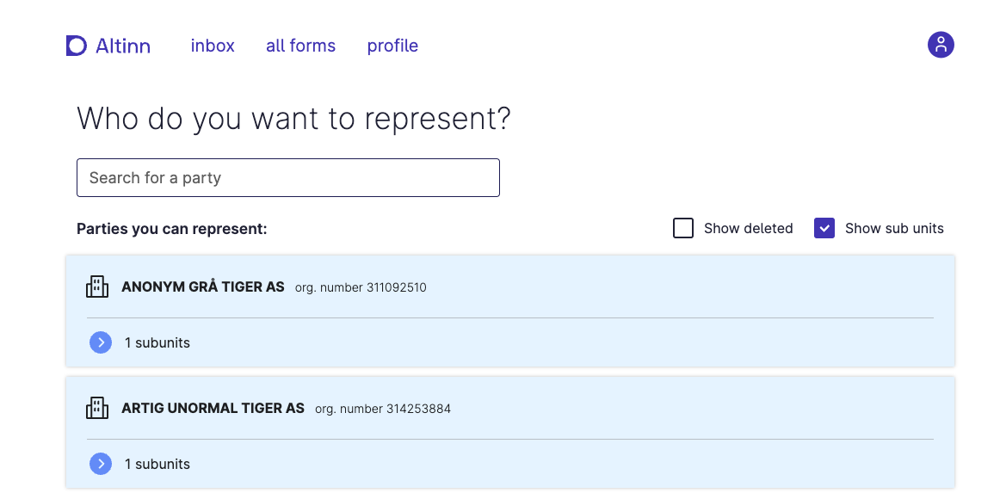

App frontend v4 brings with it some new features and breaking changes. This document aims to give an overview of the
changes and how they may affect your app. As always, with a new major version, we recommend that you test your app
thoroughly before deploying to production.

### Requires backend version 8.0.0
- https://github.com/Altinn/app-frontend-react/pull/1450
- 'required' validations no longer being filtered
- and more?

### Language rewrite
- https://github.com/Altinn/app-frontend-react/pull/1444
- New defaultValue feature helps (https://github.com/Altinn/app-frontend-react/pull/1441)
- Support for variables in deeply nested groups

### Most users will be prompted for party each time
In the Altinn profile it was possible to change a setting to 'not be prompted for party each time'. This setting was
mistakenly never read by app-frontend, so we failed to respect it. The default setting in Altinn profile is
_to be prompted_ for a party each time, so in v4 we changed the default behaviour of app-frontend to match the
setting in Altinn profile. This means that most users will be prompted for party each time they start an app, unless
they have changed the setting in Altinn profile.

The setting can be found under __Advanced settings__ in the Altinn profile:


Unless the user changes this setting, they will be prompted with the following page each time they start a new instance:


### TODO: Font changed to Inter
- https://github.com/Altinn/app-frontend-react/pull/1448
- Especially important look over fixed-length Input fields (personnummer, etc.)

### TODO: Inconsistent prev/next buttons
- https://github.com/Altinn/app-frontend-react/pull/1446
- Nothing should have changed, but apps should be re-tested

### TODO: Validations against dataModelBindings
- https://github.com/Altinn/app-frontend-react/issues/1463
- Some apps may suddenly get schema-validation again

### Title and description changes for Groups
- https://github.com/Altinn/app-frontend-react/pull/1693
The `title` attribute in `textResourceBindings` for the `Group` component as a repeating group previously only applied
to the title shown above each row in the summary view of the repeating group. This attribute is now only used as the
title for the repeating group in the form view. This means that the title will now be shown above the repeating group in
the form view if it has been set.

The `summaryTitle` attribute in `textResourceBindings` for the `Group` component is now used for displaying the title
above each row in the summary view of the repeating group.

The `body` attribute in `textResourceBindings` for the `Group` component is now called `description` in order to be
more consistent with the rest of the components.

### Validation triggers have been replaced

- https://github.com/Altinn/app-frontend-react/pull/1719

The concept of triggering validations has been removed in favor of keeping the validations in sync with the data model.
Instead of controlling when validations are triggered, you now control when validations are displayed to the user.
This functions more or less the same as before, but the configuration has been changed:

{}

The old configuration for triggering validation on page change was the following:

```json {linenos=false,hl_lines=[5]}
{
  "id": "nav-buttons-1",
  "type": "NavigationButtons",
  "textResourceBindings": {...},
  "triggers": ["validatePage"]
}
```

Where the trigger could be one of: `validatePage | validateAllPages | validateCurrentAndPreviousPages`.

To achieve the same result in v4, you instead use the new `validateOnNext` property:

```json {linenos=false,hl_lines=[5,6,7,8]}
{
  "id": "nav-buttons-1",
  "type": "NavigationButtons",
  "textResourceBindings": {...},
  "validateOnNext": {
    "page": "current",
    "show": ["All"]
  }
}
```

Where `page` can be one of: `current | all | currentAndPrevious`. And `show` contains a set of validation types to check; this can be one or more of:

- `Schema`
- `Component`
- `Expression`
- `CustomBackend`
- `Required`
- `AllExceptRequired`
- `All`

Note that there is also a new `validateOnPrevious` property, which works the same way as `validateOnNext`. Equivalently, for the `NavigationBar` component, there is a new `validateOnForward` and `validateOnBackward` property.

{}

{}

The old configuration for triggering validation when saving a repeating group row was the following:

```json {linenos=false,hl_lines=[7]}
{
  "id": "repeating-group",
  "type": "Group",
  "children": [...],
  "maxCount": 99,
  "dataModelBindings": {...},
  "triggers": ["validateRow"],
  ...
}
```

To achieve the same result in v4, you instead use the new `validateOnSaveRow` property:

```json {linenos=false,hl_lines=[7]}
{
  "id": "repeating-group",
  "type": "Group",
  "children": [...],
  "maxCount": 99,
  "dataModelBindings": {...},
  "validateOnSaveRow": ["All"],
  ...
}
```

Where `validateOnSaveRow` contains a set of validation types to check; this can be one or more of:

- `Schema`
- `Component`
- `Expression`
- `CustomBackend`
- `Required`
- `AllExceptRequired`
- `All`

{}

{}

The old configuration for single field validation was the following:

```json {linenos=false,hl_lines=[6]}
{
  "id": "some-input-field",
  "type": "Input",
  "textResourceBindings": {...},
  "dataModelBindings": {...},
  "triggers": ["validation"]
},
```

To achieve the same result in v4, you instead use the new `showValidations` property:

```json {linenos=false,hl_lines=[6]}
{
  "id": "some-input-field",
  "type": "Input",
  "textResourceBindings": {...},
  "dataModelBindings": {...},
  "showValidations": ["AllExceptRequired"]
},
```

Where `showValidations` contains a set of validation types to check; this can be one or more of:

- `Schema`
- `Component`
- `Expression`
- `CustomBackend`
- `Required`
- `AllExceptRequired`
- `All`

This causes validations to become visible immediately when they occur.
Because of this, you may want to make sure that any custom validation code you have written does not produce a validation error when the field is empty, as this will cause the validation to be shown immediately when the user enters the page.
If leaving the field empty is invalid, please mark the field as required instead of validating that with custom code.

{}

There are also some changes to the default behavior of validations.
Previously, `Schema` and `Component` validations were implicitly triggered whenever the data changed.
In v4, these validations are not implicitly set to be always visible. If you want to keep the old behavior,
where these validations were shown immediatly while typing, you need to set `"showValidations": ["Schema", "Component"]` on those components.
