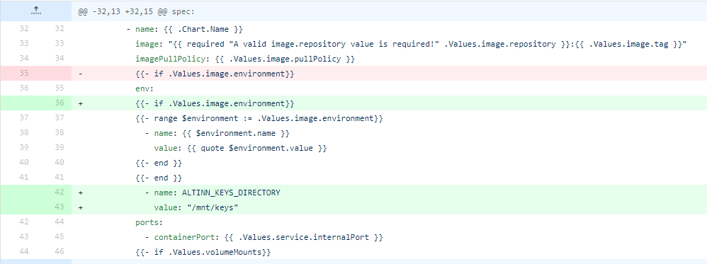
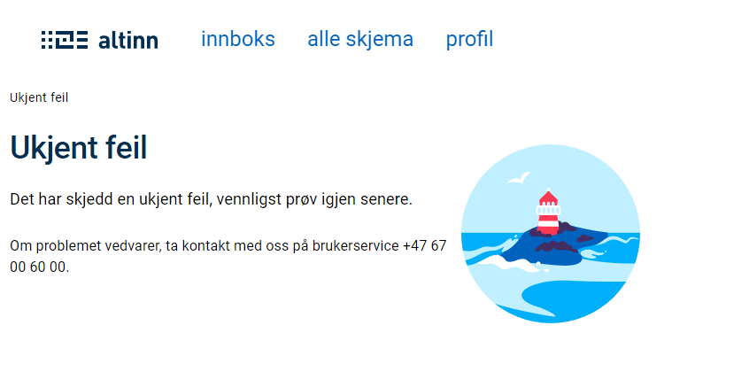
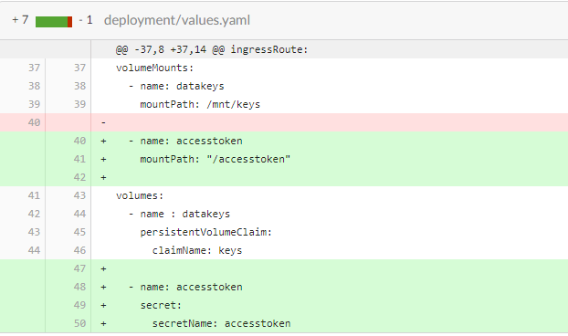
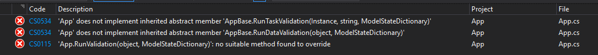

## Support for auto delete when process ends

For some apps, the fact that there's traces of it in the user archive (and the data is stored) is a problem (e.g. for
security reasons).
The Altinn.App.* packages has been updated to support auto delete when process ends. This is introduced with version
2.0.0-alpha of the packages.

Updating to this version will require changes in multiple files.
1. Updated package dependencies
 Navigate to you application repository and find `App.csproj` in the `App` folder.
   Update nuget dependencies in `App.csproj` to version 2.0.0.

    ```xml
    <PackageReference Include="Altinn.App.Api" Version="2.0.0" />
    <PackageReference Include="Altinn.App.Common" Version="2.0.0" />
    <PackageReference Include="Altinn.App.PlatformServices" Version="2.0.0" />
    ```

2. Changes in App.cs
   
    Change constructor:

      ```cs
      public App(
      IAppResources appResourcesService,
      ILogger<App> logger,
      IData dataService,
      IProcess processService,
      IPDF pdfService,
      IProfile profileService,
      IRegister registerService,
      IPrefill prefillService
      ) : base(appResourcesService, logger, dataService, processService, pdfService, prefillService)
      ```
      to:
      ```cs
      public App(
        IAppResources appResourcesService,
        ILogger<App> logger,
        IData dataService,
        IProcess processService,
        IPDF pdfService,
        IProfile profileService,
        IRegister registerService,
        IPrefill prefillService,
        IInstance instanceService
        ) : base(appResourcesService, logger, dataService, processService, pdfService, prefillService, instanceService)
      ```


## Designer moves FormLayout.json from app/ui to app/ui/layouts
In order to support multiple pages in an app we have done some restructuring of the app-template. When you are doing changes in Altinn Designer for your app the updated FormLayout.json will be put under the new structure.
For apps that have nuget references to `Altinn.App.Api`, `Altinn.App.Common`, and `Altinn.App.PlatformServices` with versions below version `1.2.0` this will make the app unable to find the FormLayout.json on the network call against the app.
1. Navigate to you application repository and find `App.csproj` in the `App` folder.
   Update nuget dependencies in `App.csproj` to version 1.2.0-alpha or newer. We recommend updating to latest version which is currently at `1.3.1`.

    ```xml
    <PackageReference Include="Altinn.App.Api" Version="1.3.1" />
    <PackageReference Include="Altinn.App.Common" Version="1.3.1" />
    <PackageReference Include="Altinn.App.PlatformServices" Version="1.3.1" />
    ```
2. If there are some breaking changes when updating the nuget-version this should be documented below. 

## Added registration of events to the new Events component

The Altinn.App.* packages has been updated to work with the new Events component in Altinn. This is introduced with version 1.1.11-alpha of the packages.

Updating to this version will require changes in multiple files. 

1. Updated package dependencies
 Navigate to you application repository and find `App.csproj` in the `App` folder.
   Update nuget dependencies in `App.csproj` to version 1.1.11-alpha or newer..

    ```xml
    <PackageReference Include="Altinn.App.Api" Version="1.1.11-alpha" />
    <PackageReference Include="Altinn.App.Common" Version="1.1.11-alpha" />
    <PackageReference Include="Altinn.App.PlatformServices" Version="1.1.11-alpha" />
    ```

2. Changes in Startup.cs:

    ```cs
    services.AddHttpClient<IEvents, EventsAppSI>();
    ```

    Startup already have multiple similar lines with calls to AddHttpClient. Add the new line anywhere among them.

    This will probably also require two new lines at the top of the file:

    ```cs
    using Altinn.App.PlatformServices.Implementation;
    using Altinn.App.PlatformServices.Interface;
    ```

3. Changes in appsettings.json:

A new property has been included in called `PlatformSettings.ApiEventsEndpoint`.
The value here is used for local test and will be replaced during deploy to test and production environments.

  ```json
  "PlatformSettings": {
    ...
      "ApiEventsEndpoint": "http://localhost:5101/events/api/v1/"
  }
|```

The default behaviour of the logic is to not send events. To override this there is a new setting called `AppSettings:RegisterEventsWithEventsComponent`.
Update the appsettings file by adding an entry in the AppSettings section:

  ```json
  "AppSettings": {
    ...
    "RegisterEventsWithEventsComponent": false
  }
  ```

Change the setting to true if the app should create and send events. Please note that the feature is under continued development and still considered experimental.

## Support for deleting instances from endpoint in app

[#4871](https://github.com/Altinn/altinn-studio/issues/4871) was fixed with in release of 1.1.10-alpha of the app nugets.
**This change only affects users and app owners that try to delete an instance.**

### Errors
403 response when trying to delete an instance using the endpoint exposed in the application.

### How to fix

If you are not using 1.1.10-alpha or above. Start by upgrading the nuget references in you application.
If you are running a newer release, skip to step 2.

1. Navigate to you application repository and find `App.csproj` in the `App` folder.
   Update nuget dependencies in `App.csproj` to version 1.1.10-alpha or newer..

    ```xml
    <PackageReference Include="Altinn.App.Api" Version="1.1.10-alpha" />
    <PackageReference Include="Altinn.App.Common" Version="1.1.10-alpha" />
    <PackageReference Include="Altinn.App.PlatformServices" Version="1.1.10-alpha" />
    ```

2. Navigate to you application repository and find `Startup.cs` in the `App` folder.
   Add a new line to the `services.AddAuthorization`-section. 
   The following should be added

   `options.AddPolicy("InstanceDelete", policy => policy.Requirements.Add(new AppAccessRequirement("delete")));`

   and the final result should look like this

   ```cs
     services.AddAuthorization(options =>
            {
                options.AddPolicy("InstanceRead", policy => policy.Requirements.Add(new AppAccessRequirement("read")));
                options.AddPolicy("InstanceWrite", policy => policy.Requirements.Add(new AppAccessRequirement("write")));
                options.AddPolicy("InstanceDelete", policy => policy.Requirements.Add(new AppAccessRequirement("delete")));
                options.AddPolicy("InstanceInstantiate", policy => policy.Requirements.Add(new AppAccessRequirement("instantiate")));
                options.AddPolicy("InstanceComplete", policy => policy.Requirements.Add(new AppAccessRequirement("complete")));
            });
   ```

3. If deleting instances should be available for the application owner this must be explicitly stated in the application
   policy.
   The required rule is
   documented [here](https://altinn.github.io/docs/altinn-studio/app-creation/autorisasjon/regelbibliotek/#org-can-delete-an-instance-of-orgapp-in-any-task-or-event)
   .

## Update path of Data Protection Keys for Apps

[#4483](https://github.com/Altinn/altinn-studio/issues/4843) changed the way we use data protection keys in order to improve the support for running locally. These keys are used in [XSRF-protection](https://docs.microsoft.com/en-us/aspnet/core/security/anti-request-forgery?view=aspnetcore-3.1).
When you are running apps locally, we are using the default behaviour (directory under current user) for .Net Core. The path is passed with an environment variable when running in an apps cluster. This change requires the deployment.yaml file to be updated with the correct variable.

**The change affects all application created in Altinn Studio before 30.09.2020 using Altinn.App.PlatformServices 1.1.8-alpha and above**

### Errors

User may experience errors posting data when the app is restarted or when multiple replicas are used.

### How to fix

You need to add the environment variable in the `deployment.yaml` file. If you have not done any changes to the file previously, you can copy the file from [here](https://github.com/Altinn/altinn-studio/blob/master/src/Altinn.Apps/AppTemplates/AspNet/deployment/templates/deployment.yaml), otherwise you need to update the file directly. Both the name of the environment variable and the value must be set as follows:

```yaml
env:
  - name: ALTINN_KEYS_DIRECTORY
    value: "/mnt/keys"
```




## Build pipeline failed on task: Build and push docker image to acr

A namespace was renamed in `Altinn.App.PlatformServices` Version="1.1.2-alpha causing the build of the application to fail
if references to this namespace isn't changed.

This affects all applications created before June 2020 that reference nuget versions >= 1.1.2-alpha.

### Errors

Build pipeline fails due to failing task: _Build and push docker image to acr_.

Expanding the task reveals error message:

```bash
Startup.cs(5,35): error CS0234: The type or namespace name 'Extensions' does not exist in the namespace 'Altinn.App.PlatformServices' (are you missing an assembly reference?)".
```

Screenshot of the failing build pipeline.


### How to fix

1. Navigate to you application repository and find `Startup.cs` in the `App` folder. 
2. Change `using Altinn.App.PlatformServices.Extentions;` to `using Altinn.App.PlatformServices.Extensions;`
3. If you have a local code editor, confirm that the code is able to compile locally before building the app in Altinn Studio.

## Deploy pipeline failed to set subscription key

Introduced in the newest version of Azure Powershell, which is used during deploy of apps. The change results in the 
subscription key for the app not being set. The subscription key is needed for the apps to have access to the platform APIs.

This only affects apps that were deployed some time within the period July 7th - July 22nd. Apps deployed
for the _first time_ to a specific environment are not affected.

### Errors

Users will experience that instantiation fails, and only a blue screen is shown. If looking
at the network traffic during instantiation, users will see that the call to `user` fails with code `404`.

### How to fix

The deployment pipeline has been updated. Re-deploying the app to the same environment will solve the problem 
(no need to trigger another build).

## Property type changed for UserProfile.ProfileSettingPreference

Introduced with issue: [#4466](https://github.com/Altinn/altinn-studio/issues/4466) and release v2020.28.  
**The change affects all applications in TT02 and PR with nuget version 1.0.98 and lower.**

### Errors
App doesn't load only the blue background is visible.

### How to fix

1. Navigate to you application repository and find `App.csproj` in the `App` folder. 
   Update nuget dependencies in `App.csproj` from 1.0.86. to version 1.1.0-alpha. 
    ```xml
    <PackageReference Include="Altinn.App.Api" Version="1.0.86-alpha" />
    <PackageReference Include="Altinn.App.Common" Version="1.0.86-alpha" />
    <PackageReference Include="Altinn.App.PlatformServices" Version="1.0.86-alpha" />
    ```
2. Modify the function _ConfigureServices()_ in  _App/Startup.cs_.

Include the lines below in the function.
Anywhere would do, but we suggest referencing the memory cache after _ services.AddControllersWithViews()_ 
and the HttpClient in the same section as the other AppSI services.

```cs
services.AddMemoryCache();
services.AddHttpClient<IText, TextAppSI>();
```

Your code changes should match the image below.


## New endpoint introduced in Altinn.Apps.Api exposing application text resources

Introduced with issue: [#4451](https://github.com/Altinn/altinn-studio/issues/4451) and nuget 1.1.0.-alpha.  
**The change affects all application created in Altinn Studio before 8.07.2020 using nuget versions 1.1.0-alpha**

### Errors

### How to fix

Once the [nuget references are updated](https://altinn.github.io/docs/altinn-studio/app-creation/update/#oppgradere-til-nyeste-versjon) to version 1.1.0-alpha,
modify the function _ConfigureServices()_ in  _App/Startup.cs_.

Include the lines below in the function.
Anywhere would do, but we suggest referencing the memory cache after _ services.AddControllersWithViews()_ 
and the HttpClient in the same section as the other AppSI services.

```cs
services.AddMemoryCache();
services.AddHttpClient<IText, TextAppSI>();
```

Your code changes should match the image below.


## Platform authorization introduced for Platform Register and Profile

Introduced with issue: [#4162](https://github.com/altinn/altinn-studio/issues/4162) and Release: v2020.23.  
**The change affects all application created in Altinn Studio before 03.06.2020.**

### Errors

Users will experience that instantiation, form filling and viewing receipt fails with the following error:



When checking the network log one will find that the POST request to
<https://ttd.apps.at22.altinn.cloud/ttd/apps-test/instances?instanceOwnerPartyId=> fails with status code 404.

### How to fix

There are three steps you must take in order to update your application to adhere to the breaking change.

1. Update `values.yaml` in the `deployment` folder in your application repository.
    If no custom changes have been made to this file since you created the application, simply replace the content of the file with
    [this code](https://raw.githubusercontent.com/Altinn/altinn-studio/e6b43fb8c3e71c16ca4a3bb47a5ff6f208b71854/src/studio/AppTemplates/AspNet/deployment/values.yaml).  
    The picture illustrates which changes are required in the file if you wish to do it manually,
    or inspect your code. Be ware that indentation is important when working with .yaml files.
    
2. Update nuget dependencies in `App.csproj` to version 1.0.86-alpha.
   Navigate to you application repository and find `App.csproj` in the `App` folder.
   Upgrade the three Altinn.App nuget packages to version 1.0.86.
    ```xml
        <PackageReference Include="Altinn.App.Api" Version="1.0.86-alpha" />
        <PackageReference Include="Altinn.App.Common" Version="1.0.86-alpha" />
        <PackageReference Include="Altinn.App.PlatformServices" Version="1.0.86-alpha" />
    ```
3. Update `Startup.cs` in the `App` folder in your application repository.
    If no custom changes have been made to this file since you created the application, simply replace the content of the file with
    [this code](https://raw.githubusercontent.com/Altinn/altinn-studio/e6b43fb8c3e71c16ca4a3bb47a5ff6f208b71854/src/studio/AppTemplates/AspNet/App/Startup.cs).
    The picture illustrates which changes are required in the file if you wish to do it manually,
    or inspect your code.


## Updated client-side validation - frontend v2 and Nuget v1.0.82-alpha

Introduced with issue: [#3944](https://github.com/Altinn/altinn-studio/issues/3944), and applies to existing apps that upgrade to the new major version of app frontend (v2).

The client-side validation of the app frontend has been replaced with a JSON-schema validation in order to provide a more complete client-side validation.
As of v2 of app frontend, client-side validation has support for type-checking basic types, including enums.
When upgrading the frontend version to v2, the app _must_ use nuget versions 1.0.82-alpha or newer. See details below.

In order to implement this, we have made changes to how we bind the data model to fields in the forms.

{}
The change is only breaking for apps using OR-type xsd (or have fields with `-`-character in xsd).
Most Seres-type data models will not be affected, and will work without needing to make changes, even after updating to v2 of app frontend.
If you do experience any problems with submitting/validating form data even with a seres-type xsd, follow the steps below.
{}

### Errors

For apps that use an OR-type xsd (or have fields with `-`-character in xsd), the app may crash during submission/validation because the data model binding used does not match the true path in the json schema (and xsd). This is because we have been using a simplified path previously, to match with the C# model. We have now changed that so that the data binding name corresponds to the true xpath for the field.

### How to fix

- If using app frontend v2 or newer, make sure app is using nuget packages v1.0.82-alpha or newer. See [documentation on how to update dependencies.](https://altinn.github.io/docs/altinn-studio/app-creation/update).
- Open the app in altinn.studio and upload datamodel again to generate a new version of the model files, with all the updated paths. 
  - _Please note that this overwrites any texts in the text resource files, so make sure to save a copy or push the app to the app repo before doing this, to recover any texts that might disappear._
- Update data model bindings in altinn.studio UI Editor, or update FormLayout.json with new data model bindings (see below for new format).
  - Each part of the path now corresponds to the xname of the field in the xsd. F.ex:

  XSD:

```xml {hl_lines=[11,19]}
<xs:schema xmlns:xs="http://www.w3.org/2001/XMLSchema">
  <!--title='Eksempel xsd skjema' lang='NOB'-->
  <xs:element name="Skjema">
    <xs:complexType>
      <xs:sequence>
        <xs:element minOccurs="0" ref="SomeGroup-grp-1111" /></xs:element>
      </xs:sequence>
      <xs:anyAttribute />
    </xs:complexType>
  </xs:element>
  <xs:element name="SomeGroup-grp-1111">
    <xs:complexType>
      <xs:sequence>
        <xs:element minOccurs="0" ref="SomeField-datadef-12345" />
      </xs:sequence>
      <xs:attribute fixed="1111" name="gruppeid" type="xs:positiveInteger" use="required" />
    </xs:complexType>
  </xs:element>
  <xs:element name="SomeField-datadef-12345">
      <xs:simpleContent>
        <xs:extension base="SomeTextformat">
          <xs:attribute fixed="12345" name="orid" type="xs:positiveInteger" use="required" />
        </xs:extension>
      </xs:simpleContent>
    </xs:complexType>
  </xs:element>
  <xs:simpleType name="SomeTextformat">
    <xs:restriction base="xs:string">
      <xs:length value="11" />
    </xs:restriction>
  </xs:simpleType>
</xs:schema>
```

- Old format for data model binding: `someGroupgrp1111.someFielddatatef12345.value`. 
- New format for data model binding: `SomeGroup-grp-1111.SomeField-datadef-12345`.

_Once the data model and bindings are updated, build and deploy app for the changes to take effect._


## Error when attempting to create an instance as Application Owner

Introduced with issue: [#3738](https://github.com/Altinn/altinn-studio/issues/3738).

The Register API had a few GET operations that took an input parameter through the body of an http request.
Requests against these operations would work in AT environments, but would be broken by API Management in production like environments.
The operations in question has now been removed and replaced with operations that require POST requests.

### Errors
The methods that have been removed were used by an app when an instantiation were done by the Application owner.
More specifically if the instanceOwnerPartyId were unknown.
The instantiation request would then have the Person number or organization number instead, and the Register operation would be used to identify the correct party id. 

```json
POST https://{org}.apps.tt02.altinn.no/{app-id}/instances/

{
  "appId" : "org/app",
  "instanceOwner": {
    "personNumber": "12247918309",
    "organisationNumber": null,
    "instanceOwnerPartyId": null
  },
  ...
}
```

### How to fix
Any issues related to this change can be fixed by upgrading to the latest version of [Altinn.App.PlatformServices](https://www.nuget.org/packages/Altinn.App.PlatformServices/).
This means the App must be updated and a the new version deployed to all environments. Existing instances are not affected.


## Deploy pipeline fails with error: UPGRADE FAILED

Introduced with upgrade of AKS cluster.
The api version (extensions/v1beta1) used to deploy apps
to the AKS cluster is no longer supported.

### Errors

When triggering deploy from altinn.studio the deploy fails.
On closer inspection of the pipeline (byggloggen)
the error message below is shown at the end of the failed step.


### How to fix

To fix this issue  the deployment to use a new api version.
Navigate to you application repository and find *deployment.yaml*.
It is placed in the folder *deployment/templates*.

Make the changes spesified below to the file, and update the repository.
Remember to pull the latest version in altinn.studio before attempting to re-deploy.


- Change apiVersion from extensions/v1beta1 to apps/v1.

- Add the following lines under _replicas_ in the _spec_ section.
Be ware of indentation here. Two spaces are used as indent for sub sections.

```yaml
selector:
  matchLabels:
    app: {{ template "name" . }}
```

## Send-in / Validation fails with 'Ukjent feil'

Introduced with issue: [#3927](https://github.com/Altinn/altinn-studio/issues/3927).

There was a vulnerability in the solution allowing to update a whole instance object
using an endpoint in app backend or storage. This has been solved by refactoring app backend
and removing the endpoints.

### Error

When sending in an instance after completing form filling the error below i prompted.
In network you can see that the 'validate'-request receives a 500 code in response.


### How to fix

Navigate to you application repository and find App.csproj.
Upgrade the three Altinn.App nugetpackages to version 1.0.78.

```xml
<PackageReference Include="Altinn.App.Api" Version="1.0.78-alpha" />
<PackageReference Include="Altinn.App.Common" Version="1.0.78-alpha" />
<PackageReference Include="Altinn.App.PlatformServices" Version="1.0.78-alpha" />
```


## Validation fails for attachments in some cases after 30.03.2020

Introduced with issues: [#1925](https://github.com/Altinn/altinn-studio/issues/1925) and [#3915](https://github.com/Altinn/altinn-studio/issues/3915).

In Altinn Studio, all data types that were created from a FileUpload component were set with `allowedContentTypes: [application/octet-stream]` as default.

This was also set for all uploads from the app. This has now been changed, so that the 
file types defined by the app developer are also set in `allowedContentTypes`, and the file upload is sent
with the corresponding `Content-Type` of the file in the request header.

### Error
Apps that were created before the fix was implemented (30.03.2020) may experience that validation 
fails for the attachment, even though it is of the correct format specified in Altinn Studio. This is 
because the dataType for the attachment expects `application/octet-stream`, but instead receives the actual
mime type for the uploaded file.

### How to fix
Update `allowedContentTypes` for the data type that fails. This can either be done manually in the applications 
`applicationMetadata.json` for the affected data type(s) or by updating the FileUpload component in Altinn Studio
so that the expected `allowedContentTypes` are saved. 

After updating, the app must be re-deployed.


## Build fails after upgrading Altinn.App-nugets to version 1.0.62-alpha
Introduced with issue: [#3820](https://github.com/Altinn/altinn-studio/issues/3820).

The base class that every application inherits has been altered to allow for both data and task validation. 

### Error

When building App.cs errors similar to those depicted in the picture below are logged.



### How to fix

If you haven't made any changes to `App/logic/Validation/ValidationHandler.cs` and `App/logic/App.cs`
the quickest way to fix the build errors are to copy these files from the template and paste them into your repository. 
Find the template files [here](https://github.com/Altinn/altinn-studio/tree/master/src/studio/AppTemplates/AspNet/App/logic).

If changes have been made to these files, follow the instructions below to fix the errors.

#### App/logic/Validation/ValidationHandler.cs

1. Add a reference to _Altinn.Platform.Storage.Interface.Models_ by including the snippet below amongst the using statements.
    ```cs
    using Altinn.Platform.Storage.Interface.Models;
    ```
2. Add the function below in the class.
    ```cs
    public async Task ValidateTask(Instance instance, string taskId, ModelStateDictionary validationResults)
    {
        await Task.CompletedTask;
    }
    ```

#### App/logic/App.cs

1. Rename function `RunValidation` to `RunDataValidation`
2. Add the function below in the class

```cs
/// <summary>
/// Run validation event to perform custom validations
/// </summary>
/// <param name="validationResults">Object to contain any validation errors/warnings</param>
/// <returns>Value indicating if the form is valid or not</returns>
public override async Task RunTaskValidation(Instance instance, string taskId, ModelStateDictionary validationResults)
{
    await _validationHandler.ValidateTask(instance, taskId, validationResults);
}
```
