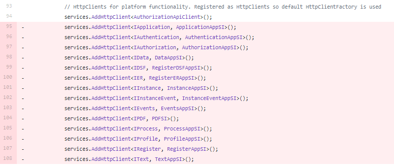

Altinn.App.* libraries target .Net 5 now, which requires that the application does the same.

In addition, all references to app and platform services have been moved from Startup.cs and should be replaced with
two method calls.

Follow the instructions below to ensure that the app is compatible with version 4 of the Altinn.App.* packages.


1. Update target framework and package dependencies

    Navigate to you application repository and find `App.csproj` in the `App` folder. 

    Update target framework to .Net 5 by replacing 

    ```xml
    <TargetFramework>netcoreapp3.1</TargetFramework>
    ```
    with 

    ```xml
    <TargetFramework>net5.0</TargetFramework>
    ```
    In the same file, update the Altinn.App.* package references to version 4.0.0.  

    ```xml
    <PackageReference Include="Altinn.App.Api" Version="4.0.0">
      <CopyToOutputDirectory>lib\$(TargetFramework)\*.xml</CopyToOutputDirectory>
    </PackageReference>
    <PackageReference Include="Altinn.App.Common" Version="4.0.0" />
    <PackageReference Include="Altinn.App.PlatformServices" Version="4.0.0" />
    ```

    The changes in the file should match the image below:

    

2. Update Dockerfile to use .Net 5 images

    The Dockerfile can be found in the root folder of the application repository.

    Update build image by replacing 

    ```Dockerfile
    FROM mcr.microsoft.com/dotnet/core/sdk:3.1-alpine AS build
    ```

    with 

    ```Dockerfile
    FROM mcr.microsoft.com/dotnet/sdk:5.0-alpine AS build
    ```

    And update the runtime image by replacing 

    ```Dockerfile
    FROM mcr.microsoft.com/dotnet/core/aspnet:3.1-alpine AS final
    ```

    with 

    ```Dockerfile
    FROM mcr.microsoft.com/dotnet/aspnet:5.0-alpine AS final
    ```
    The changes in the file should match the image below:

    

3. Replace references to services with call to extension method

    In the `App` folder you will also find `Startup.cs`

    Several lines of code will be removed and replaced with the two lines below. 

    ```cs
    services.AddAppServices(Configuration, _env);
    services.AddPlatformServices(Configuration, _env);      
    ```

   The code that should be removed from the file is marked in pink in the pictures below,
   which cover one section of the file each.

   Depending on how many custom changes you have made in your file the line numbers might not match.
   Do not worry, the services should still be grouped together roughly as shown in the picture.
   The application will run even if not all services are removed, so just do your best.

   Start by removing references to the Altinn App services.

    

    Remove references to all the Altinn Platform services.

    

    Remove all loading of configuration files.

    

    Remove logic to configure Application insights.

   

    Remove private method for retrieving the key for Application Insights.
    
    

    As previously stated the removed references are now replaced by calls to two new methods
   that will load all existing and future platform and app services into your application.

   `services.AddPlatformServices(Configuration, _env);`  loads all configurations and services that the app requires to
   use Altinn Platform functionality,
   and `services.AddAppServices(Configuration, _env);` loads all remaining configurations and services that the app
   requires such as Authorization and Prefill services.

   Ensure that these lines are added withing the `ConfigureServices` function.
