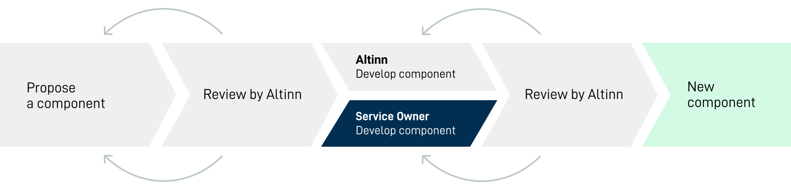

---
title: Develop a component
description: We'd love if you start developing functionality or new components that Altinn has approved. We do however appreciate if you plan your work together with us before starting. 
weight: 40
--

Before you start developing new functionality, it's a good idea to check if the task is already in our backlog.
If you can't find it, we appreciate if you [propose your wanted component/functionality](../propose-component/) 
and enter into dialoge with us before starting.

We apply the same criteria to externally developed components and functionality as we do with our own. Before developing
starts, we thus would like to be included in specifying how the component should be designed, both functionally and technically.
To achieve a nice workflow for developing, dialogue is essential.

**In this dialogue we will:**

- Discover what needs the component should meet, and discuss the solution
- Identify any shortcomings in the design or technical solution that needs to be overcome
- Decide if we should help you with design or user testing

## Development handbook
All information you need to get started is included in our [development handbook](../handbook/). The handbook includes
information on how to write [consistent code](/community/contributing/handbook/front-end/routine/) and [build new components](/community/contributing/handbook/front-end/new-component/).

## Accessability testing

Apps built on Altin 3 must be accessible for everyone, and to ensure that this is the case we follow the
WCAG 2.1 guidelines. Please see the demands described at [the Norwegian Authority for Universal Design of ICT](https://www.uutilsynet.no/english/checking-your-own-website/916) 
or [a11yproject](https://www.a11yproject.com/checklist/).

## Review of component

When a pull request is made we will do a review of your component. Hopefully we have already agreed
how the component should be made before development started, thus reducing the need for large changes at this stage.

- Testing
- WCAG testing
- Code review
- Design review

If we do find something that needs improvement, we will contact you about further development.