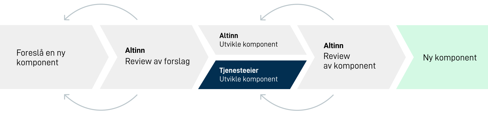

Før du starter utvikling av ny funksjonalitet kan det være lurt å sjekke om oppgaven allerede ligger i backloggen vår. 
Om du ikke finner den vil vi gjerne at du først [foreslår ønsket funksjonalitet/komponent](../propose-component/) 
og starter en dialog med oss før utviklingen starter.

Vi stiller samme krav til eksterne bidrag som vi gjør til vår egne. Før utviklingen starter vil vi derfor gjerne 
være med å spesifisere hvordan komponenten skal løses både når det gjelder design og tekniske beslutninger. Det beste for å få til en bra 
flyt er en dialog.

**I dialog med deg vil vi:**

- Finne ut hva komponenten skal dekke og diskutere løsningen
- Er det mangler i designskisser eller teknisk løsning som må utbedres
- Trenger du hjelp med design eller brukertesting

## Utviklingshåndbok
All informasjon du trenger for komme i gang finner du i vår [utviklingshåndbok](../handbook/). Håndboken inneholder blant annet
informasjon du trenger for å skrive [konsistent kode](/community/contributing/handbook/front-end/routine/) og [bygge nye komponenter](/community/contributing/handbook/front-end/new-component/).

## Tilgjengelighetstest
Apper bygget på Altinn 3 skal være tilgjengelig for alle og for å forsikre oss om dette skal vi oppfylle 
WCAG 2.1 rettningslinjene. Se kravene beskrevet på [UU-tilsynet](https://www.uutilsynet.no/regelverk/testprosedyrar-nettstader/709) 
eller [a11yproject](https://www.a11yproject.com/checklist/).

## Review av komponent
Når en pull request blir laget vil vi gjøre en review av komponenten din. Forhåpentligvis har vi blitt 
enige om hvordan komponenten skal løses på forhånd slik at ikke de store endringene blir i denne delen av prosessen. 

- Testing
- WCAG-testing
- Code review
- Design review

Dersom vi finner noe som bør utbedres kontakter vi deg for videre utvikling. 
