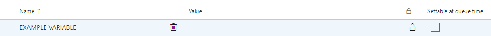
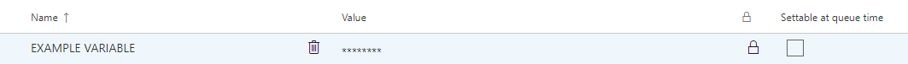
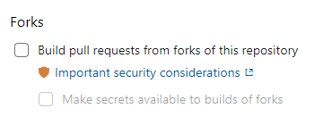

- [Quality checklist](#quality-checklist)
- [Build pipelines](#build-pipelines)
- [Release pipelines](#release-pipelines)

## Quality Checklist

- [ ] all sensitive information is marked as secret. Read more about setting variables as secret [here.](#setting-a-variable-as-secret)
- [ ] verify that no sensitive information is available in the exported API JSON definition (https://dev.azure.com/brreg/d0be3bbb-9145-4490-8d76-fd8024277467/_apis/pipelines/{definitionId})
- [ ] make sure that no secrets are shared with forks of github repos if you are using a github integrated pipeline. Read more about that  [here.](#disable-sharing-of-secrets-on-github-forks)
- [ ] if it exists a [built in](https://docs.microsoft.com/en-us/azure/devops/pipelines/tasks/?view=azure-devops) task for the job the pipeline should do, this should be prefered over writing your own scripts. Both for maintainability and security reasons.
- [ ] referencing other pipelines is done by definitionId.

## Build Pipelines

The build pipelines are grouped in folders based on either the part of the solution they are used for
or the purpose of the pipeline. See build pipelines [here](https://dev.azure.com/brreg/altinn-studio/_build?treeState=XGFsdGlubi1hcHBz&view=folders).

- [altinn-apps](#altinn-apps)
- [altinn-platform](#altinn-platform--altinn-studio)
- [altinn-studio](#altinn-platform--altinn-studio)
- [code-analysis](#code-analysis)
- [load-test](#load-test)
- [test](#test)

### altinn-apps

There are _pull request_ and _master_ pipelines for app frontend and kubernetes wrapper.

The pull request pipeline builds a dockerimage and is triggered whenever a pull request is created or updated
that modifies code related to the component.

The master pipeline builds a docker image and pushes it to Azure Container Registry.
The pipeline is triggered whenever new code is merged into the master branch that modifies code related to the component.

Remaing pipelines in this folder are described below.

#### altinn-studio-build-app-image

- trigger: triggered by app developers in Altinn Studio
- details: builds a docker image of an app and pushes it to Container Registery.
- cloud component integrations: Azure Container Registry

#### altinn-studio-deploy-app-image

- trigger: triggered by app developers in Altinn Studio.
- details: Gets APIM Subscription key if required and deploys a new helm release to the correct AKS cluster.
- cloud component integrations: Azure API Management, Azure Kubernetes services

#### altinn-studio-update-deploy-release-db

- trigger: final step in build/deploy app image pipelines
- details: Sends request to designer to update status of a given buil or release of an app.

#### PDF-generator master
- trigger: new code is pushed to the gh-pages branch of the [altinn-studio-charts repository](https://github.com/Altinn/altinn-studio-charts)
- default: the created build is used as the artifact to trigger the release pipeline for the PDF generator to AT-environments.

### altinn-platform / altinn-studio

Pipelines in altinn-platform and altinn-studio share the same structure.
There is a _pull request_ and _master_ pipeline for each component.

The pull request pipeline builds a dockerimage and is triggered whenever a pull request is created or updated
that modifies code related to the component.

The master pipeline builds a docker image and pushes it to Azure Container Registry.
The pipeline is triggered whenever new code is merged into the master branch that modifies code related to the component.

The pull request pipeline for the .net app template does not build a docker image,
but simply ensures that it is possible to build the app template used by Altinn Studio.

Pipelines follow this naming standard: [component]-(master/pull-request).

### code-analysis

Each component in the solution has their own analysis pipeline.
The pipeline runs unit and integration tests and triggers a sonar cloud analysis of the code.

Pipelines follow this naming standard: [component]-analysis-[langugage].

### load-test

The load-test pipelines are administered by the load-testing team.
The pipelines run k6 tests aimed at YT01.

### test

There are automated tests that are aimed at our running solutions and that
can be run in any environment.

The pipelines in this project have varying triggers. Some are
on a schedule and regularily run in one or all of our environments.
Others are triggered when a new release is deployed to an environment.

#### apps-and-platform-postman

- trigger: nightly schedule
- environment: at22
- details: tests platform and app APIs

#### studio-cypress

- trigger: final task in release pipeline for Designer
- environment: all
- details: runs cypress test in Altinn Studio to validate most common functionality.

#### apps-k6

- trigger: N/A
- environment: N/A
- details: k6 tests to verify Altinn Apps behavior

#### platform-k6

- trigger: final task in release pipeline for relevant platform components.
- environment: all except YT01.
- details: k6 tests to verify Altinn Platform functionality.

## Release Pipelines

See all release pipelines [here](https://dev.azure.com/brreg/altinn-studio/_release?_a=releases&view=all&path=%5C).

Our release pipelines are set up with multiple stages.
This allows for different policies related to deploy and varying triggers.

Common for all release pipelines is that they rely on an artifact
containing the helm chart which is packed in Azure Studio Ops project.

Deploy to TT02 or production requires approval from a team member.
Weekly releases are scheduled for these environments.

## HOWTO

### Setting a variable as secret

Marking a variable is secret is straight forward. Navigate to the pipeline variables. 

All that is needed in order for a variable to be secured in the pipeline is click on the lock icon at the right hand side.

### Disable sharing of secrets on github forks

Disabling of secret sharing on repo forks are done by navigating from the pipeline to `Triggers` and selecting the github integration under "Pull Request Validation". Here you can disable secret sharing by disabling the build on forks.

