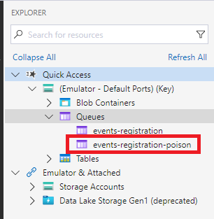
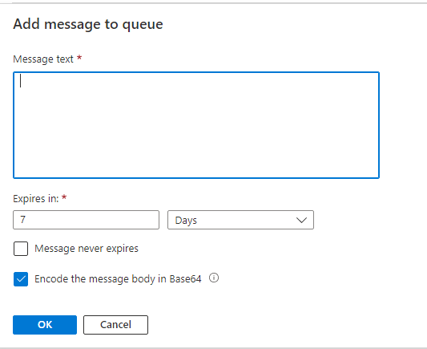
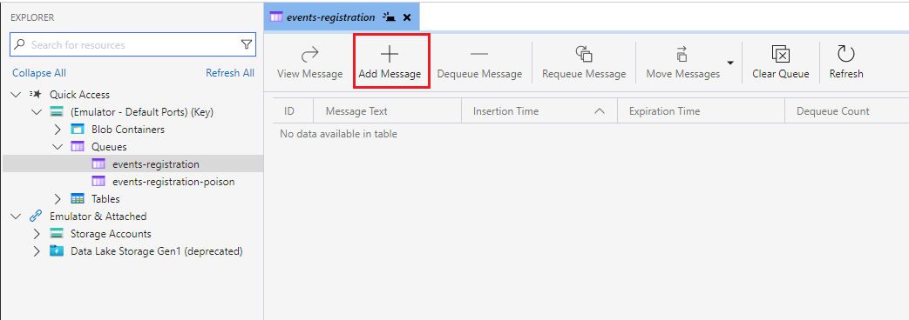
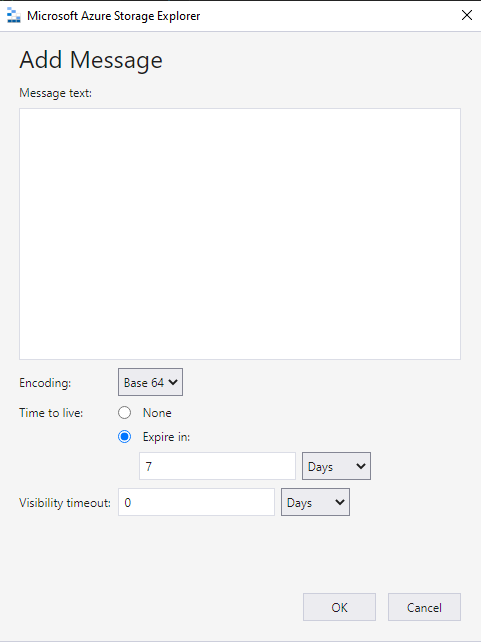

## Moving messages between queues

During operations we sometimes need to move messages between queues. 
The most common scenario is wanting to re-process elements that have ended in the poison 
queue after too many failed attempts. 

### Prerequisites
- [Azure Storage Explorer]() 
- An Azure AD account with write-permissions for the related storage account 

### How to
1. Open Storage Explorer.
    If you are working towards a test or production environment you must 
      - Sign into Azure under the Account Management tab
      - select the storage account you want to work with 
2. Move to the _Explorer_ tab and identify the source queue in the left hand menu
    
3. You should now see the messages in the queue in the explorer.
    If you only want to move a single message, this should be highlighted
    
4. Click the arrow next to _Move messages_ to specify if all or just a single message should be moved
5. In the dialogue, select the destination queue and click `Move`
    
6. The messages will be moved immediatly. Check the destination queue to confirm.

## Manually adding messages in queue
Manually adding a message to a queue is useful both when testing new functionality and during incident management.

You have two options when manually adding a message to a Storage Queue, 
the [Azure Portal](https://portal.azure.com/) or [Azure Storage Explorer]().

### Prerequisites
- [Azure Storage Explorer]() or a browser
- An Azure AD account with write-permissions for the related storage account

### How to (Azure Portal)
1. Log onto the Azure Portal and identify the correct Storage Account   
2. Select `Queues` in the left hand menu and identify the queue to work with 
    
3. Click the queue you want to work with
4. In the overview page of the queue click `Add message`
    
5. Paste your message into the dialogue box, in our case it's often a json document
   
6. Ensure that `Encode the message body in Base64` is checked
7. Click OK

### How to (Storage Explorer)
1. Open Storage Explorer.
    If you are working towards a test or production environment you must 
      - Sign into Azure under the Account Management tab
      - select the storage account you want to work with 
2. Move to the _Explorer_ tab and identify the queue you want to work with in the left hand menu
    
3. Once selected, click `Add message` in the top ribbon
4. Add the message in the dialogue box, in our case it's often a json document
    
6. Ensure encoding is set to `Base64` and click ok
 