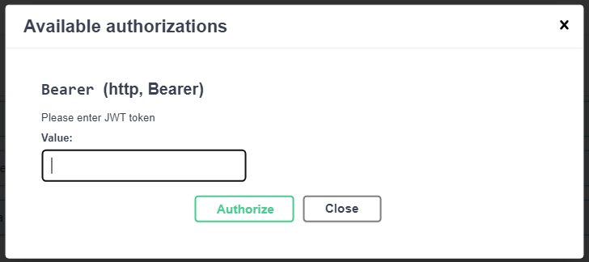
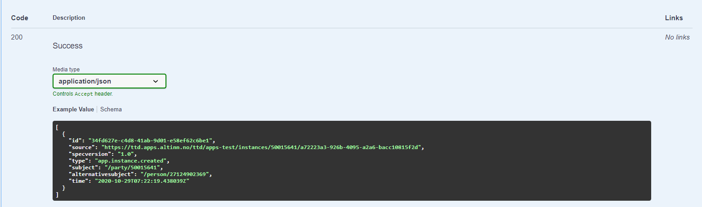

We use Swagger to document our APIs. 

## Swashbuckle

We use Swashbuckle to generate the documentation. 
[Further documentation on Swashbuckle.AspNetCore is available here](https://github.com/domaindrivendev/Swashbuckle.AspNetCore)

The configurations described below are all located in `Program.cs` in the `AddSwaggerGen` method.


## Configure authorization

Most of our APIs requires authorization. To enable the end user to test these endpoints through Swagger 
support for authentication must be configured. 



The authorization box above is created with the configuration below. 
It enables the user provide a JWT token to the requests that are sent through Swagger as a bearer token. 


```cs
c.AddSecurityDefinition("Bearer", new OpenApiSecurityScheme
{
    In = ParameterLocation.Header,
    Description = "Please enter JWT token",
    Name = "Authorization",
    Type = SecuritySchemeType.Http,
    BearerFormat = "JWT",
    Scheme = "bearer"
});

c.AddSecurityRequirement(new OpenApiSecurityRequirement
{
    {
        new OpenApiSecurityScheme
        {
            Reference = new OpenApiReference
            {
                Type = ReferenceType.SecurityScheme,
                Id = "Bearer"
            }
        },
        Array.Empty<string>()
    }
});
```

[Further documentation on setting up security definitions and requirements
is available here.](https://github.com/domaindrivendev/Swashbuckle.AspNetCore#add-security-definitions-and-requirements)

## Set up schema filter

The swagger documentation contains examples of each schema that is used in the request and/or response of the APIs. 
By default, the example contains the default value of each value type. 
Our experience is that this might not be very explanatory to the end user.

To overwrite these examples with custom ones a _SchemaFilter_ can be set up. 
First a schema filter class that implements the interface _ISchemaFilter_ must be created. 
Secondly, the filter class must be registered in the _AddSwaggerGen_ method in `Program.cs`.

The result of running a schema through a filter when generating the OpenAPI specification
is shown below. 

```json 
[
  {
    "id": "8fb5a622-87e7-4f5e-b25e-215c93c3b86b",
    "source": "https://ttd.apps.altinn.no/ttd/apps-test/instances/50015641/a72223a3-926b-4095-a2a6-bacc10815f2d",
    "specversion": "1.0",
    "type": "app.instance.created",
    "subject": "/party/50015641",
    "alternativesubject": "/person/27124902369",
    "time": "2020-10-29T07:22:19.438039Z"
  }
]
```

### Implementation example

This example implements a schema filter for the _CloudEvent_ model. 
The full implementation is shown below and then broken down to explain each part.

```cs
public class SchemaExampleFilter : ISchemaFilter
{
    /// <inheritdoc/>
    public void Apply(OpenApiSchema schema, SchemaFilterContext context)
    {
        if(context.Type.Name ==  nameof(CloudEvent)){
            schema.Example = new OpenApiObject
                {
                    ["id"] = new OpenApiString(Guid.NewGuid().ToString()),
                    ["source"] = new OpenApiString("https://ttd.apps.altinn.no/ttd/apps-test/instances/50015641/a72223a3-926b-4095-a2a6-bacc10815f2d"),
                    ["specversion"] = new OpenApiString("1.0"),
                    ["type"] = new OpenApiString("app.instance.created"),
                    ["subject"] = new OpenApiString("/party/50015641"),
                    ["alternativesubject"] = new OpenApiString("/person/27124902369"),
                    ["time"] = new OpenApiString("2020-10-29T07:22:19.438039Z")
                };
        }

        return;
    }
}
```

The class _SchemaExampleFilter_ is created and it implements the interface _ISchemaFilter_.
The interface contains a single public method

```cs
public void Apply(OpenApiSchema schema, SchemaFilterContext context)
{
}
```

The _context_ object will have details on the current type an example may be provided for. 
We choose to match the types using _context.Type.Name_ and _nameof()_.

The example is an _OpenApiObject_ and is bound to the _Example_ property of the input parameter _schema_.

```cs
schema.Example = new OpenApiObject
{
    ["id"] = new OpenApiString(Guid.NewGuid().ToString()),
    ["source"] = new OpenApiString("https://ttd.apps.altinn.no/ttd/apps-test/instances/50015641/a72223a3-926b-4095-a2a6-bacc10815f2d"),
    ["specversion"] = new OpenApiString("1.0"),
    ["type"] = new OpenApiString("app.instance.created"),
    ["subject"] = new OpenApiString("/party/50015641"),
    ["alternativesubject"] = new OpenApiString("/person/27124902369"),
    ["time"] = new OpenApiString("2020-10-29T07:22:19.438039Z")
};
```

Note that we use _OpenApiString_ for many of the types, this is to simply the setup on our part,
and will not be communicated to the end user as the type to use.

Finally the class must be registered as a schema filter in _Program.cs_.

```cs {linenos=false,hl_lines=[7]}
    services.AddSwaggerGen(c =>
    {
        c.SwaggerDoc("v1", new OpenApiInfo { Title = "Altinn Platform Events", Version = "v1" });
        IncludeXmlComments(c);
        c.EnableAnnotations();

        c.SchemaFilter<SchemaExampleFilter>();
    });
```



## Set up request body filter

When using schema filters, it is only possible to provide a single example per schema. 
In the case where the schema in the request body can have many variants where all could have the benefit of being exemplified in Swagger, 
request body filters should be used.

To overwrite the schema example with a request body example a _RequestBodyFilter_ can be set up. 
First, a request body filter class that implements the interface _IRequestBodyFilter_ must be created. 
Secondly, the filter class must be registered in the _AddSwaggerGen_ method in `Program.cs`.

The result of running a request body through a filter when generating the OpenAPI specification
is shown below for the [SubscriptionRequestModel](https://github.com/Altinn/altinn-events/blob/main/src/Events/Models/SubscriptionRequestModel.cs). 

```json
{
  "source": "https://ttd.apps.altinn.no/ttd/apps-test/instances/50015641/a72223a3-926b-4095-a2a6-bacc10815f2d",
  "specversion": "1.0",
  "type": "app.instance.created",
  "subject": "/party/50015677"
}
```

### Implementation example

This example implements a request body filter for the _SubscriptionRequestModel_. 
The full implementation is shown below. 


```cs
public class RequestBodyExampleFilter : IRequestBodyFilter
{
    public void Apply(OpenApiRequestBody requestBody, RequestBodyFilterContext context)
    {
        if(context.BodyParameterDescription.Type.Name == nameof(CloudEventRequestModel)){
            OpenApiMediaType appJson = requestBody.Content["application/json"];

            List<(string Name, OpenApiObject Value)> examples = new()
            {
                ("Instance created event with alternative subject",
                CreateOpenApiObject(new List<(string Name, string Value)>()
                {
                    ("source", "https://ttd.apps.altinn.no/ttd/apps-test/instances/50015641/a72223a3-926b-4095-a2a6-bacc10815f2d"),
                    ("specversion",  "1.0"),
                    ("type",  "app.instance.created"),
                    ("alternativesubject", "/person/01017512345")
                })),
                ("Instance created event without alternative subject",
                CreateOpenApiObject(new List<(string Name, string Value)>()
                {
                    ("source", "https://ttd.apps.altinn.no/ttd/apps-test/instances/50067592/f3c92d96-0eb3-4532-a16f-bcafd94bde3a"),
                    ("specversion",  "1.0"),
                    ("type",  "app.instance.created"),
                    ("subject",  "/party/50067592")
                }))
            };

            examples.ForEach(entry => appJson.Examples.Add(entry.Name, new OpenApiExample { Value = entry.Value }));

            requestBody.Content["application/json"] = appJson;
        }

        return;
    }
}
```

Finally the class must be registered as a schema filter in _Program.cs_.

```cs {linenos=false,hl_lines=[7]}
    services.AddSwaggerGen(c =>
    {
        c.SwaggerDoc("v1", new OpenApiInfo { Title = "Altinn Platform Events", Version = "v1" });
        IncludeXmlComments(c);
        c.EnableAnnotations();

        c.RequestBodyFilter<RequestBodyExampleFilter>();
    });
```
