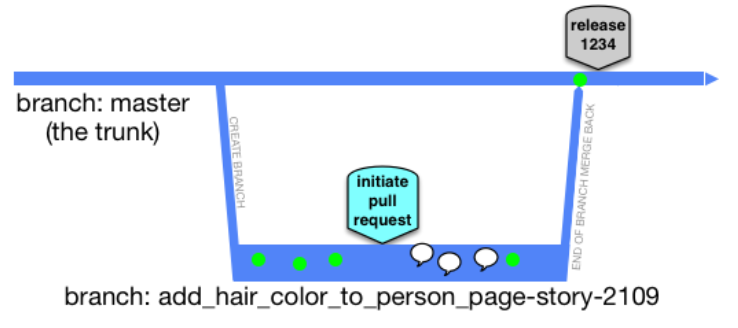

## Principles

1. We use [scaled trunk-based development](#scaled-trunk-based-development).
   This ensures the codebase is always releasable on demand and helps to make Continuous Delivery a reality.
2. Code is checked in using short lived [feature branches](#feature-branches) and pull requests (PR).
   Review is always done by someone else than the author

## Scaled Trunk Based Development

Read more about scaled trunk based development [here.](https://trunkbaseddevelopment.com/)

> A source-control branching model, where developers collaborate on code in a single branch called “trunk” (master), resist any pressure to create other long-lived development branches by employing documented techniques.
> They therefore avoid merge hell, do not break the build, and live happily ever after.

## Feature Branches

Development is done on [feature branches with short lifespans](https://trunkbaseddevelopment.com/short-lived-feature-branches/) before PR is requested against the main branch.

The figure below illustrates

- A feature branch with three commits
- Pull request is create with QA and merge back to main
- A new commit (forth green circle) based on feedback from QA
- Merge back to main

## Pull Requests

A pull request (PR) is created to perform quality assurance (QA) and to merge a feature branch into main.
You create a pull request after you have pushed your branch to github,
using [this pull request template](https://github.com/Altinn/.github/blob/main/.github/pull_request_template.md).

All tasks in the template should be done and checked off before the PR is submitted, and if the PR solves
an issue, the issue should be referenced in the PR description.

Once a pull request is created it triggers various automatic actions, such as
builds, tests and static code analysis to ensure the quality and functionality of the code before it is merged.

Now that a PR has been submitted others will review your code and leave comments if they have feedback.
All comments must be resolved before the PR can be merged.

Once all the tests and reviews have been completed we are ready to merge the new code into main.
This is done using squash such that the history of the master branch is simple and understandable.

