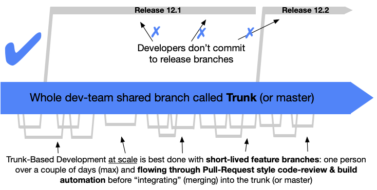

## Principles

1. Altinn Studio uses [trunk-based development](#trunk-based-development)
    - This ensures the codebase is always releasable on demand and helps to make Continuous Delivery a reality.
2. Code is checked in using short living [feature branches](#feature-branches)
    - naming standard for feature branches are `feature/<issueNumber>-<description>` , for instance: `feature/1028-text-component`
    - naming standard for bug branches are `bug/<issueNumber>-<description>` , for instance: `bug/877-performance-leak-ui-editor`

## Trunk Based Development

Read more about trunk based development [here.](https://trunkbaseddevelopment.com/)

> A source-control branching model, where developers collaborate on code in a single branch called “trunk” (master), resist any pressure to create other long-lived development branches by employing documented techniques.
> They therefore avoid merge hell, do not break the build, and live happily ever after.

## Feature Branches

Development is done on [feature branches with short lifespans](https://trunkbaseddevelopment.com/short-lived-feature-branches/) before PR is requested against the master branch.

The figure below illustrates

- A feature branch with three commits
- Pull request is create with QA and merge back to master
- A new commit (forth green circle) based on feedback from QA
- Merge back to master

## Pull Requests

A pull request (PR) is created to perform quality assurance (QA) and to merge a feature branch into master.
You create a pull request after you have pushed your branch to our github repo.

- Include a reference to the issue that triggered the pull request (`Fixes #issuenumber`)

Once a pull request is submitted against our master branch it triggers various pipelines, such as builds, tests, static code analysis to ensure that code that breaks builds is not merged into master. These tests are triggered manually.
Now that a PR has been submitted others may review your code and leave comments if they have feedback.

Once all the tests and QA have been completed we are ready to merge the new code into master.
This is done using squash such that the history of the master branch is simple and understandable.

