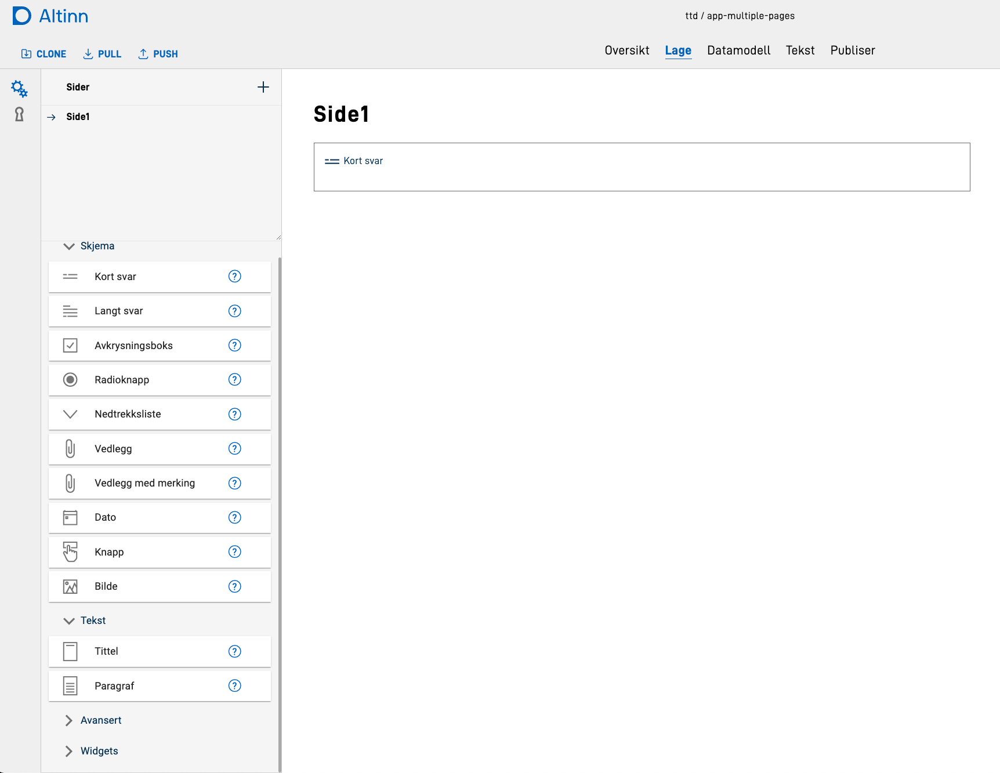
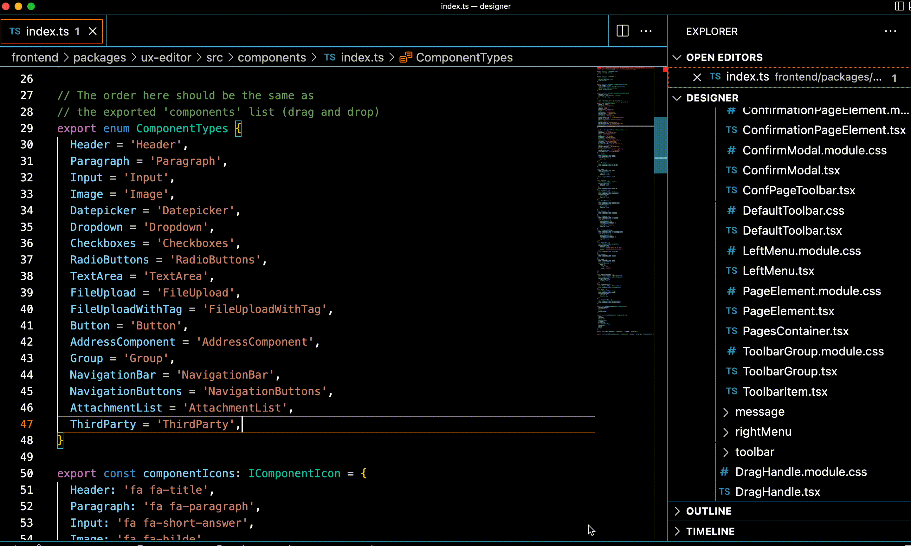
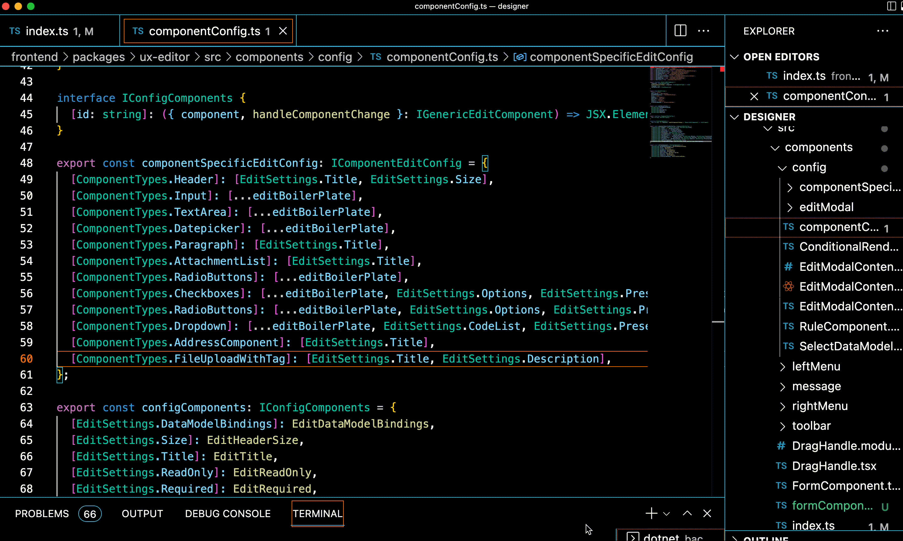

This guide will explain how to add a new component to the Altinn Studio forms builder.

### Pre-requisites:
- The new component must be [implemented in app-frontend][1].
- Studio must be [set up to run locally][2] to test your changes.

## Add the component to the toolbar
All components that can be added to a form from Altinn Studio are shown in the *toolbar* on the left-hand side of the
window:

To add your component to the toolbar, do the following steps:
- Navigate to the forms-builder code, which is located in `frontend/packages/ux-editor`. 
- Open the file `src/components/index.ts`
- Add your new component to the `ComponentTypes` enum - _make sure you use the same naming as you have used for the 
  `type` property of your component in the layout files_.
  
- Set an icon for your component in the toolbar in the `componentIcons`object. Available icons can be found [here][3],
  use naming `fa fa-<icon name>`.
- Add a new object describing your new component. 
  The object must have type `IComponent`, and can contain the following properties:
  | Property           | Description | 
  | --------           | ----------- |
  | `name`             | Component name, use the `ComponentTypes` enum as value | 
  | `Icon`             | Component icon, use the `componentIcons` property you created | 
  | `customProperties` | Object containing any custom properties that the component should be initialized with (default values) | 
- Add your newly created component definition to the relevant list:
    - `schemaComponents` for basic form components
    - `textComponents` for components that are primarily displaying texts
    - `advancedComponents` for more complex components.
  
When you now open Altinn Studio locally and navigate to the forms builder, you should see your new component in the
toolbar, and should be able to drag it into the form.

## Set up options to edit component
All components will display the `id` field available for editing when trying to edit a component. To set up editing of
other properties for the component, follow the instructions below.

- Navigate to `src/components/config/componentConfig.ts`. 
- Find the `componentSpecificEditConfig` object, add your new ComponentType enum value as key, and add a new list of
  settings that can be edited.
    - Current properties that are supported for editing directly are:
        - dataModelBindings
        - size (Header component)
        - title (textResourceBindings.title)
        - description (textResourceBindings.description)
        - readOnly
        - required
        - options
        - optionsId (codeList)
        - preselectedIndex
  
      If you need to edit any other properties for a component, consider if it is something that is relevant for only your
      component, or if it could be reused. If it can be used by other components, feel free to add it to the list of
      `configComponents` by implementing it, see the existing components as examples. 
    - Many components have the same set of properties that should be edited: `dataModelBindings, title, description, readOnly, required`.
      we have collected these into a reusable list called `editBoilerplate` which can be used instead of typing all the 
      property names when relevant.
      
- If you have custom needs for editing your component, you can do the following:
  - Add a new folder under `src/components/config/componentSpecificContent` with the name of your component.
  - In this folder, implement the view that can be used to edit your component. See existing `componentSpecificContent`
    for examples. Create an `index.ts` file form the component folder and export your newly implemented edit component 
    view from there.
  - Open `src/components/config/componentSpecificContent/ComponentSpecificContent.tsx`
  - Add a new case to the `switch/case` statement with your component. Import the custom view you just created and
    render it here, inside a `<FieldSet>` component.
- Note that it is possible to combine this custom approach with the standard approach described above. If you have any 
  of the standard properties to edit, use the config setup, and create a custom view for anything that is not covered 
  by that.

When you add your component to the form now, and open the editing view, you should see all the properties that you have
added (standard and custom) available to edit.

[1]: ../new-component
[2]: https://github.com/Altinn/altinn-studio
[3]: https://github.com/Altinn/altinn-cdn/tree/master/toolkits/fortawesome/altinn-studio/0.1/icons/svg