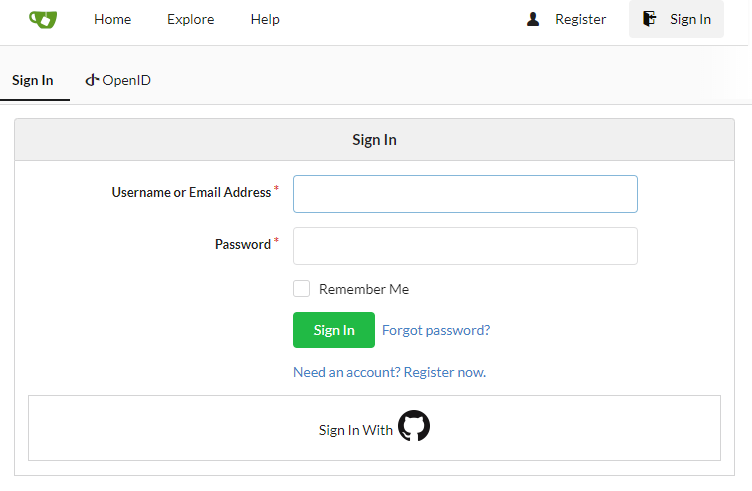

Gitea is used for version control of the apps developed in Altinn Studio.

## Customize
The documentation on how to customize Gitea can be found [here](https://docs.gitea.io/en-us/customizing-gitea/).

## Templates
The user interface of Gitea can be customized to match your application needs.
You can copy the templates from [Gitea's GitHub](https://github.com/go-gitea/gitea/tree/master/templates). 

For example the default login page looks like this

It's customized to look like this

Follow these steps to change any user interface of Gitea. Here example is given for login:

1. Copy the login template from Gitea's GitHub
2. Paste it in your application in the same folder structure as Gitea.
3. Edit the file. You can change the html tags and introduce new CSS or add new text or image without affecting the logic.
4. Update the Docker image to use these templates.

Now, the new login template will be taken in use.
