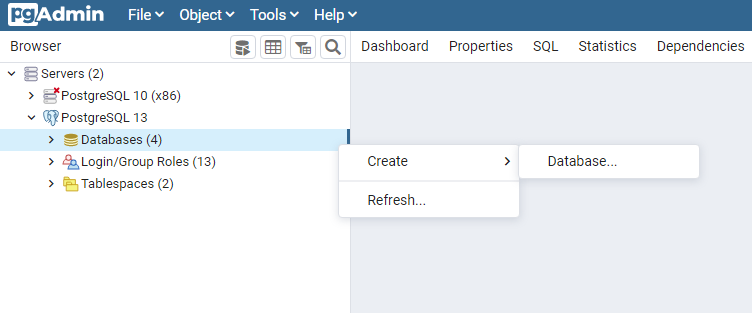
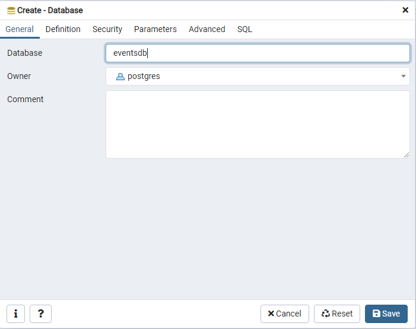
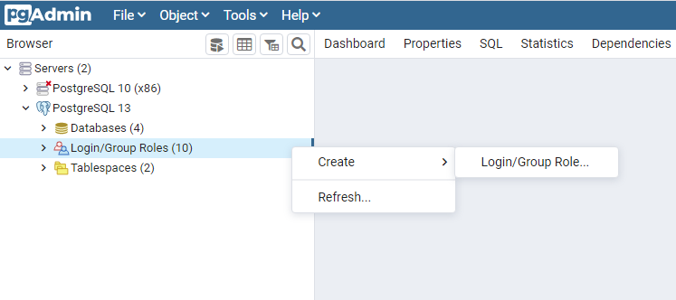
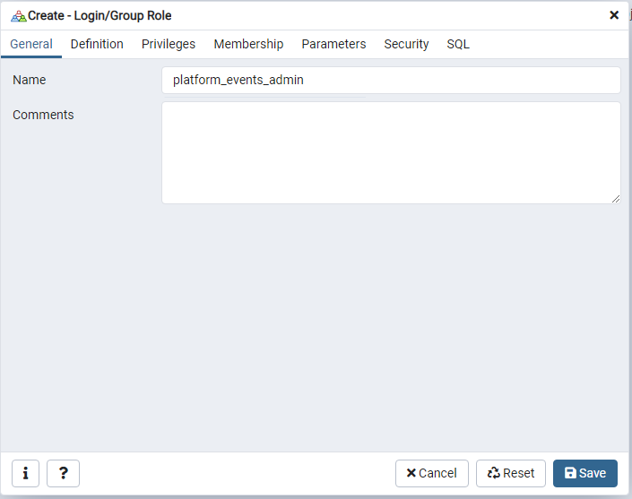
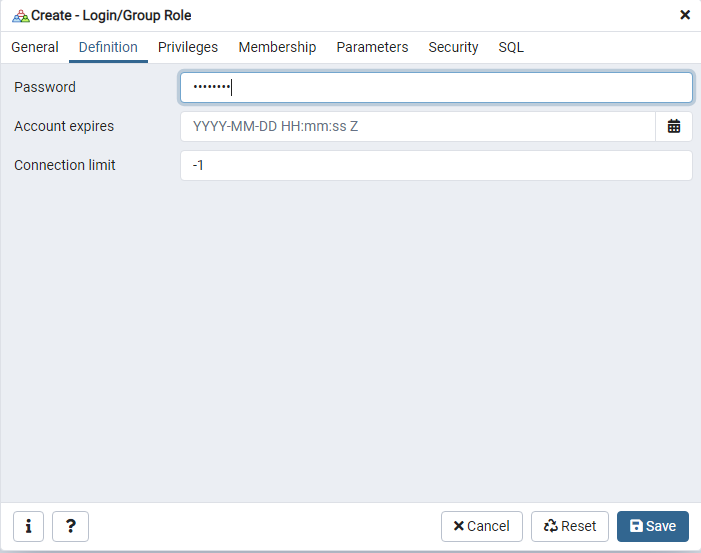
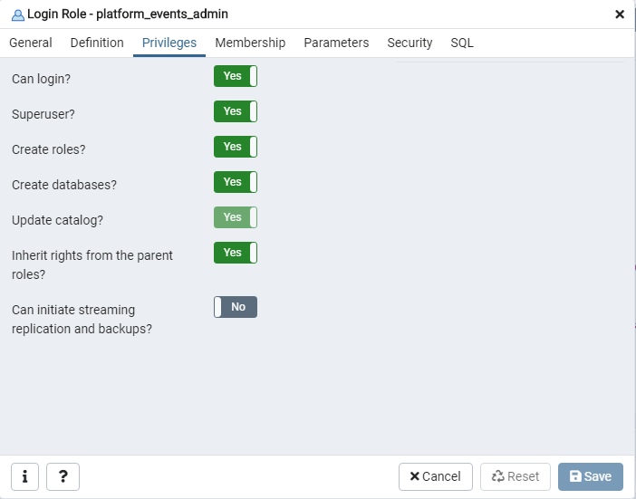
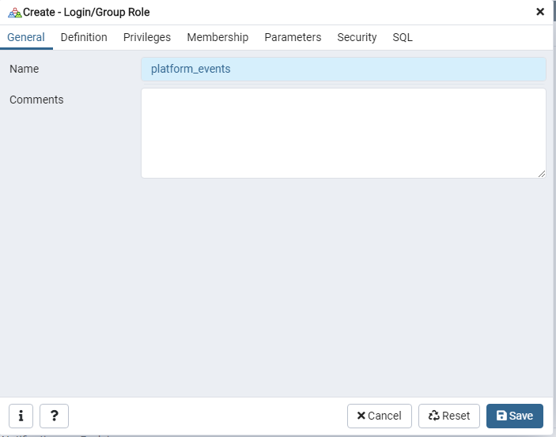
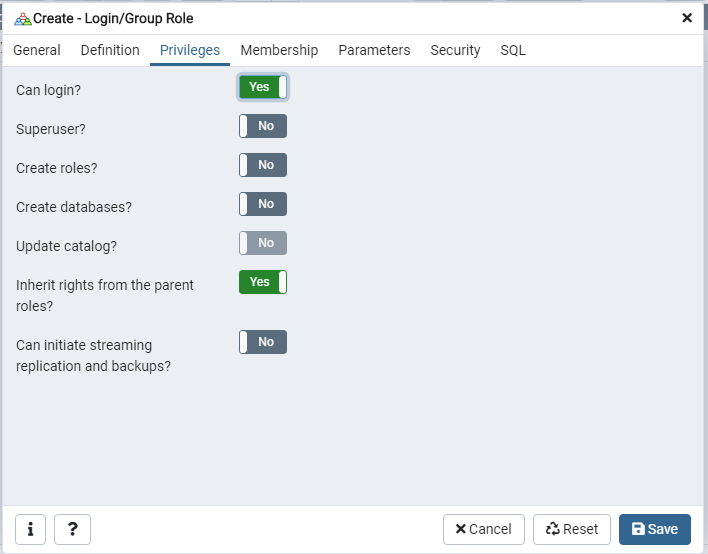
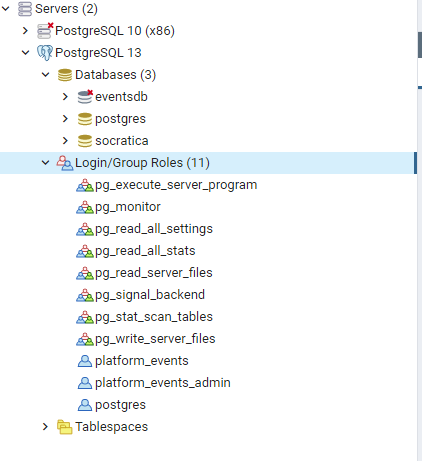
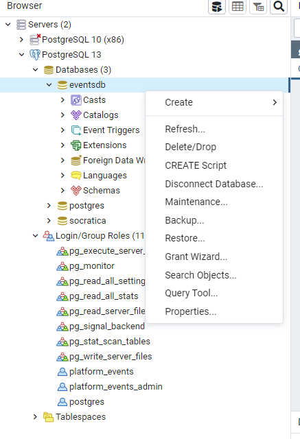

{}
**NOTE:** Work in progress.
{}

## Install PostgreSQL and pgAdmin4

Follow the instructions on https://www.postgresql.org/download/

## Set up database

Open pgAdmin 4.
We will be working on the PostgreSQL 13 server.

1. Right click on _Databases_ and select _Create_.


2. Fill inn database name `eventsdb` and click _Save_.


3. You should now be able to see a new database in the list. If you don't - right click the server and select _REFRESH_.


## Set up admin user

1. Right click on _Login/Group Roles_ , select _Create_ and _Login/Group Roles_.


2. In the _General_ tab fill out the username `platform_events_admin`


3. Navigate to the _Definition_ tab and insert password: `Password`


4. Navigate to the _Priviliges_ tab and enable all options and click _Save_.


5. Confirm that the user has been created in the side bar.
If you cannot see the user, try refreshing the _Login/Group Roles_ section.


## Set up app user

1. Right click on _Login/Group Roles_ , select _Create_ and _Login/Group Roles_.


2. In the _General_ tab fill out the username `platform_events`


3. Navigate to the _Definition_ tab and insert password: `Password`


4. Navigate to the _Priviliges_ tab and enable *Can log in* and click _Save_.


5. Confirm that the user has been created in the side bar.
If you cannot see the user, try refreshing the _Login/Group Roles_ section.


6. Create a schema called events.
 [A more detailed description to come..]

7. Right click the database in the side menu and select _Query tool..._


8. Run script grating user privilliges on schema resources.

```sql
GRANT  USAGE  ON SCHEMA events TO platform_events;
GRANT SELECT,INSERT,UPDATE,REFERENCES,DELETE,TRUNCATE,REFERENCES,TRIGGER ON ALL TABLES IN SCHEMA events TO platform_events;
GRANT ALL ON ALL SEQUENCES IN SCHEMA events TO platform_events;
```

The result should be as shown in the picture below.

