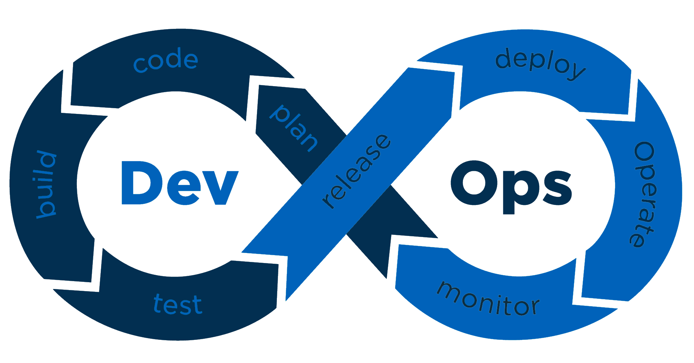

Having a Secure DevOps process requires that security is built into the applications, the process, the infrastructure, and the configuration, and more.

Below you find information on what kind of tools, patterns, and processes we follow to make sure we think about application and infrastructure security for all phases.

## Planning phase

During the planning phase, the requirements for features are gathered.
Already in this phase, we identify changes that need special security considerations. Typical this is done as part of grooming.
We mark our security-related features and bugs to a [specific label.](https://github.com/Altinn/altinn-studio/issues?q=is%3Aopen+is%3Aissue+label%3Akind%2Fsecurity)
Details of security-related issues are in many cases kept out of GitHub.

## Code phase

During the development of a feature, we have several processes and tools to help us creating secure code.

### Development checklists

We have a development checklist that ensures that developers and reviewers consider the different security aspects.

[See checklist.](checklist)

### IDE and tools

We use both Visual Studio and Visual Studio Code. Those provide us with tools for static code analysis.

- StyleCop analyzes C# source code to enforce a set of style and consistency rules. [See project](https://github.com/DotNetAnalyzers/StyleCopAnalyzers)
- [Code Analysis](https://docs.microsoft.com/en-us/visualstudio/code-quality/roslyn-analyzers-overview?view=vs-2019) verifies the code after a [ruleset defined by Altinn](https://github.com/Altinn/altinn-studio/blob/master/Altinn3.ruleset)

### Unit and integration tests

As part of the coding process unit and integration-tests are created. Besides, to cover functionality,
many of them cover security aspects like authentication and authorization.

## Build phase

Once a developer has finished coding a feature he/she creates a pull request in our repository.

### Peer Reviews

All pull requests require peer review from at least one team member from the Altinn DevOps team.

[See active pull requests.](https://github.com/Altinn/altinn-studio/pulls)

### Run Unit and integration tests

As part of the build pipelines, all unit and integration tests are run. This makes sure that security functionality has not been broken.

### Static code analysis

#### Sonar Cloud

Every pull request is analyzed by [Sonar Cloud](https://www.sonarcloud.io/github)

Sonar Cloud analyzes the code by a [defined rule set](https://sonarcloud.io/organizations/altinn/rules) and checks the code against OWASP Top 10, SANS Top 25 and the Co

We have defined some [quality gates](https://sonarcloud.io/organizations/altinn/quality_gates/show/3829) that the code need to adhere to to be able to merging pull request in to master. 

Our current active issues are available [here](https://sonarcloud.io/organizations/altinn/issues?resolved=false).

#### LGTM

[LGTM](https://github.com/marketplace/lgtm) is a code analysis platform for identifying vulnerabilities and preventing them from reaching production.

This is run for every pull request.

### Test

Each feature added to our platform is tested.

- Integration tested with positive and negative tests for access control where possible
- Manual functional tests
- Manual security testing for selected features

#### Dynamic code analysis.

We use different tools to perform dynamic code analysis. 

Some of the tools are

- [HCL AppScan](https://www.hcltechsw.com/products/appscan)

We also regulary use third party secyurity companies to go through our code.

### Release phase

Releases are created automatically. For Test environments, every build is deployed automatically.
For the Application Test environment and production, we deploy once a week. Those releases are created automatically.
Deploy are needs to be approved by one team member.

### Deploy phase

All deployment is done with an automated tool like Azure Pipelines reducing the risk for misconfiguration.

Applications are deployed to Azure Kubernetes Services that has standard policies defined with a focus on the reduction of risk.
Read more about  [Secure DevOps with AKS.](https://docs.microsoft.com/en-us/azure/architecture/solution-ideas/articles/secure-devops-for-kubernetes)

### Operate phase

When the different applications are in production the DevOps team make sure that everything works as expected

We have different tools to identify security threats for our running applications.

- Application Insights presents log and traffic information making it possible to detect different types of attacks
-  X
-  y

### Monitor phase

During the monitor phase, the team follows up on how the different solutions are working and identifying improvements and changes.

#### Dependency updates

We use [Dependabot](https://dependabot.com/) and [WhiteSource Bolt](https://www.whitesourcesoftware.com/free-developer-tools/bolt/) to monitor updates for dependencies.

[It creates pull request in a mirror repository](https://github.com/alt-how/altinn-studio/pulls)
