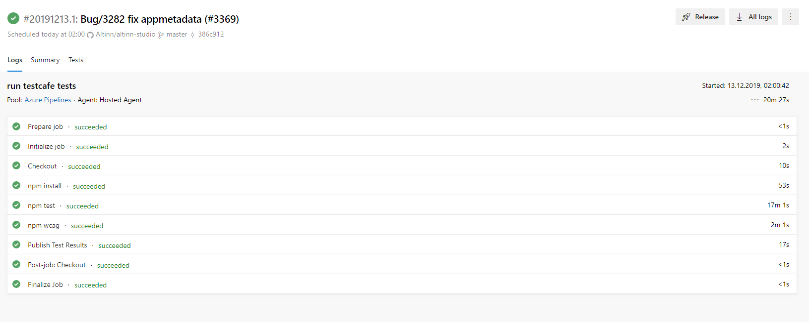
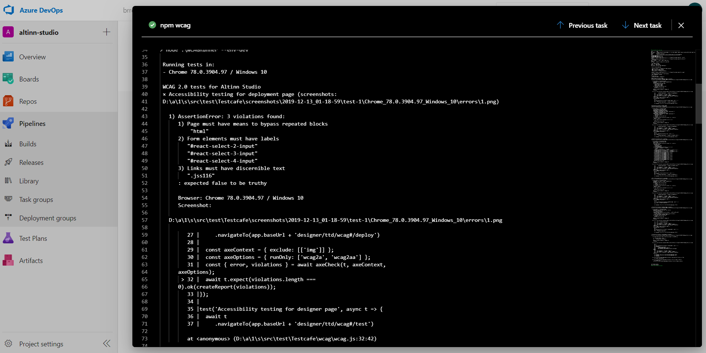
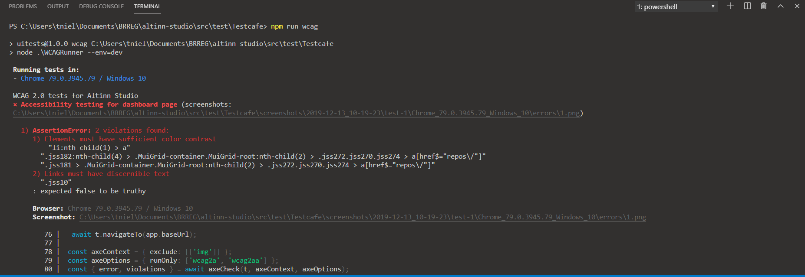

This document describes how to see results of testcafe wcag tests, and how to write new wcag tests in testcafe. See the general testcafe documentation for a recipe on how to set up a development environment for writing testcafe test.

## Testing Altinn Studio for accesibility with testcafe and axe-core
WCAG tests run in Altinn Studio using the testcafe UI test project, with some additional plug-ins: axe-testcafe is the plug-in used for Altinn Studio, see documentation [here](https://www.npmjs.com/package/axe-testcafe). The accessibility engine aXe allows the tester to configure which wcag rules to run, elements to include or ignore, and to format a report that can be generated automatically.

The Altinn Studio wcag tests are run automatically each night in azure devops. Link to the build can be found [here](https://dev.azure.com/brreg/altinn-studio/_build?definitionId=54), the wcag tests are run as a task in the build definition **altinn-studio-test-testcafe**. To inspect a run of the wcag tests, open the build definition:



The "Tests" tab contains the the general UI test report. WCAG tests use a seperate reporter (called "spec") to allow the user see which elements break with accesibility rules. Open the *npm wcag* task to inspect the wcag test results:



Line 40 describes the title of the test. In this case, the testcase for the deployment page. Line 43 displays the number of A and AA rules violated on the specific page. The list under this line describes which specific rules were violated, a list of wcag rules can be found [here](https://dequeuniversity.com/rules/axe/3.2), as well as which element on the page caused the violation.


## Writing new wcag tests in testcafe

Writing new wcag tests will become necessary as new functionality and pages are added to Altinn Studio. New wcag tests are added to the wcag js file in the testcafe project: *src/test/Testcafe/wcag/wcag.js*

To write a new wcag test, add the following code to the file

```javascript
test('My new wcag test for ACME page', async t => {
    const { error, violations } = await axeCheck(t);
    await t.expect(violations.length === 0).ok(createReport(violations));
});
```

Add the required testcafe code to navigate to the page under test, for example the dashboard page:

```javascript
test('My new wcag test for altinn studio dashboard', async t => {
    await t.navigateTo(app.baseUrl)
    const { error, violations } = await axeCheck(t);
    await t.expect(violations.length === 0).ok(createReport(violations));
});
```

The object *app* is a part of the page object model of the testcafe project, baseUrl points to the dashboard url for the selected altinn studio environment to be tested.

Axe can also allow the tester to specify the context, what elements of the test should included or excluded, as well as which rules should be run:

```javascript
test('Accessibility testing for dashboard page', async t => {
    await t.navigateTo(app.baseUrl);
    const axeContext = { exclude: [['img']] };
    const axeOptions = { runOnly: ['wcag2a', 'wcag2aa'] };
    const { error, violations } = await axeCheck(t, axeContext, axeOptions);
    await t.expect(violations.length === 0).ok(createReport(violations));
});
```
More on the axe context and options can be found in the [axe documentation](https://github.com/dequelabs/axe-core/blob/develop/doc/API.md#api-name-axerun)
To debug the new test, append ```test``` with the only keyword: ```test.only```

The new test can now be run from the command line using the package.json wcag script.

```npm run wcag```

The test report is then generated displayed in the console:

