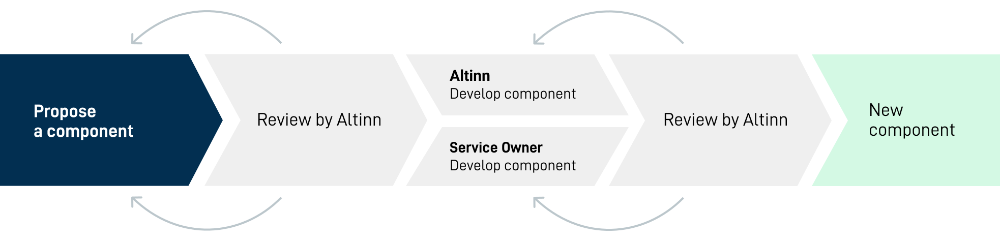

- **[Create a Feature request in Github](https://github.com/Altinn/altinn-studio/issues/new?assignees=FinnurO&labels=kind%2Ffeature-request&template=feature_request.md)**  
Describe the component, why it will be useful and when it is needed.
- **Review of the suggestion**  
Altinn will review your suggestion to make sure that a new component fits our [criteria](#criteria).
After the review, Altinn will tell you what we've decided and what we recommend.
- **Plan the development**  
A member of our team will contact you so that we can find out together who will take care of developing the component.
{.connected-bullets}

## Criteria

When a suggestion is reviewed we mainly focus on what the actual need is and what the component is meant to solve.
Is a new component needed, or do we have existing functionality that can be changed or expanded?

If a new component is the ideal solution, we want to make sure it has sufficient quality by making sure it fits these criteria:

- **Useful** - The suggestion should fit user needs, be understandable, recognisable and and not error-prone.
- **Accessible** - The suggestion should comply with the WCAG 2.1 standard.
- **Consequent** - The suggestion should reuse existing styles and components in the design system when relevant.
Users shouldn't have to worry that words, situations and actions has different meanings in different situations.
- **Versatile** - A new component should be designed in a way that makes it usable in similar scenarios and apps.



