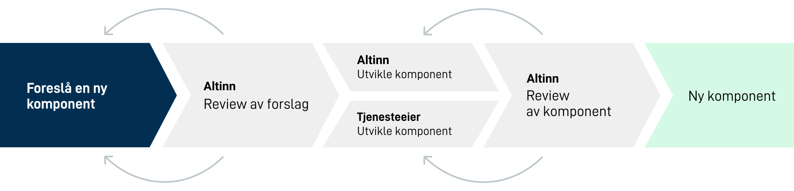

- **[Opprett en Feature request in github](https://github.com/Altinn/altinn-studio/issues/new?assignees=FinnurO&labels=kind%2Ffeature-request&template=feature_request.md).**  
Beskriv komponenten, forklar hvorfor den vil være nyttig og i hvilken 
sammenheng den trengs. 
- **Review av forslag**  
Altinn går gjennom forslaget for å kontrollere at en eventuell ny komponent oppfyller visse [kriterier](#kriterier). 
Etter gjennomgangen vil Altinn gi deg beskjed om beslutningen og anbefalingene.
- **Planlegg utviklingen**  
Et medlem av teamet vil kontakte deg for å finne ut i samarbeid hvem som skal 
fortsette utviklingen. 
{.connected-bullets}

## Kriterier

Når et nytt forslag tas inn til vurdering ser vi først og fremst på hva som faktisk er behovet og hva komponenten skal løse. 
Er det en ny komponent som trengs eller har vi eksisterende funksjonalitet som kan endres eller utvides? 

Dersom løsningen er en ny komponent, ønsker vi å sikre best mulig kvalitet på denne ved å imøtekomme følgende 
kriterier: 
- **Brukbar** - Forslaget skal tilfredsstille brukernes behov, være forståelig, gjenkjennelig og forhindre at det 
oppstår problemer.
- **Tilgjengelig** - Forslaget skal følge standarden i WCAG 2.1.
- **Konsekvent** - Forslaget skal gjenbruke eksisterende stiler og komponenter i designsystemet der det er relevant. 
Brukere skal ikke trenge å lure på om forskjellige ord, situasjoner eller handlinger betyr det samme.
- **Allsidig** - En ny komponent bør utformes slik at den kan brukes i andre tilsvarende scenarioer og tjenester.



