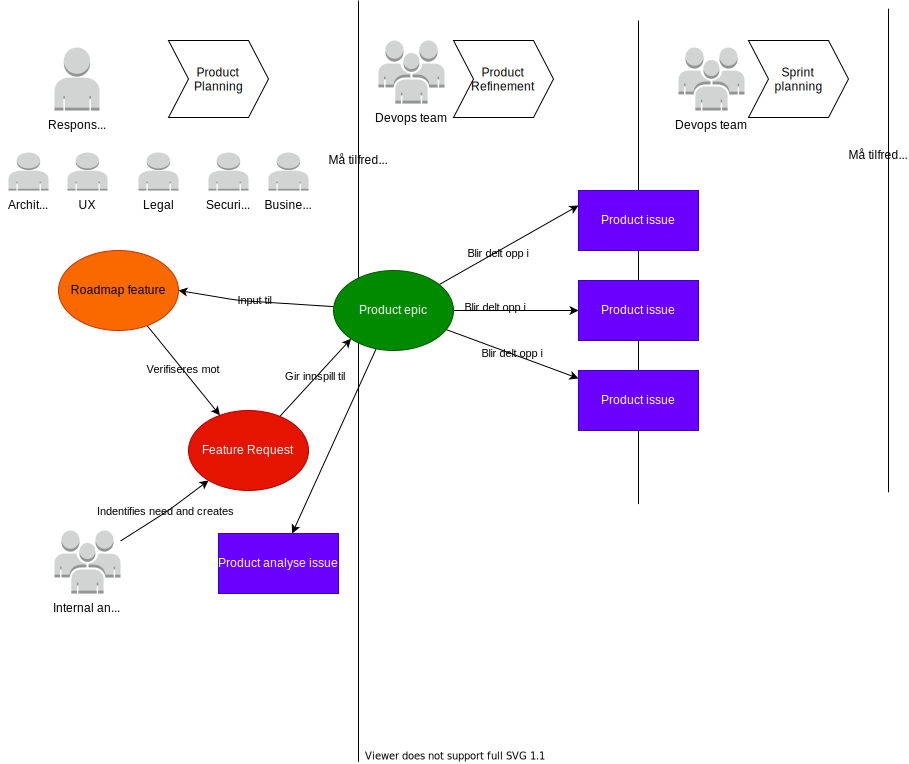

## DRAFT!!!!

Dette dokumentet beskriver artifakter og prosesser tilknyttet hvordan roadmap administreres og feature refines.

## Artifakter

Arbeidet med Altinn 3 krever en del artifakter.

[Fullscreen](roadmap.drawio.svg)

### Roadmap feature

Denne beskriver overordnet hvilken funksjonalitet feature dekker og overordnet egenskapene med funksjonaliteten.

Målet er at interessenter skal kunne lese denne uten å lese noe annet for å få en god forståelse hvilken funksjonalitet denne gir. 

Denne opprettes av produkteierene basert på følgende muligheter

- Feature requests i backlog som er meldt inn av team eller eksterne
- Identifiserte behov

Vi ønsker å legge oss på detaljnivået til [Github Roadmap](https://github.com/orgs/github/projects/4247) for roadmap features

Ansvarlig: Produkteiere
  
### Product feature epic

Kilden til denne kan være roadmap features eller opprettes i sammeheng med identifiserte behov.  Denne oppstår i stor grad før roadmap feature.

Denne vil inneholde detaljert beskrivelse av feature samt referer til underoppgaver som f.eks

- Juridisk analyse av oppgaver
- Teknisk analyse
- Funksjonell analyse

Det er produkteierne som i utgangspunktet eier denne, men får hjelp av teamarkitekter, utviklere, jurister og andre som trengs for å spesifisere disse

Denne featuren epic vil ligge i produktbackloggen hvor den mest naturlig hører hjemme. 

Det vil være naturlig at man itererer over denne mange ganger før den er klar til feature refinement.

Ansvarlig: Produkteiere

### Product Backlog issues

Dette er detaljerte oppgaver som er knyttet til epic. Kan være analyse oppgaver eller rene implementasjonsoppgave.

Issue tilknyttet en produkt feature epic trenger ikke å ligge i samme backlog som epic. 

Disse tas inn i sprinter som del av sprint planning

Ansvarlig: Devops team

# Prosess

Følgende prosess følges med artifakten

[Fullscreen](roadmapprocess.drawio.svg)

## Roadmap refinement

Dette er arbeidet som produkteierne utfører for å skape elementer i roadmap backloggen. 

Arbeidet starter typisk basert på en feature request som eksterne, team aller produkteiere har identifisert.

Avhengig av feature kan dette arbeidet inkludere

- Analysere funksjonelle behov
- Analysere tekniske behov og muligheter
- Vurdere alternativ løsningsformer på funksjonelt behov
- UX Analyse og design

Dette arbeidet dokumenteres i baclog epics eller underliggende backlog issues og oppsummeres i selve roadmap features når løsning er definert.

Detaljeringsgraden på dette arbeidet må tilfredstille **Defintion of ready** for å kunne tas videre og man iterer over
artifaktene til dette er tilfelle.

## Feature refinement

Feature refinement er behandling av Backlog epic med underliggende issues.

Målet med feature refinement er å detaljere issue til et nivå at team kan ta oppgavene inn i sprinter. 

- Viktige teknologi valg må være analysert
- Bør være mulig å identifisere oppgaver å dele opp i egne issues
- Være detaljert nok til at man kan si noe om omfang. 

Resultatet av feature refinement kan være at produkteiere må tilbake til "tegnebordet" for finne ut av problemstillinger som ble identifisert av devopsteam.

For saker hvor produkteiere mener alt er avklart trenger man ikke å ta dette til feature refinement. Disse kan tas rett til planning.


