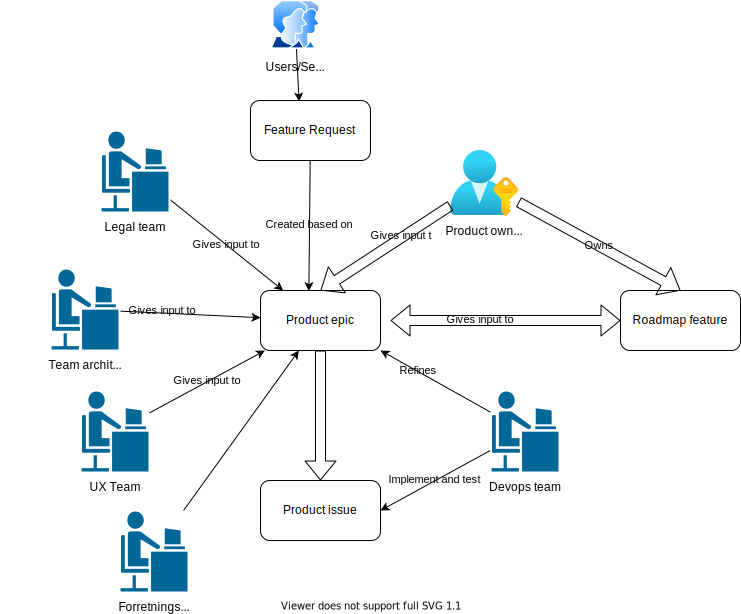

Dette dokumentet beskriver hvordan vi jobber med features for Altinn 3 plattformen.

## Artifakter
Arbeidet med Altinn 3 krever en del artifakter.

[Fullscreen](roadmap.drawio.svg)

### Feature request
En feature request er en forespørsel om ønsket funksjonalitet i Altinn 3 plattformen. Den opprettes enten av eksterne
som bruker plattformen, eller av andre som har identifsert et behov.

Feature request opprettes i de forsjellige produktbackloggene.
- [Altinn Apps](https://github.com/Altinn/apps-backlog/issues/issues?page=2&q=is%3Aissue+is%3Aopen)
- [Altinn Studio](https://github.com/Altinn/altinn-studio/labels/kind%2Ffeature-request)
- [Altinn Platform](https://github.com/Altinn/altinn-platform/labels/kind%2Ffeature-request)

### Product epic
Kilden til denne er typisk en feature request. 
Denne vil inneholde detaljert beskrivelse av feature samt referer til underoppgaver som f.eks
- Funksjonelle beskrivelser og tekniske analyser
- User Experience og Interaction design hensyn
- Juridiske vurderinger
- Sikkerhets vurderinger
- Kostnad/finansierings betraktninger
- (Oversikt over hvilke apper som har dette behovet?)

Det er produkteierne som i utgangspunktet eier denne, men får hjelp av teamarkitekter, utviklere, jurister og andre som trengs for å spesifisere disse
Denne featuren epic vil ligge i produktbackloggen hvor den mest naturlig hører hjemme. 
Det vil være naturlig at man itererer over denne mange ganger i product planing, før den er klar til product refinement.

[Eksempel 1 - funksjonel signering](https://github.com/Altinn/app-template-dotnet/issues/16)

Ansvarlig: Produkteiere

### Analyse issues
Analyse issue er github issues som typisk er lenket til product epic. 
Dette vil være premissgiveres vurderinger til videre realisering av epicen. 

Dette kan altså f.eks være
- User Experience og Interaction design hensyn
- Juridiske vurderinger
- Sikkerhets vurderinger
- Kostnad/finansierings betraktninger

Ansvarlig: Produkteiere
-Utførende: Diverse premissgivere

### Development issue
Dette er detaljerte oppgaver som er knyttet til epic og kan være analyse oppgaver eller rene implementasjonsoppgave.
Issue tilknyttet en produkt feature epic trenger ikke å ligge i samme backlog som epic. 
Disse tas inn i sprinter som del av sprint planning

Ansvarlig: Devops team
-Utførende: Devops team

### Roadmap feature
Denne beskriver overordnet hvilken funksjonalitet feature dekker og egenskapene ved funksjonaliteten.
Formålet er at eksterne interessenter skal kunne lese denne uten å lese noe annet for å få en god forståelse hvilken funksjonalitet en slik feature dekker og når den kommer.

Denne opprettes av produkteierene. 
Vanligvis basert på product epics, etter at den er nødvendig analysert og kan tas inn i roadmap.
Roadmap features finnes i [Roadmap repository](https://github.com/Altinn/altinn-roadmap/issues).
Vi ønsker å legge oss på detaljnivået til [Github Roadmap](https://github.com/orgs/github/projects/4247) for roadmap features

Ansvarlig: Produkteier
-Utførene: Produkteier

# Prosess
Følgende prosess følges med artifakten

[Fullscreen](roadmapprocess.drawio.svg)

## Product planing
Dette er arbeidet som produkteierne utfører, sammen med andre ressurser, for å skape og jobbe med epics i produkt backloggen og tilhørende analyse issues.
En oppsummering av et slikt element vil kunne ende opp som et road map feature.

Ansvarlig: Produkteier
-Søtte: Forretningsutviklere, Arkitekter, UX, Jurister, Sikkerhet, Forretning, Leverandørstyrere, samt andre produkteiere.

## Product refinement
Dette er en behandling med utgangspunkt i produkt epics med hensikt om å definere underliggende development issues.
Altså gjøre klart for sprintplaning, eventuelt sende det tilbake til produkt planing.

Målet med feature refinement er å detaljere issue til et nivå at team kan ta oppgavene inn i sprinter. 

- Viktige teknologi valg må være analysert
- Bør være mulig å identifisere oppgaver å dele opp i egne issues
- Være detaljert nok til at man kan si noe om omfang. 

## Sprint planing
DevOps teamet tar inn development issues i en (eller flere) sprinter basert på kapasitet. 


