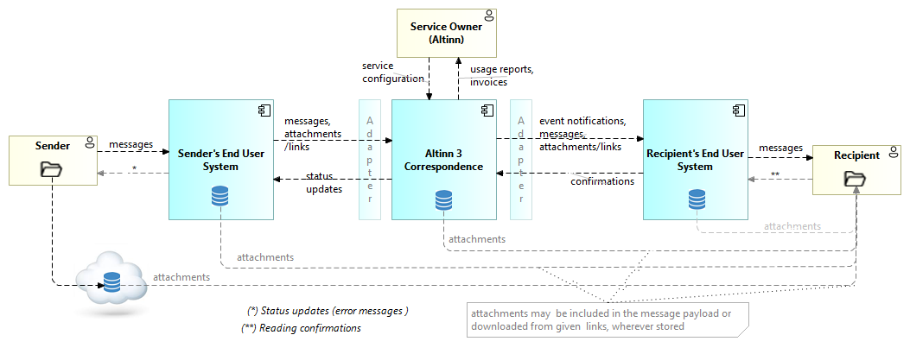
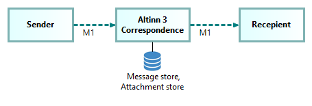
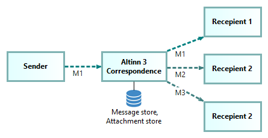

## Context overview - actors and information flow

The following diagram gives a high level overview of Altinn 3 Correspondence actors and information flow.

Explanation to the diagram:

TBD

## Supported messaging patterns

The basic messaging pattern supported by Altinn Correspondence is one-to-one messaging from one sender to one recipient.

Altinn 3 Correspondence also supports one-to-many messaging patterns.

## Conceptual information model

TBD

<!--
## State machine description {#message-transfer-state-machine}

TBD
-->