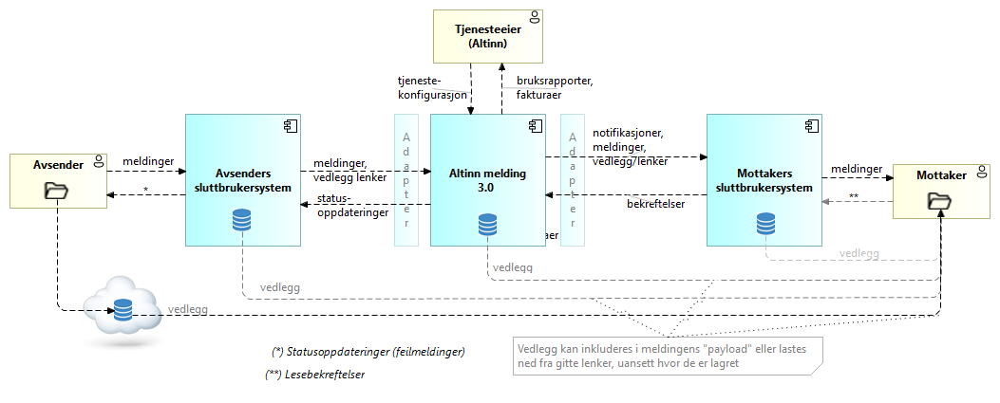
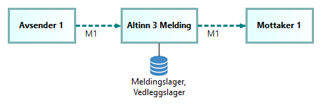
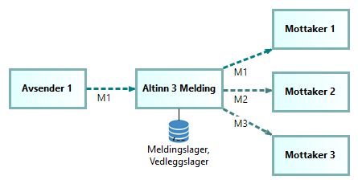

## Kontekstoversikt - aktører og informasjonsflyt

Følgende diagram gir en overordnet oversikt over aktører og informasjonsflyt  involvert i meldingsutveksling gjennom Altinn Melding.

Forklaring til dette diagrammet:

TBD.

## Meldingsmønstre

Det grunnleggende meldingsmønsteret som støttes av Altinn Melding er en-til-en meldingutveksling,
dvs. en melding fra en avsender til en enkelt mottaker.

Altinn 3 Melding støtter også mønstre for en-til-mange meldingsutveksling.

## Konseptuell informasjonsmodell

TBD.

## Tilstandsmaskinbeskrivelse {#message-transfer-state-machine}

TBD.