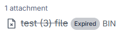

## What is attachment expiry?

Altinn 3 Correspondence supports configuring an expiry date on attachments.
When this expiry date is reached, the attachment will be deleted from the correspondence system and made unavailable for download.

The expiry date is configured per attachment and does not affect
the availability of the correspondence itself. The correspondence will still be visible to
the recipient even if one or more attachments have expired and been deleted.

## Why use attachment expiry?

- **Data minimisation**: Automatically remove attachments when they should no longer be available.
- **Compliance**: Support legal or contractual requirements for how long
  specific documents may be stored or be available to the recipient.
- **Reduced risk**: Limit how long sensitive documents are available
  on correspondences.

## How attachment expiry works in the lifecycle

At a high level, the lifecycle for an attachment with an expiry date is:

1. **The attachment is created and linked to one or more correspondences**  
   The attachment is stored and can be downloaded by authorised recipients, in line with
   the normal post-published lifecycle.

3. **When the attachment’s expiry date is reached:**
   - The attachment is marked as expired in the correspondence system.
   - The underlying file is deleted from storage in the correspondence system.
   - The attachment is made unavailable for download via the APIs.
   - The event `no.altinn.correspondence.attachmentexpired` is sent to the service owner.
   - The attachment is displayed as expired and with no download link on correspondences in *Arbeidsflate*.

4. **The correspondence continues its lifecycle**  
   The correspondence itself will continue through the normal post-published
   lifecycle (read, confirmed, deleted, etc.), regardless of whether
   one or more attachments on the correspondence have expired.

## Displaying attachment expiry

In *Arbeidsflate* it is clearly shown that an attachment has an expiry date, when it will expire, and whether it has expired.

