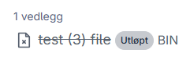

## Hva er utløpsdato for vedlegg?

Altinn 3 Melding støtter å sette en utløpsdato på vedlegg.
Når denne utløpsdatoen er nådd, vil vedlegget bli slettet fra meldingssystemet og gjort utilgjengelig for nedlasting.

Utløpsdato konfigureres per vedlegg, og påvirker ikke
tilgjengeligheten til selve meldingen. Meldingen vil fortsatt være synlig for
mottakeren selv om ett eller flere vedlegg har utløpt og blitt slettet.

## Hvorfor bruke utløpsdato på vedlegg?

- **Dataminimering**: Fjerne vedlegg automatisk når de ikke lenger skal være tilgjengelige.
- **Etterlevelse**: Understøtte juridiske eller avtalefestede krav til hvor lenge
  bestemte dokumenter kan lagres eller være tilgjengelige for mottaker.
- **Redusert risiko**: Begrense hvor lenge sensitive dokumenter er tilgjengelige
  på meldinger.

## Hvordan utløpsdato fungerer i livssyklusen

På et overordnet nivå er livssyklusen for et vedlegg med utløpsdato:

1. **Vedlegget opprettes og knyttes til en eller flere meldinger**  
   Vedlegget lagres og kan lastes ned av autoriserte mottakere, i tråd med
   den normale post-publiserte livssyklusen.

3. **Når utløpsdato-en på vedlegget nås:**
   - Vedlegget blir markert som expired i meldingssystemet.
   - Den underliggende filen slettes fra lagring i meldingssystemet.
   - Vedlegget blir gjort utilgjengelig for nedlasting via API-ene.
   - Hendelsen `no.altinn.correspondence.attachmentexpired` blir sendt ut til tjeneste-eier
   - Vedlegget blir vist som utløpt på meldinger i arbeidsflate uten en lenke til nedlastning

4. **Meldingen fortsetter sin livssyklus**  
   Selve meldingen vil fortsette gjennom den vanlige post-publiserte
   livssyklusen (lest, bekreftet, slettet, osv.), uavhengig av om
   ett eller flere vedlegg på meldingen har utløpt.

## Visning av utløpsdato på vedlegg

Det kommer tydelig frem i arbeidsflate at et vedlegg har en utløpsdato, når den utløper og om den har utløpt.

