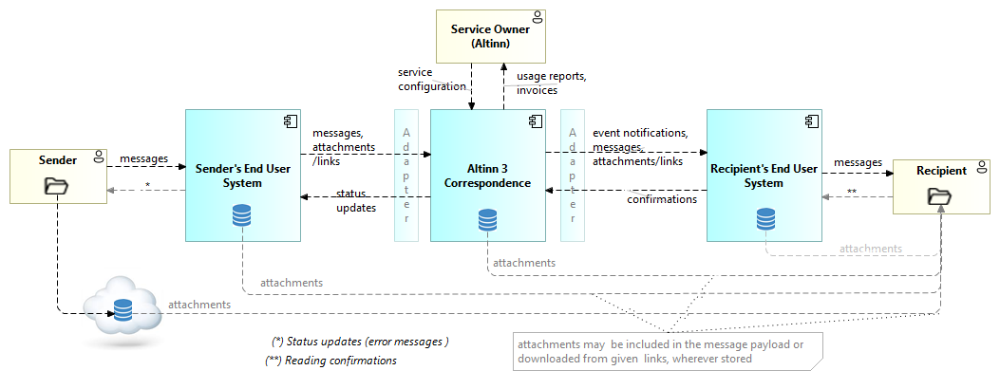
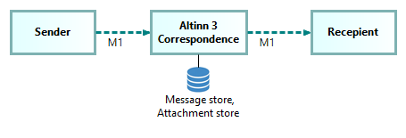

## Context overview - actors and information flow

The following diagram gives a high level overview of Altinn 3 Correspondence actors and information flow.

## Supported messaging patterns

The basic messaging pattern supported by Altinn Correspondence is one-to-one messaging from one sender to one recipient.

Altinn 3 Correspondence also supports batch sending. This means sending the same correspondence to multiple recipients in a single request.
When using batch sending, the system creates and stores a separate correspondence for each recipient.
This allows correspondence statuses and events to be handled individually for each recipient.

Note: Specifying an IdempotentKey on the correspondences is not supported when using batch sending.