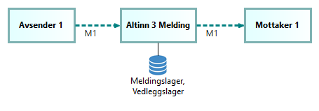

## Kontekstoversikt - aktører og informasjonsflyt

Følgende diagram gir en overordnet oversikt over aktører og informasjonsflyt  involvert i meldingsutveksling gjennom Altinn Melding.

## Meldingsmønstre

Det grunnleggende meldingsmønsteret som støttes av Altinn Melding er en-til-en meldingutveksling,
dvs. en melding fra en avsender til en enkelt mottaker.

Altinn 3 Melding støtter også batch-utsending. Dette er det å sende den samme meldingen til flere mottakere i en forespørsel. 
Ved batch-utsending oppretter og lagrer systemet en melding per mottaker. 
Dette gjør det mulig å håndtere meldingsstatuser og hendelser seperat for hver mottaker.

Merk: Det er ikke støtte for å angi IdempotentKey på meldingene ved batch-utsending.