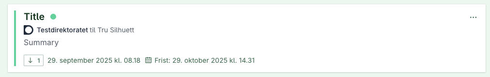
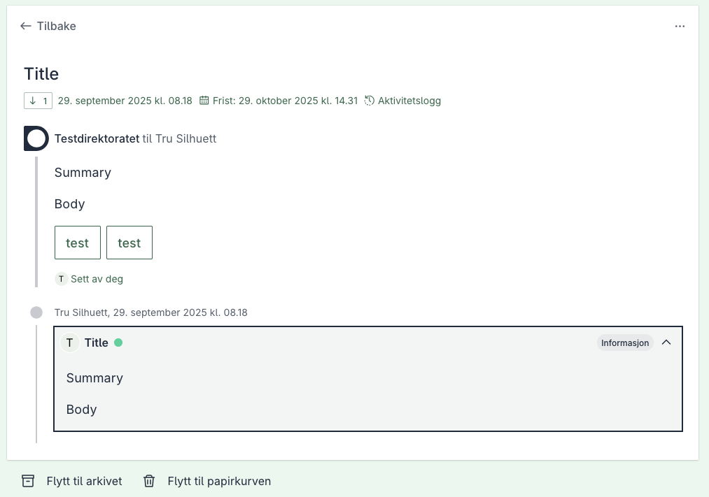



## Transmissions
A transmission can be created through the Altinn 3 Correspondence API to group multiple related instances within the same dialog.

#### Transmissions in arbeidsflate

Example Dialog with transmission:


Transmission at the bottom, marked with type "information".


### How to get started

When a correspondence is created the entity will be given a dialogId which resides in the external reference of the correspondence.
Future instances which are related to the dialog can be grouped through transmissions. This is done by referring to the dialogId in the external reference.

```json
{
    "correspondence":{
        ...,
        "externalReferences":[
            {
                "referenceValue": string,
                "referenceType" ReferenceType
            }
        ]
    }
}
```
The referenceValue of the transmission must be set to the dialogId of the dialog you're referring to.
Furthermore, the referenceType must be set to DialogportenDialogId to indicate that the new correspondence is part of a pre-existing dialog.

#### Setting transmission type
Transmission type is Information (1) if not set on the correspondence. You can set it by adding a DialogportenTransmissionType external reference when initializing the correspondence. Both the enum name and the numeric value are accepted. For example:

```json
{
    "correspondence":{
        ...,
        "externalReferences":[
            {
                "referenceValue": "Information",
                "referenceType": "DialogportenTransmissionType"
            }
        ]
    }
}
```

Or using the numeric value:
```json
{
    "correspondence":{
        ...,
        "externalReferences":[
            {
                "referenceValue": "1",
                "referenceType": "DialogportenTransmissionType"
            }
        ]
    }
}
```

Valid transmission types are:

| Type        | Value |
|-------------|:-----:|
| Information | 1     |
| Acceptance  | 2     |
| Rejection   | 3     |
| Request     | 4     |
| Alert       | 5     |
| Decision    | 6     |
| Submission  | 7     |
| Correction  | 8     |

#### Transmission successfully created
Once a transmission has successfully been created, the external references of the newly created correspondence will consist of a reference to the dialog in which
the correspondence is related as well as a reference to a transmissionId which has been set. 

The response should be of the following format:

```json
{
    "correspondence":{
        ...,
        "externalReferences":[
            {
                "referenceValue": dialogId,
                "referenceType": "DialogportenDialogId"
            },
            {
                "referenceValue": transmissionId,
                "referenceType": "DialogportenTransmissionId"
            }
        ]
    }
}
```

