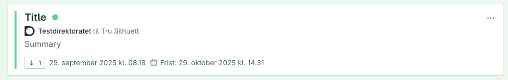
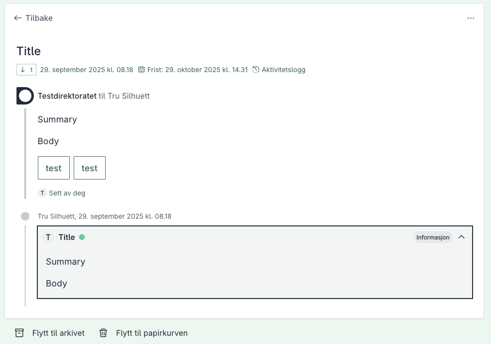



## Transmissions
En transmission kan opprettes gjennom Altinn 3 Melding API for å gruppere flere relaterte instanser innenfor samme dialog.

#### Transmissions i arbeidsflate

Eksempel på en dialog med transmission: 


Her ser du den nederst, markert med type "informasjon".


### Hvordan komme i gang

Når en melding opprettes vil entiteten få tildelt en dialogId som ligger i den eksterne referansen til meldingen.
Fremtidige instanser som er relatert til dialogen kan grupperes gjennom transmissions. Dette gjøres ved å referere til dialogId i den eksterne referansen.

```json
{
    "correspondence":{
        ...,
        "externalReferences":[
            {
                "referenceValue": string,
                "referenceType" ReferenceType
            }
        ]
    }
}
```
ReferenceValue for en transmission må settes til dialogId for dialogen du refererer til.
I tillegg må referenceType settes til DialogportenDialogId for å indikere at den nye meldingen er del av en eksisterende dialog.

#### Sette transmission-type
Transmission type er Information (1) dersom den ikke settes på meldingen. Du kan sette den ved å legge til en ekstern referanse med referenceType DialogportenTransmissionType når du initialiserer meldingen. Både enum-navn og numerisk verdi godtas. For eksempel:

```json
{
    "correspondence":{
        ...,
        "externalReferences":[
            {
                "referenceValue": "Information",
                "referenceType": "DialogportenTransmissionType"
            }
        ]
    }
}
```

Eller ved å bruke den numeriske verdien:

```json
{
    "correspondence":{
        ...,
        "externalReferences":[
            {
                "referenceValue": "1",
                "referenceType": "DialogportenTransmissionType"
            }
        ]
    }
}
```

Gyldige transmission-typer er:

| Type        | Verdi |
|-------------|:-----:|
| Information | 1     |
| Acceptance  | 2     |
| Rejection   | 3     |
| Request     | 4     |
| Alert       | 5     |
| Decision    | 6     |
| Submission  | 7     |
| Correction  | 8     |

#### Transmission opprettet
Når en transmission har blitt opprettet vil de eksterne referansene til den nyopprettede meldingen bestå av en referanse til dialogen som
meldingen er relatert til, samt en referanse til en transmissionId som har blitt satt.

Responsen skal være i følgende format:

```json
{
    "correspondence":{
        ...,
        "externalReferences":[
            {
                "referenceValue": dialogId,
                "referenceType": "DialogportenDialogId"
            },
            {
                "referenceValue": transmissionId,
                "referenceType": "DialogportenTransmissionId"
            }
        ]
    }
}
```
