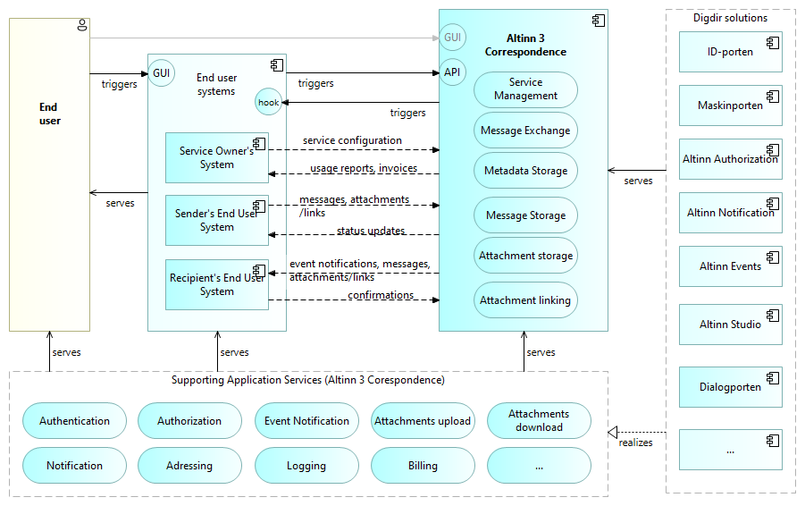

## High Level Solution Overview – main building blocks

The following figure gives a high level solution overview.

## Integration with Dialogporten and Arbeidsflate

## Security Controls {#security-controls}

### Authentication and authorization

Authentication and authorization are supported through Dialogporten (end users), Maskinporten (system-to-system) and Altinn Authorization.

This primarily protects against the following threats:

* Unauthorized access: Only legitimate users and systems gain access to resources.
* Privilege escalation: Access is granted following the principle of least privilege.
* Session hijacking and data leaks: Strong authentication mechanisms reduce risk.

### Checksum validation

For attachments, a checksum (MD5) can be provided by the sender and verified after upload to ensure integrity. Mismatch leads to failure.

### Malware scanning

Uploaded attachments are scanned with Microsoft Defender for Storage. Findings lead to failure/blocking, the event is logged and relevant events are published.

### In-transit protection {#in-transit-protection}

All communication uses TLS/HTTPS, both towards platform services and onwards to end users/systems.

### At-rest protection {#at-rest-protection}

Attachments and metadata are stored in Azure services encrypted at rest (platform encryption). Access is controlled via authorization and the platform’s network/access controls.

### DDoS mitigation

Mitigation is handled through Altinn/the platform’s Azure API Management (APIM), including use of policies that constrain traffic patterns.

### Secure coding practices

Following Altinn’s secure development guidelines (e.g., logging, error handling, least privilege) contributes to robustness.

### Open source

Open source enables transparency, community review, and rapid vulnerability remediation.

### Key vault

Azure Key Vault is used in infrastructure and deployment pipelines for secure handling of secrets. The application primarily uses Managed Identity to access Azure resources.

### Security controls through Azure API Management

* Rate limiting and quotas
* IP filtering (configured in the platform’s APIM)
* Basic protection against malicious requests

### Network security controls

* Isolation and segmentation handled at the platform level
* Network security rules (e.g., database firewall)
* Secure communication (VPN, etc.) where relevant for platform services

### Penetration testing

Testing is carried out according to Altinn/the platform’s security and test regime to discover and remediate weaknesses.
