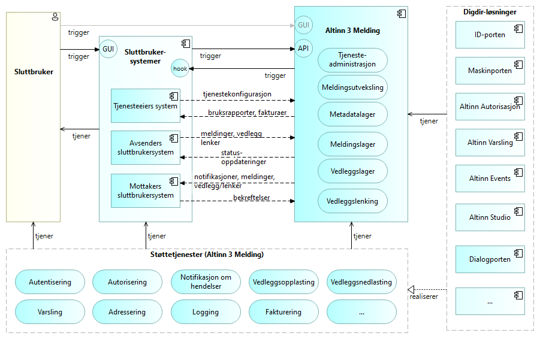
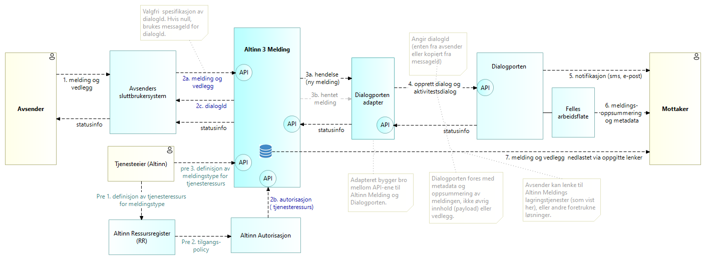

## Overordnet løsningsarkitektur

Følgende figur gir en oversikt over de vikigste byggeklossene i overordnet løsningsarktitektur for Altinn 3 Melding.

## Integrasjon med Dialogporten og Arbeidsflate

## Sikkerhetskontroller {#security-controls}

### Autentisering og autorisasjon

Autentisering og autorisasjon støttes gjennom Dialogporten (sluttbrukere), Maskinporten (system-til-system) og Altinn Autorisasjon.

Dette beskytter særlig mot følgende trusler:

* Uautorisert tilgang: Kun legitimerte brukere og systemer får tilgang til ressurser.
* Privilegiumeskalering: Tilgang gis etter minste privilegium.
* Session hijacking og datalekkasjer: Sterke autentiseringsmekanismer reduserer risiko.

### Sjekksumkontroll

For vedlegg kan sjekksum (MD5) oppgis av avsender og kontrolleres etter opplasting for å verifisere integritet. Mismatch fører til feiling.

### Viruskontroll

Opplastede vedlegg skannes med Microsoft Defender for Storage. Funn fører til feiling/sperring, hendelsen loggføres og relevante hendelser publiseres.

### Beskyttelse under overføring {#in-transit-protection}

All kommunikasjon skjer over TLS/HTTPS, både mot plattformtjenester og videre til sluttbrukere/systemer.

### Beskyttelse under lagring {#at-rest-protection}

Vedlegg og metadata lagres i Azure-tjenester som er kryptert i ro (plattformkryptering). Tilgang kontrolleres via autorisasjon og plattformens nettverks-/tilgangskontroller.

### Forebygging av DDoS-angrep

Forebygging håndteres gjennom Altinn/Plattformens Azure API Management (APIM), inkludert bruk av policier som begrenser trafikkmønstre.

### God kodepraksis

Etterlevelse av Altinns retningslinjer for sikker utvikling (bl.a. logging, feilhåndtering, minst privilegium) bidrar til robusthet.

### Åpen kildekode

Åpen kildekode muliggjør transparens, fellesskapsreview og rask sårbarhetsretting.

### Nøkkelhvelv

Azure Key Vault benyttes i infrastruktur og deploy-pipelines for sikker håndtering av hemmeligheter. Applikasjonen bruker i hovedsak Managed Identity for tilgang til Azure-ressurser.

### Sikkerhetskontroller gjennom Azure API Management

* Rate limiting og kvoter
* IP-filtrering (konfigurert i plattformens APIM)
* Grunnleggende beskyttelse mot skadelige forespørsler

### Sikkerhetskontroller gjennom nettverk

* Isolasjon og segmentering håndteres på plattformnivå
* Nettverkssikkerhetsregler (f.eks. database‑firewall)
* Sikker kommunikasjon (VPN m.m.) der relevant for plattformtjenester

### Penetrasjonstesting

Testing gjennomføres i henhold til Altinn/Plattformens sikkerhets- og testregime for å avdekke og utbedre svakheter.