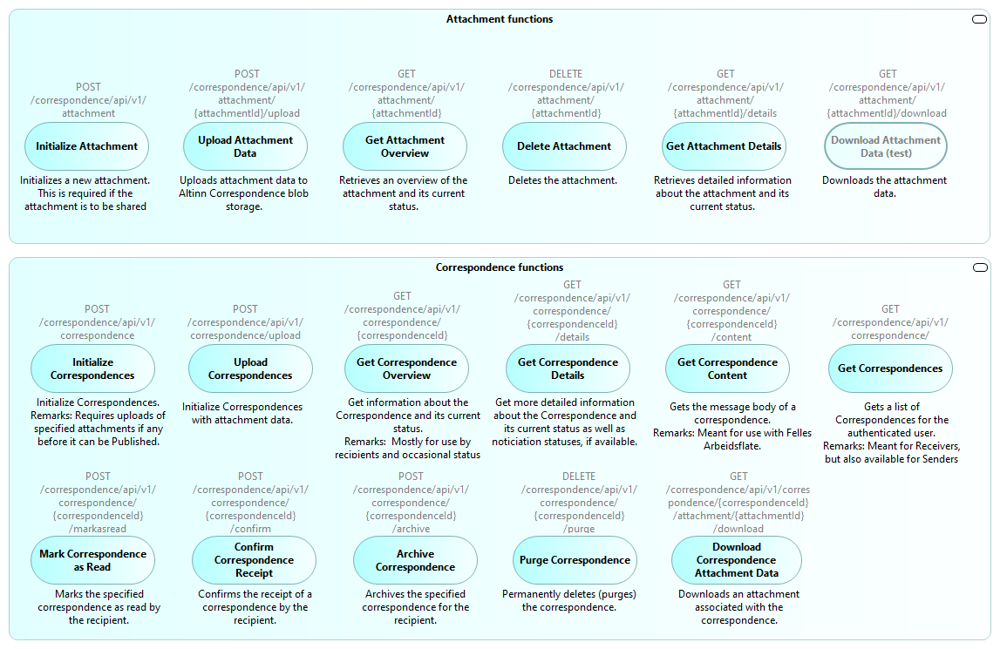
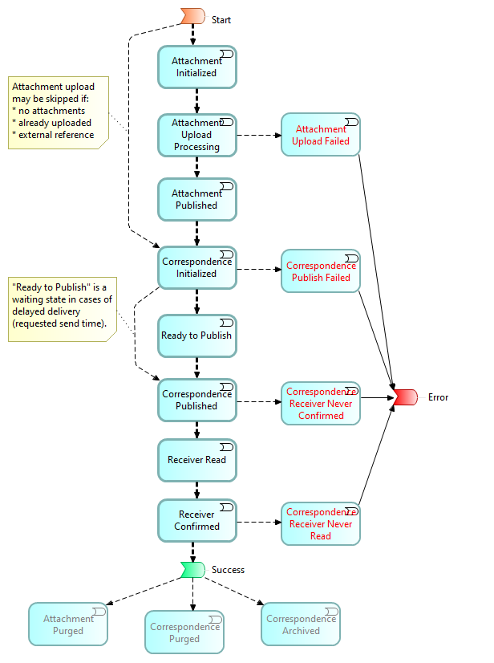
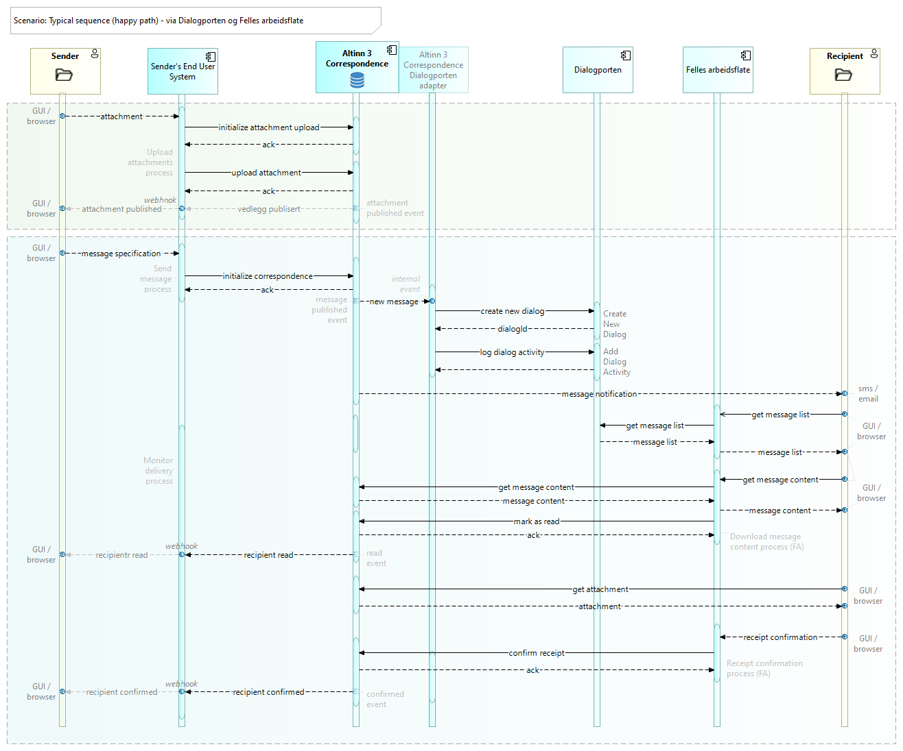

## Overview of Altinn 3 Correspondence external interfaces
The following figure indicates the main system interfaces of Altinn 3 Correspondence:

## API Operations

## Event notifications (machine-to-machine)

## End user notifications (email, SMS)
Notifications to end users about new messages and other events are sent via the Altinn Notification Service.

Also see:

## Scenario descriptions

### End-to-end typical sequence

The follow sequence diagram shows the typical “happy path” sequence:

