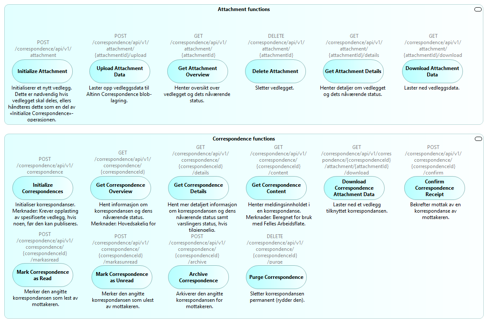

## Oversikt over Altinn 3 Melding eksterne grensesnitt
Følgende figur indikerer de viktigste systemgrensesnittene for Altinn 3 Melding som selvstendig løsning (uten Dialogporten):

## API-operasjoner
En oversikt over operasjoner i Altinn 3 Formidling API gis av følgende figur:

## Notifikasjoner om hendelser - maskin-til-maskin

## Varsling til sluttbrukere via e-post og SMS
Varsler til sluttbrukere om nye meldinger, filer og andre hendelser sendes via Altinns varslingstjeneste.

Se også:

## Scenariobeskrivelser

### Ende-til-ende typisk sekvens

Følgende sekvensdiagram viser typisk “happy path” sekvens fra opprettelse av vedlegg og melding, 
til levering og mottaksbekreftelse:

