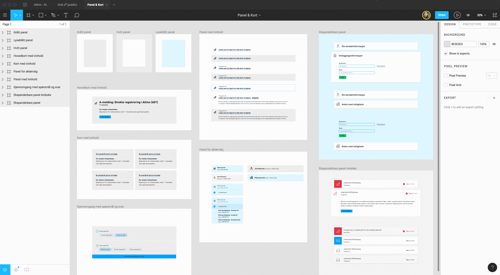
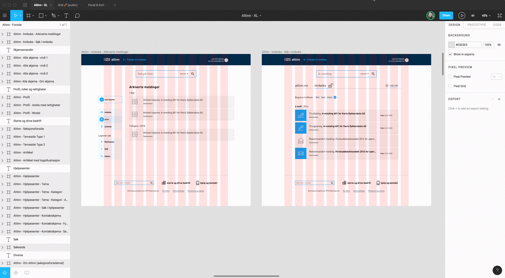

For å få tilgang til Altinns Figma-konto ta kontakt med [Alise Kjelling](mailto:alise.kjelling@brreg.no).

Ved hjelp av “Team Library” deler vi komponenter på tvers av alle filer og prosjekter i Altinns Figmakonto. Filmen over viser hvordan komponentene er delt inn i "Lister", "Skjemakomponenter" og så videre.

## Masterkomponenter og instanser
Dersom en master-komponent oppdateres vil de ulike filene som bruker komponenten få en melding om oppdateringen og spørsmål om å oppdatere til nyeste versjon.

Filmen under viser eksempel på endring av en fargekomponent. Brukes fargen av en knapp, vil man i knappens fil få spørsmål om å oppdatere fargen. Herfra kan man igjen publisere den nye knappen, slik at disse endringene igjen når ut til alle filer som bruker knappen.

Hver masterkomponent eksisterer kun en gang. 
Alle instanser av komponenten lever sitt eget liv og endringer i disse vil ikke påvirke masterkomponenten. Man kan alltid resette en instans til å se ut som masterkomponenten igjen (ved å høyreklikke og velge “reset”).

## Sett opp en ny mal i figma
For å lage en ny mal må du først kopiere griden du ønsker å bruke (som du finner i “Introduksjon” > “Grid”). Gå deretter inn i prosjektet du skal jobbe med (f.eks “Maler-Altinn”). 
Velg filen XL eller XS, alt ettersom om du skal lage en ny desktopskisse eller mobilskisse. Lim inn griden (den kan justeres i høyden, men ikke i bredden). Hent til slutt inn komponentene du trenger fra “Team Library” og gjør eventuelle justeringer på dem.

## Variasjoner av komponenter
En komponent kan inneholde flere ulike varianter av lag du kan skru på og av. Dersom du f.eks henter inn komponenten “Standard liste” og ser i lagene, vil du finne skjulte lag du kan aktivere ved å bruke øyesymbolet.

## Versjonskontroll
På hver fil har man mulighet til å vise versjonshistorikk. Her kan man enkelt gå tilbake i historikken dersom en komponent er ødelagt.

## Prototyping
Når sidemaler befinner seg i samme fil, er det mulig å lenke mellom dem. På denne måten kan man sette opp en enkel klikkbar prototype som viser hvor de ulike lenkene fører deg hen.

<h2>Eksempel på Altinns Figma-filer</h2>
De navigerbare rammene under viser eksempler på filer vi har i komponentbiblioteket vårt. For å få tilgang til biblioteket, ta kontakt med <a href="mailto:alise.kjelling@brreg.no">Alise Kjelling</a>.  

<iframe style="border: none;" width="690" height="450" src="https://www.figma.com/embed?embed_host=share&url=https://www.figma.com/file/CXfqqhADO3NqUy8UAyZbgtP1/Lister-%F0%9F%9A%80-public" allowfullscreen></iframe>

<iframe style="border: none;" width="690" height="450" src="https://www.figma.com/embed?embed_host=share&url=https://www.figma.com/file/GyswmqpVg2wXAfn1631J9Ipz/Skjemakomponenter-%F0%9F%9A%80-public" allowfullscreen></iframe>

<iframe style="border: none;" width="690" height="450" src="https://www.figma.com/embed?embed_host=share&url=https://www.figma.com/file/ZkfTPt4kU0SWMhjN5Jyht65y/Panel-and-Kort-%F0%9F%9A%80-public" allowfullscreen></iframe>

