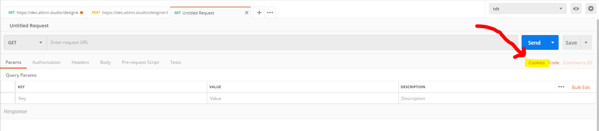

## Postman
To test API endpoints the tool postman enables easy configuration and setup of various HTTP requests, [read more about postman here.](https://learning.getpostman.com/docs/postman/sending_api_requests/requests)

### Authentication

Several of the exposed APIs requires various cookies, for instance authentication and gitea information. To be able to do requests against these APIs the cookies have to be included in the HTTP request, and configured in postman. The cookies can be found in the following way:
- In your browser login to dev.altinn.studio/altin.studio/altinn3.no depending on what environment you are targeting
- Notice that the cookies AltinnStudioDesigner, AltinnStudioRuntime and i_like_gitea (among others) has been saved for the domain name you have logged in to.
  - For Chrome cookies can be found under settings -> advanced -> cookies -> see all.

The two cookies AltinnStudioDesigner and AltinnStudioRuntime works as auth against the Designer and Runtime API, so if you are targeting a Designer API you should include the AltinnStudioDesigner cookie, along with the i_like_gitea cookie, and if you are targeting a runtime API the AltinnStudioRuntime cookie should be included.
Cookies are easily added to the postman requests under the slightly hidden cookies setting, see:

