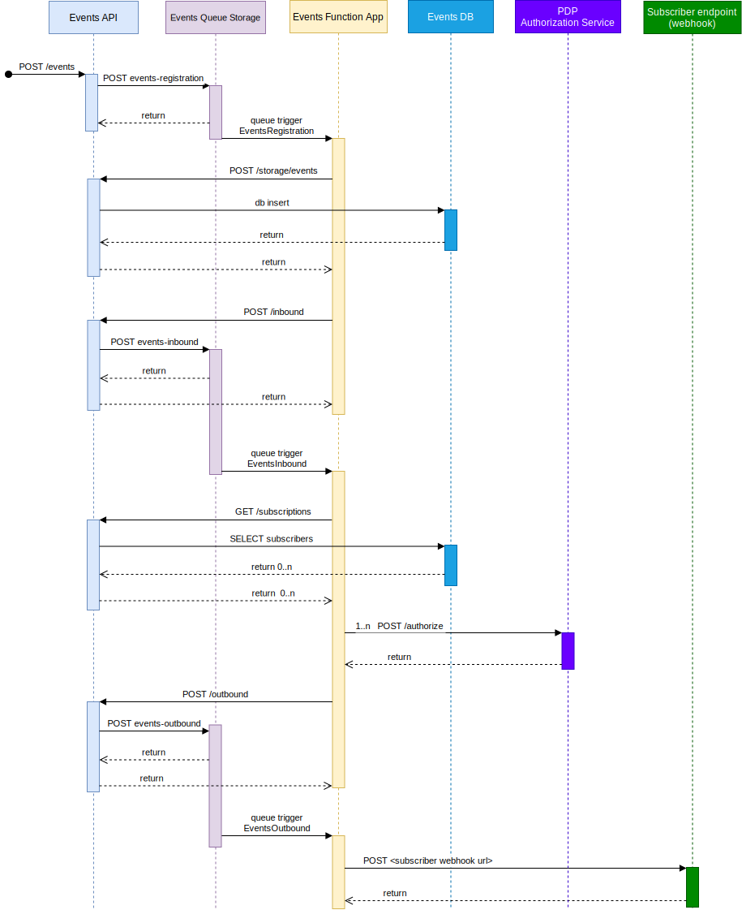

## System architecture illustration

When a publish request is posted to the `/app` endpoint, the event will first be saved in the `events-registration` queue for operational resilience and flexibility. 

When an event retrieval request is received, it will respond with results from the internal relational database used for events persistence.

## Flow for processing a single incoming event

## System and service dependencies 
### Internal
- **Altinn Authorization**: used to authorize access to endpoints

### External
- [**Azure Kubernetes Services**](https://azure.microsoft.com/en-us/products/kubernetes-service): hosts the docker containers for microservices and cron jobs 
  in a fully managed Kubernetes cluster
- [**PostgreSQL**](https://www.postgresql.org/): used for storage
- [**Azure Functions**](https://docs.microsoft.com/en-us/azure/azure-functions/): used internally to process and forward incoming cloud events to subscriber webhooks. 

