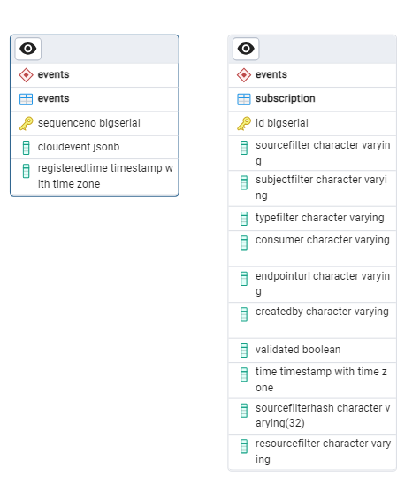

## API

### Public API

The following API controllers are defined: 
- [AppController](https://github.com/Altinn/altinn-events/blob/main/src/Events/Controllers/AppController.cs) : publishes (store and forward) and retrieve app events
- [EventsController](https://github.com/Altinn/altinn-events/blob/main/src/Events/Controllers/EventsController.cs) : publishes (store and forward) and retrieve generic events
- [SubscriptionController](https://github.com/Altinn/altinn-events/blob/main/src/Events/Controllers/SubscriptionController.cs) : creates, retrieves, validates and deletes event subscriptions

### Private API
The API controllers listed below are exclusively for use within the Notification solution:
- [StorageController](https://github.com/Altinn/altinn-events/blob/main/src/Events/Controllers/StorageController.cs) : saves incoming events to persistent storage (database)  
- [InboundController](https://github.com/Altinn/altinn-events/blob/main/src/Events/Controllers/InboundController.cs) : pushes events to _events-inbound_ queue
- [OutboundController](https://github.com/Altinn/altinn-events/blob/main/src/Events/Controllers/OutboundController.cs) : identify and authorize event subscribers and push event and subscriber details to _events-outbound_ queue
- [WebhookReceiverController](https://github.com/Altinn/altinn-events/blob/main/src/Events/Controllers/WebhookReceiverController.cs) : provides end point to support automated testing of subscriptions

## Database

Events data is persisted in a PostgreSQL database.

### Tables

Each table in the events schema is described in the table below, followed by a diagram showing the relation between the tables.

| Table              | Description                                        |
| ------------------ | -------------------------------------------------- |
| events             | Contains each cloud event and the registered time  |
| subscription       | Holds metadata for each event subscription         |

<!--Schema extracted through pgAdmin using ERD tool for schema-->

### Indexes

A number of indexes have been introduces to increased performance of the frequently used queries.

| index                                   |table       |
|-----------------------------------------|------------|
|events_pkey                              |events      |
|idx_events_computed_time                 |events      |
|idx_events_cloudevent_id                 |events      |
|idx_events_cloudevent_subject            |events      |
|idx_events_cloudevent_alternativesubject |events      |
|idx_events_cloudevent_source             |events      |
|idx_events_cloudevent_type               |events      |
|idx_events_cloudevent_time               |events      |
|idx_events_cloudevent_resource_sequenceno|events      |
|idx_events_cloudevent_subject_time       |events      |
|eventssubscription_pkey                  |subscription|
|idx_gin_subscription_consumer            |subscription|
|idx_subscription_subject_source_type     |subscription|
|idx_btree_subscription_sourcefilterhash  |subscription|
|idx_subscription_resourcefilter          |subscription|

## Azure Storage Queues
Azure Storage Queues have been set up to enable the .NET application and Azure Functions to send data for processing by
a different service.

Logic for enqueueing elements is handled by
[EventsQueueClient](https://github.com/Altinn/altinn-events/blob/main/src/Events/Clients/EventsQueueClient.cs) and 
called from all relevant services. 

The queues we operate with are 
- events-registration
- events-inbound
- events-outbound
- subscription-validation

## Azure Functions

Multiple [Azure Functions](https://docs.microsoft.com/en-us/azure/azure-functions/) have been set up to 
decouple the processing and pushing of events as well as subscription validation.
All functions run based on Storage Queue triggers. An important principle for the functions is that each function 
should only have a single dependency to a logical action e.g. save to database, push to recipient etc. 
This way, if the action fails a retry can be done without any unexpected side effects. 

- [EventsRegistration](https://github.com/Altinn/altinn-events/blob/main/src/Events.Functions/EventsRegistration.cs) : 
  Pushes events to internal API endpoint that persists cloud event to database and on success pushes to
  internal API endpoint for inbound processing.
- [EventsInbound](https://github.com/Altinn/altinn-events/blob/main/src/Events.Functions/EventsInbound.cs) :
  Pushes event to internal API endpoint that finds subscriptions with filters matching the cloud event.
- [EventsOutbound](https://github.com/Altinn/altinn-events/blob/main/src/Events.Functions/EventsOutbound.cs) 
  POST cloud event to webhook endpoint associated with a subscription.
- [SubscriptionValidation](https://github.com/Altinn/altinn-events/blob/main/src/Events.Functions/SubscriptionValidation.cs) 
  POST validation cloud event to user-defined webhook endpoint to check that it is ready to receive data. 
  If so, a request is sent to internal API endpoint that updated the status in the database.

| Name                   | Trigger queue            | Retry mechanism |
|------------------------|--------------------------|-----------------|
| EventRegistration      | events-registration      | default         |
| EventsInbound          | events-inbound           | default         |
| EventsOutbound         | events-outbound          | [CustomQueueProcessorFactory](https://github.com/Altinn/altinn-events/blob/main/src/Events.Functions/Factories/CustomQueueProcessorFactory.cs) |
| SubscriptionValidation | subscription-validation  | [CustomQueueProcessorFactory](https://github.com/Altinn/altinn-events/blob/main/src/Events.Functions/Factories/CustomQueueProcessorFactory.cs) |

## Dependencies 

The microservice takes use of a range of external and Altinn services as well as .NET libraries to support the provided
functionality. 
Find descriptions of key dependencies below. 

### External Services
| Service                         | Purpose                                                        | Resources                                                                       |
| ------------------------------- | -------------------------------------------------------------- | ------------------------------------------------------------------------------- |
| Azure Database for PostgreSQL   | Hosts the database                                             | [Documentation](https://azure.microsoft.com/en-us/products/postgresql)          |
| Azure API Management            | Manages access to public API                                   | [Documentation](https://azure.microsoft.com/en-us/products/api-management)      |
| Azure Functions                 | Hosts the server less functions                                | [Documentation](https://azure.microsoft.com/nb-no/products/functions)           |
| Azure Key Vault                 | Safeguards secrets used by the microservice                    | [Documentation](https://azure.microsoft.com/en-us/products/key-vault)           |
| Azure Kubernetes Services (AKS) | Hosts the microservice and cron jobs                           | [Documentation](https://azure.microsoft.com/en-us/products/kubernetes-service/) |
| Azure Monitor                   | Telemetry from the application is sent to Application Insights | [Documentation](https://azure.microsoft.com/en-us/products/monitor)             |
| Azure Storage                   | Hosts the queues and persists data in queues                   | [Documentation](https://azure.microsoft.com/nb-no/products/storage/)            |                  

### Altinn Services
| Service                     | Purpose                                                 | Resources                                                    |
| --------------------------- | ------------------------------------------------------- | ------------------------------------------------------------ |
| Altinn Authorization        | Authorizes access to the API                            | [Repository](https://github.com/altinn/altinn-authorization) |
| Altinn Register             | Provides lookup of alternative subjects person and org  | [Repository](https://github.com/altinn/altinn-register)      |

### .NET Libraries
The Events microservice and functions take use of a range of libraries to support the provided functionality. 

| Library                 | Purpose                                 | Resources                                                                                                                                   |
| ----------------------------------- | ------------------------------------------- | ------------------------------------------------------------------------------------------------------------------------------- |
| Azure.Storage.Queues                | Used to send data to the storage queues     | [Repository](https://github.com/Azure/azure-storage-net), [Documentation](https://learn.microsoft.com/en-us/dotnet/api/overview/azure/storage.queues-readme?view=azure-dotnet)|
| CloudNative.CloudEvents.AspNetCore  | Used for encoding and decoding cloud events | [Repository](https://github.com/cloudevents/sdk-csharp), [Documentation](https://cloudevents.io/)                                |
| AccessToken                         | Used to validate tokens in requests         | [Repository](https://github.com/altinn/altinn-accesstoken), [Documentation](../../../authentication/reference/architecture/accesstoken/)  |
| JWTCookieAuthentication             | Used to validate Altinn token (JWT)         | [Repository](https://github.com/Altinn/altinn-authentication), [Documentation](../../../authentication/reference/architecture/jwtcookie/) |
| Npgsql                              | Used to access the database server          | [Repository]( https://github.com/rdagumampan/yuniql ), [Documentation](https://www.npgsql.org/)                                 |
| Yuniql                              | DB migration                                | [Repository](https://github.com/rdagumampan/yuniql), [Documentation](https://yuniql.io/)                                        |

[A full list of NuGet dependencies is available on GitHub](https://github.com/Altinn/altinn-events/network/dependencies).

## Testing 
Quality gates implemented for a project require an 80 % code coverage for the unit and integration tests combined.
[xUnit](https://xunit.net/) is the framework used and the [Moq library](https://github.com/moq) supports mocking
parts of the solution.

### Unit tests
The unit test projects are is available on GitHub.
- [Altinn.Platform.Events.Tests](https://github.com/Altinn/altinn-events/tree/main/test/Altinn.Events.Tests)
- [Altinn.Platform.Events.Functions.Tests](https://github.com/Altinn/altinn-events/tree/main/test/Altinn.Platform.Events.Functions.Tests)

### Integration tests
No integration tests using external components haeve ben implemented for this solution.
Look to unit test project for all tests related to Events. 

### Automated tests 
[The automated test project is available on GitHub](https://github.com/Altinn/altinn-events/tree/main/test/k6)

The automated tests for this micro service are implemented through [Grafana's k6](https://k6.io/). 
The tool is specialized for load tests, but we do use it for automated API tests as well. 
The test set is used for both use case and regression tests. 

#### Use case tests
[All use case workflows are available on GitHub](https://github.com/Altinn/altinn-events/tree/main/.github/workflows)

Use case tests are run every 15 minutes through GitHub Actions. 
The tests run during the use case tests are defined in the k6 test project. 
The aim of the tests is to run through central functionality of the solution to ensure that it is running and available to our end users.

#### Regression tests 
Regression tests are hosted in [Azure DevOps pipelines](https://dev.azure.com/brreg/altinn-studio/_build?definitionId=96) 
and triggered at the end of a release pipeline. 

## Hosting

### Web API 
The microservice runs in a Docker container hosted in AKS, 
and it is deployed as a Kubernetes deployment with autoscaling capabilities

The events application runs on port 5090. 

See [DockerFile](https://github.com/Altinn/altinn-events/blob/main/Dockerfile) for details.

### Azure Functions
The Azure functions are hosted in a function app only containing event related functions. 

### Azure Storage
The Storage Queues are hosted in a geo-zone-redundant, general purpose v2 storage account. 

### Database
The database is hosted on a PostgreSQL flexible server in Azure. 

## Build & deploy

### Web API 
  - Build and Code analysis runs in a [Github workflow](https://github.com/Altinn/altinn-events/actions)
  - Build of the image is done in an [Azure DevOps Pipeline](https://dev.azure.com/brreg/altinn-studio/_build?definitionId=383)
  - Deploy of the image is enabled with Helm and implemented in an [Azure Devops Release pipeline](https://dev.azure.com/brreg/altinn-studio/_release?_a=releases&view=all&definitionId=49)

### Azure Functions
   -Build of the Azure Function zip file is done in an [Azure DevOps Pipeline](https://dev.azure.com/brreg/altinn-studio/_build?definitionId=244)
   - Deploy of the Azure Functions is done in an [Azure DevOps Release pipeline](https://dev.azure.com/brreg/altinn-studio/_release?_a=releases&view=all&definitionId=27)

### Database
  - Migration scripts are copied into the Docker image of the web API when this is build
  - Execution of the scripts is on startup of the application and enabled by [YUNIQL](https://yuniql.io/)

## Run on local machine
Instructions on how to set up the service on local machine for development or testing is covered by 
[the README in the repository](https://github.com/Altinn/altinn-events). 