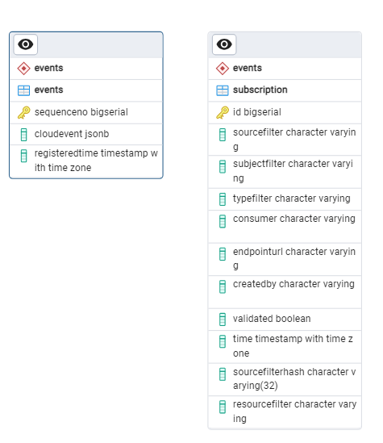

## API

### Offentlig API

Følgende API-kontrollere er definert:

- [AppController](https://github.com/Altinn/altinn-events/blob/main/src/Events/Controllers/AppController.cs) : publiserer (lagre og videresende) og henter app-hendelser
- [EventsController](https://github.com/Altinn/altinn-events/blob/main/src/Events/Controllers/EventsController.cs) : publiserer (lagre og videresende) og henter generiske hendelser
- [SubscriptionController](https://github.com/Altinn/altinn-events/blob/main/src/Events/Controllers/SubscriptionController.cs) : oppretter, henter, validerer og sletter hendelsesabonnementer

### Privat API

API-kontrollerne listet nedenfor er utelukkende for bruk innenfor Notification-løsningen:

- [StorageController](https://github.com/Altinn/altinn-events/blob/main/src/Events/Controllers/StorageController.cs) : lagrer innkommende hendelser til persistent lagring (database)
- [InboundController](https://github.com/Altinn/altinn-events/blob/main/src/Events/Controllers/InboundController.cs) : sender hendelser til _events-inbound_-køen
- [OutboundController](https://github.com/Altinn/altinn-events/blob/main/src/Events/Controllers/OutboundController.cs) : identifiserer og autoriserer hendelsesabonnenter og sender hendelses- og abonnentdetaljer til _events-outbound_-køen
- [WebhookReceiverController](https://github.com/Altinn/altinn-events/blob/main/src/Events/Controllers/WebhookReceiverController.cs) : tilbyr endepunkt for å støtte automatisert testing av abonnementer

## Database

Hendelsesdata lagres vedvarende i en PostgreSQL-database.

### Tabeller

Hver tabell i events-skjemaet er beskrevet i tabellen nedenfor, etterfulgt av et diagram som viser forholdet mellom tabellene.

| Tabell       | Beskrivelse                                           |
| ------------ | ----------------------------------------------------- |
| events       | Inneholder hver cloud event og registreringstidspunkt |
| subscription | Inneholder metadata for hvert hendelsesabonnement     |

<!--Schema extracted through pgAdmin using ERD tool for schema-->

### Indekser

En rekke indekser har blitt introdusert for å øke ytelsen til de ofte brukte spørringene.

| indeks                                    | tabell       |
| ----------------------------------------- | ------------ |
| events_pkey                               | events       |
| idx_events_computed_time                  | events       |
| idx_events_cloudevent_id                  | events       |
| idx_events_cloudevent_subject             | events       |
| idx_events_cloudevent_alternativesubject  | events       |
| idx_events_cloudevent_source              | events       |
| idx_events_cloudevent_type                | events       |
| idx_events_cloudevent_time                | events       |
| idx_events_cloudevent_resource_sequenceno | events       |
| idx_events_cloudevent_subject_time        | events       |
| eventssubscription_pkey                   | subscription |
| idx_gin_subscription_consumer             | subscription |
| idx_subscription_subject_source_type      | subscription |
| idx_btree_subscription_sourcefilterhash   | subscription |
| idx_subscription_resourcefilter           | subscription |

## Azure Storage-køer

Azure Storage-køer har blitt satt opp for å gjøre det mulig for .NET-applikasjonen og Azure Functions å sende data for prosessering av
en annen tjeneste.

Logikk for innlegging av elementer i kø håndteres av
[EventsQueueClient](https://github.com/Altinn/altinn-events/blob/main/src/Events/Clients/EventsQueueClient.cs) og
kalles fra alle relevante tjenester.

Køene vi opererer med er

- events-registration
- events-inbound
- events-outbound
- subscription-validation

## Azure Functions

Flere [Azure Functions](https://docs.microsoft.com/en-us/azure/azure-functions/) har blitt satt opp for å
frikoble prosessering og utsending av hendelser samt abonnementsvalidering.
Alle funksjoner kjøres basert på Storage Queue-triggere. Et viktig prinsipp for funksjonene er at hver funksjon
kun skal ha en enkelt avhengighet til en logisk handling, f.eks. lagre til database, sende til mottaker osv.
På denne måten, hvis handlingen mislykkes, kan et nytt forsøk gjøres uten uventede bivirkninger.

- [EventsRegistration](https://github.com/Altinn/altinn-events/blob/main/src/Events.Functions/EventsRegistration.cs) :
  Sender hendelser til internt API-endepunkt som lagrer cloud event vedvarende til database og ved suksess sender til
  internt API-endepunkt for innkommende prosessering.
- [EventsInbound](https://github.com/Altinn/altinn-events/blob/main/src/Events.Functions/EventsInbound.cs) :
  Sender hendelse til internt API-endepunkt som finner abonnementer med filtre som matcher cloud event.
- [EventsOutbound](https://github.com/Altinn/altinn-events/blob/main/src/Events.Functions/EventsOutbound.cs)
  POST-er cloud event til webhook-endepunkt tilknyttet et abonnement.
- [SubscriptionValidation](https://github.com/Altinn/altinn-events/blob/main/src/Events.Functions/SubscriptionValidation.cs)
  POST-er validerings-cloud event til brukerdefinert webhook-endepunkt for å sjekke at det er klart til å motta data.
  Hvis det er klart, sendes en forespørsel til internt API-endepunkt som oppdaterer statusen i databasen.

| Navn                   | Triggerkø               | Retry-mekanisme                                                                                                                                |
| ---------------------- | ----------------------- | ---------------------------------------------------------------------------------------------------------------------------------------------- |
| EventRegistration      | events-registration     | standard                                                                                                                                       |
| EventsInbound          | events-inbound          | standard                                                                                                                                       |
| EventsOutbound         | events-outbound         | [CustomQueueProcessorFactory](https://github.com/Altinn/altinn-events/blob/main/src/Events.Functions/Factories/CustomQueueProcessorFactory.cs) |
| SubscriptionValidation | subscription-validation | [CustomQueueProcessorFactory](https://github.com/Altinn/altinn-events/blob/main/src/Events.Functions/Factories/CustomQueueProcessorFactory.cs) |

## Avhengigheter

Mikrotjenesten benytter seg av en rekke eksterne og Altinn-tjenester samt .NET-biblioteker for å støtte den tilbudte
funksjonaliteten.
Finn beskrivelser av nøkkelavhengigheter nedenfor.

### Eksterne tjenester

| Tjeneste                        | Formål                                                                                         | Ressurser                                                                       |
| ------------------------------- | ---------------------------------------------------------------------------------------------- | ------------------------------------------------------------------------------- |
| Azure Database for PostgreSQL   | Er vert for databasen                                                                          | [Dokumentasjon](https://azure.microsoft.com/en-us/products/postgresql)          |
| Azure API Management            | Administrerer tilgang til offentlig API                                                        | [Dokumentasjon](https://azure.microsoft.com/en-us/products/api-management)      |
| Azure Functions                 | Er vert for serverløse funksjoner                                                              | [Dokumentasjon](https://azure.microsoft.com/nb-no/products/functions)           |
| Azure Key Vault                 | Beskytter hemmeligheter brukt av mikrotjenesten                                                | [Dokumentasjon](https://azure.microsoft.com/en-us/products/key-vault)           |
| Azure Kubernetes Services (AKS) | Er vert for mikrotjenesten og cron-jobber                                                      | [Dokumentasjon](https://azure.microsoft.com/en-us/products/kubernetes-service/) |
| Azure Monitor                   | Telemetri fra applikasjonen sendes til Application Insights                                    | [Dokumentasjon](https://azure.microsoft.com/en-us/products/monitor)             |
| Azure Storage                   | Er vert for køene og lagrer data vedvarende i køer                                            | [Dokumentasjon](https://azure.microsoft.com/nb-no/products/storage/)            |

### Altinn-tjenester

| Tjeneste             | Formål                                                          | Ressurser                                                     |
| -------------------- | --------------------------------------------------------------- | ------------------------------------------------------------- |
| Altinn Authorization | Autoriserer tilgang til API-et                                 | [Repository](https://github.com/altinn/altinn-authorization)  |
| Altinn Register      | Tilbyr oppslag av alternative subjekter for person og org      | [Repository](https://github.com/altinn/altinn-register)       |

### .NET-biblioteker

Events mikrotjenesten og funksjonene benytter seg av en rekke biblioteker for å støtte den tilbudte funksjonaliteten.

| Bibliotek                          | Formål                                                     | Ressurser                                                                                                                                                                      |
| ---------------------------------- | ---------------------------------------------------------- | ------------------------------------------------------------------------------------------------------------------------------------------------------------------------------ |
| Azure.Storage.Queues               | Brukes til å sende data til lagringskøene                 | [Repository](https://github.com/Azure/azure-storage-net), [Dokumentasjon](https://learn.microsoft.com/en-us/dotnet/api/overview/azure/storage.queues-readme?view=azure-dotnet) |
| CloudNative.CloudEvents.AspNetCore | Brukes til koding og dekoding av cloud events             | [Repository](https://github.com/cloudevents/sdk-csharp), [Dokumentasjon](https://cloudevents.io/)                                                                              |
| AccessToken                        | Brukes til å validere tokens i forespørsler               | [Repository](https://github.com/altinn/altinn-accesstoken), [Dokumentasjon](../../../../authorization/reference/architecture/accesstoken/)                                     |
| JWTCookieAuthentication            | Brukes til å validere Altinn-token (JWT)                  | [Repository](https://github.com/Altinn/altinn-authentication), [Dokumentasjon](../../../../authorization/reference/architecture/jwtcookie/)                                    |
| Npgsql                             | Brukes til å få tilgang til databaseserveren              | [Repository](https://github.com/rdagumampan/yuniql), [Dokumentasjon](https://www.npgsql.org/)                                                                                  |
| Yuniql                             | DB-migrering                                               | [Repository](https://github.com/rdagumampan/yuniql), [Dokumentasjon](https://yuniql.io/)                                                                                       |

[En fullstendig liste over NuGet-avhengigheter er tilgjengelig på GitHub](https://github.com/Altinn/altinn-events/network/dependencies).

## Testing

Kvalitetsporter implementert for et prosjekt krever 80 % kodedekning for enhets- og integrasjonstestene kombinert.
[xUnit](https://xunit.net/) er rammeverket som brukes, og [Moq-biblioteket](https://github.com/moq) støtter mocking
av deler av løsningen.

### Enhetstester

Enhetstestprosjektene er tilgjengelige på GitHub.

- [Altinn.Platform.Events.Tests](https://github.com/Altinn/altinn-events/tree/main/test/Altinn.Events.Tests)
- [Altinn.Platform.Events.Functions.Tests](https://github.com/Altinn/altinn-events/tree/main/test/Altinn.Platform.Events.Functions.Tests)

### Integrasjonstester

Ingen integrasjonstester som bruker eksterne komponenter har blitt implementert for denne løsningen.
Se enhetstestprosjektet for alle tester relatert til Events.

### Automatiserte tester

[Det automatiserte testprosjektet er tilgjengelig på GitHub](https://github.com/Altinn/altinn-events/tree/main/test/k6)

De automatiserte testene for denne mikrotjenesten er implementert gjennom [Grafanas k6](https://k6.io/).
Verktøyet er spesialisert for lasttester, men vi bruker det også for automatiserte API-tester.
Testsettet brukes for både brukstilfelle- og regresjonstester.

#### Brukstilfelle-tester

[Alle brukstilfelle-arbeidsflyter er tilgjengelige på GitHub](https://github.com/Altinn/altinn-events/tree/main/.github/workflows)

Brukstilfelle-tester kjøres hvert 15. minutt gjennom GitHub Actions.
Testene som kjøres under brukstilfelle-testene er definert i k6-testprosjektet.
Målet med testene er å kjøre gjennom sentral funksjonalitet i løsningen for å sikre at den kjører og er tilgjengelig for våre sluttbrukere.

#### Regresjonstester

Regresjonstester er verter i [Azure DevOps pipelines](https://dev.azure.com/brreg/altinn-studio/_build?definitionId=96)
og utløses ved slutten av en release pipeline.

## Hosting

### Web API

Mikrotjenesten kjører i en Docker-container som er verter i AKS,
og den er distribuert som en Kubernetes-deployment med autoskaleringsmuligheter

Events-applikasjonen kjører på port 5090.

Se [DockerFile](https://github.com/Altinn/altinn-events/blob/main/Dockerfile) for detaljer.

### Azure Functions

Azure-funksjonene er verter i en funksjonsapp som kun inneholder hendelsesrelaterte funksjoner.

### Azure Storage

Storage-køene er verter i en geo-sone-redundant, generell formål v2-lagringskonto.

### Database

Databasen er verter på en PostgreSQL fleksibel server i Azure.

## Bygg & distribusjon

### Web API

- Bygg og kodeanalyse kjører i en [Github workflow](https://github.com/Altinn/altinn-events/actions)
- Bygging av bildet gjøres i en [Azure DevOps Pipeline](https://dev.azure.com/brreg/altinn-studio/_build?definitionId=383)
- Distribusjon av bildet er aktivert med Helm og implementert i en [Azure Devops Release pipeline](https://dev.azure.com/brreg/altinn-studio/_release?_a=releases&view=all&definitionId=49)

### Azure Functions

-Bygging av Azure Function zip-filen gjøres i en [Azure DevOps Pipeline](https://dev.azure.com/brreg/altinn-studio/_build?definitionId=244)

- Distribusjon av Azure Functions gjøres i en [Azure DevOps Release pipeline](https://dev.azure.com/brreg/altinn-studio/_release?_a=releases&view=all&definitionId=27)

### Database

- Migreringsskript kopieres inn i Docker-bildet til web API-et når dette bygges
- Kjøring av skriptene skjer ved oppstart av applikasjonen og er aktivert av [YUNIQL](https://yuniql.io/)

## Kjør på lokal maskin

Instruksjoner om hvordan du setter opp tjenesten på lokal maskin for utvikling eller testing er dekket av
[README i repositoriet](https://github.com/Altinn/altinn-events).