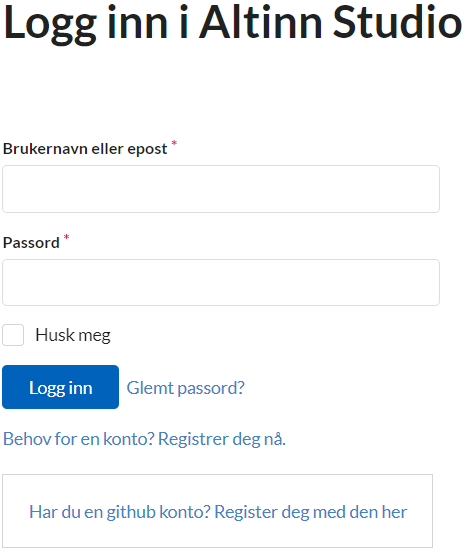
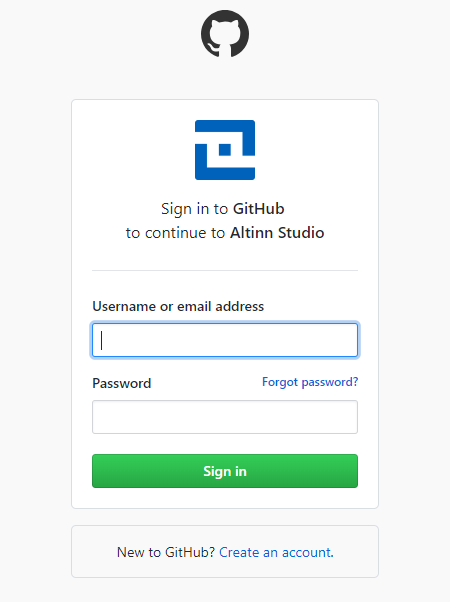
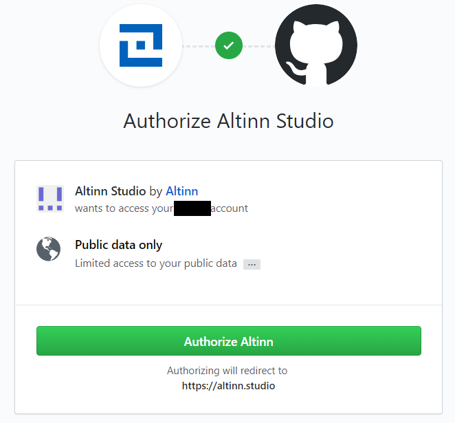

{}
ONLY necessary if you have not already created a user in Altinn Studio.
{}

How to up your user in [altinn.studio](https://altinn.studio) for the first time.

## Create a user linked to GitHub

- Choose to [log in](https://altinn.studio/user/login).
If you have a Github account, select "[Har du en github konto? Register deg med den her](https://altinn.studio/user/oauth2/github)".

- If you are not already logged in at Github, login with your Github credentials.

- Authorize that Altinn Studio can use your Github account for login.

- Register your new local Altinn Studio user by filling in the registration form. This user will be linked to your GitHub user.
  When done you are already logged in.

## Create a user without GitHub

- Choose to [log in](https://altinn.studio/user/login).
  If you do not want to use your Github user, select "[Behov for en konto? Registrer deg nå.](https://altinn.studio/user/sign_up)"

- Fill in your user information to register your user. When done you are already logged in.

